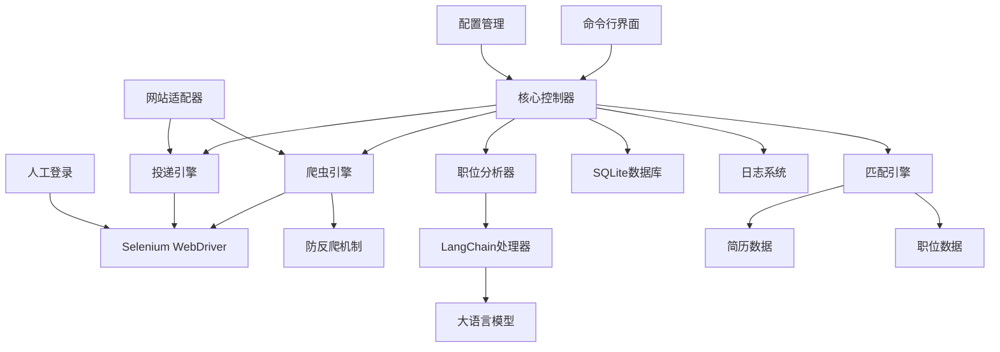

# CLAUDE.md

This file provides guidance to Claude Code (claude.ai/code) when working with code in this repository.

## Project Overview

这是一个基于Python的自动投递简历工具，支持智联招聘、前程无忧、Boss直聘等主流招聘网站。工具使用Selenium进行网页自动化，采用人工登录后自动化操作的方式，LangChain进行职位信息结构化分析，并通过多维度匹配算法评估简历匹配度。

## Technology Stack

- **核心语言**: Python 3.8+
- **网页自动化**: Selenium WebDriver
- **AI分析**: LangChain + OpenAI/本地LLM
- **数据库**: SQLite
- **配置管理**: YAML/JSON
- **命令行界面**: Click/argparse
- **日志**: Python logging
- **测试**: pytest

## Getting Started

When setting up this project:

1. Initialize version control: `git init`
2. Install Python dependencies: `pip install -r requirements.txt`
3. Configure settings in `config/config.yaml`
4. Run the tool: `python src/main.py --website zhilian`

## Development Commands

```bash
# 安装依赖
pip install -r requirements.txt

# 运行工具
python src/main.py --website zhilian

# 运行测试
pytest tests/

# 生成需求文件
pip freeze > requirements.txt
```

## Architecture

### 系统架构图



### 模块架构

#### 1. 核心控制器 (Core Controller)
- **职责**: 协调各个模块，控制整体流程
- **主要功能**: 初始化组件、控制爬取流程、异常处理、状态管理

#### 2. 网站适配器 (Website Adapters)
- **职责**: 为不同招聘网站提供统一接口
- **设计模式**: 策略模式 + 工厂模式
- **支持网站**: 智联招聘、前程无忧、Boss直聘

#### 3. 爬虫引擎 (Crawler Engine)
- **职责**: 基于Selenium执行网页自动化操作，包含会话管理
- **主要功能**: 启动浏览器、等待人工登录、检测登录状态、页面导航、数据提取

#### 4. 职位分析器 (Job Analyzer)
- **职责**: 使用AI分析职位信息
- **主要功能**: 职位描述结构化、技能标签提取、薪资范围解析

#### 5. 匹配引擎 (Matching Engine)
- **职责**: 评估简历与职位的匹配度
- **匹配维度**: 技能匹配(50%)、工作经验(30%)、薪资范围(20%)

#### 6. 投递引擎 (Submission Engine)
- **职责**: 执行简历投递操作
- **主要功能**: 定位投递按钮、模拟点击投递、状态确认

### 项目目录结构

```
resume_auto_submitter/
├── src/
│   ├── main.py                 # 主入口
│   ├── core/
│   │   ├── controller.py       # 核心控制器
│   │   ├── config.py          # 配置管理
│   │   └── exceptions.py      # 自定义异常
│   ├── adapters/
│   │   ├── base.py            # 基础适配器
│   │   ├── zhilian.py         # 智联招聘适配器
│   │   ├── qiancheng.py       # 前程无忧适配器
│   │   └── boss.py            # Boss直聘适配器
│   ├── crawler/
│   │   ├── engine.py          # 爬虫引擎
│   │   ├── anti_bot.py        # 防反爬机制
│   │   └── selenium_utils.py   # Selenium工具函数
│   ├── analyzer/
│   │   ├── job_analyzer.py    # 职位分析器
│   │   ├── prompts.py         # LangChain提示词
│   │   └── llm_client.py      # LLM客户端
│   ├── matcher/
│   │   ├── matching_engine.py # 匹配引擎
│   │   └── scoring.py         # 评分算法
│   ├── submitter/
│   │   └── submission_engine.py # 投递引擎
│   ├── database/
│   │   ├── models.py          # 数据模型
│   │   └── operations.py      # 数据库操作
│   ├── cli/
│   │   ├── commands.py        # 命令行命令
│   │   └── utils.py           # CLI工具函数
│   └── utils/
│       ├── logger.py          # 日志工具
│       └── helpers.py         # 辅助函数
├── config/
│   ├── config.yaml            # 主配置文件
│   ├── config.example.yaml    # 配置示例
│   └── prompts/
│       ├── job_analysis.txt   # 职位分析提示词
│       └── matching.txt       # 匹配分析提示词
├── data/                      # 数据库文件
├── logs/                      # 日志文件
├── tests/                     # 测试文件
├── docs/                      # 文档
├── requirements.txt
└── README.md
```

### 数据库设计

#### 职位信息表 (jobs)
```sql
CREATE TABLE jobs (
    id INTEGER PRIMARY KEY AUTOINCREMENT,
    job_id VARCHAR(100) UNIQUE NOT NULL,  -- 职位唯一标识
    title VARCHAR(200) NOT NULL,          -- 职位标题
    company VARCHAR(200) NOT NULL,        -- 公司名称
    url VARCHAR(500) NOT NULL,            -- 职位详情页URL
    application_status VARCHAR(50) DEFAULT 'pending',  -- 投递状态
    match_score FLOAT,                     -- 匹配度评分
    website VARCHAR(50) NOT NULL,         -- 来源网站
    created_at TIMESTAMP DEFAULT CURRENT_TIMESTAMP,
    submitted_at TIMESTAMP                 -- 投递时间
);
```

### 核心流程

1. **启动浏览器**: 打开指定招聘网站
2. **人工登录**: 等待用户手动完成登录
3. **自动爬取**: 获取职位列表，逐个分析
4. **AI分析**: 使用LangChain结构化职位信息
5. **匹配评分**: 计算简历与职位的匹配度
6. **自动投递**: 根据匹配度决定是否投递
7. **记录保存**: 将结果保存到数据库

### 配置示例

```yaml
# 基础配置
app:
  name: "Resume Auto Submitter"
  version: "1.0.0"

# 网站配置
websites:
  zhilian:
    enabled: true
    base_url: "https://www.zhaopin.com"
    submit_button_selector: ".btn-apply"

# 匹配算法配置
matching:
  weights:
    skills: 0.5
    experience: 0.3
    salary: 0.2
  thresholds:
    auto_submit: 0.8
    manual_review: 0.6
    skip: 0.3

# 简历配置
resume:
  skills: ["Python", "Java", "React", "Node.js"]
  experience_years: 3
  expected_salary_min: 15000
  expected_salary_max: 25000
  preferred_locations: ["上海"]
```

## AI提示词模板

### 职位分析提示词 (config/prompts/job_analysis.txt)
```
你是一个专业的职位分析专家。请分析以下职位信息，并以JSON格式输出结构化数据。

职位信息：
{job_description}

请提取以下信息：
1. 技能要求（skills）：列出所需的技术技能
2. 工作经验要求（experience_years）：提取经验年限要求
3. 薪资范围（salary_range）：提取薪资信息
4. 工作地点（location）：提取工作地点
5. 公司规模（company_size）：提取公司规模信息
6. 职位标签（tags）：生成相关标签

输出格式：
{
  "skills": ["技能1", "技能2"],
  "experience_years": 数字,
  "salary_min": 数字,
  "salary_max": 数字,
  "location": "地点",
  "company_size": "规模",
  "tags": ["标签1", "标签2"]
}
```

### 匹配分析提示词 (config/prompts/matching.txt)
```
你是一个专业的简历匹配分析师。请分析候选人简历与职位要求的匹配度。

候选人信息：
{resume_info}

职位要求：
{job_requirements}

请从以下维度分析匹配度（0-1分）：
1. 技能匹配度（权重50%）
2. 经验匹配度（权重30%）
3. 薪资匹配度（权重20%）

输出格式：
{
  "skills_match": 0.8,
  "experience_match": 0.7,
  "salary_match": 0.9,
  "overall_score": 0.78,
  "analysis": "详细分析说明"
}
```

## 重构后的模块化架构

### 登录功能分离

系统已重构为模块化架构，将登录功能和内容提取功能完全分离：

```
┌─────────────────┐    ┌─────────────────┐
│   登录模块      │    │   内容提取模块   │
│                 │    │                 │
│ ├─ LoginManager │    │ ├─ ContentExtractor
│ ├─ SessionManager│    │ ├─ PageParser   │
│ └─ BrowserManager│    │ └─ DataStorage  │
└─────────────────┘    └─────────────────┘
```

### 最新更新：分页功能增强 (2025-01-18)

#### 🚀 分页功能概述

内容提取模块新增完整的分页功能，支持自动导航多页内容，大幅提升数据采集覆盖范围：

- **默认配置**: 自动读取前10页内容
- **智能导航**: 自动检测和点击下一页按钮
- **多页合并**: 自动合并所有页面的提取结果
- **页码标记**: 每个结果都标记来源页码
- **错误恢复**: 单页失败不影响整体提取流程

#### 📄 分页配置

```yaml
# 搜索策略配置 (config/config.yaml)
search:
  strategy:
    max_pages: 10              # 默认最大页数
    enable_pagination: true    # 是否启用分页
    page_delay: 2              # 页面间延迟时间（秒）
    page_delay_max: 5          # 页面间最大延迟时间（秒）
```

#### 🔧 核心分页方法

**PageParser 新增方法：**

1. **`has_next_page(driver)`** - 检测下一页按钮
   - 支持多种选择器：`.btn_next`, `.next-page`, `.page-next`, `.pager-next`等
   - 智能判断按钮是否可用（非禁用状态）

2. **`navigate_to_next_page(driver)`** - 导航到下一页
   - 模拟人类点击行为（悬停、滚动等）
   - 验证页面跳转是否成功
   - 支持AJAX加载的页面

3. **`get_current_page_info(driver)`** - 获取页面信息
   - 从URL参数和页面元素中提取页码
   - 返回当前页码和页面状态

**ContentExtractor 增强方法：**

1. **`extract_from_search_url()`** - 支持多页提取
   - 新增 `max_pages` 参数
   - 实现页面循环逻辑
   - 为每个结果添加 `page_number` 字段

2. **`extract_from_keyword()`** - 关键词多页搜索
   - 支持 `max_pages` 参数传递

3. **`extract_multiple_keywords()`** - 批量多页提取
   - 新增 `max_pages_per_keyword` 参数

#### 💡 使用示例

```python
# 使用默认配置（10页）
results = extractor.extract_from_keyword("AI工程师")

# 自定义页数
results = extractor.extract_from_keyword("AI工程师", max_pages=5)

# 批量提取多个关键词，每个最多3页
results = extractor.extract_multiple_keywords(
    ["AI工程师", "数据工程师"],
    max_pages_per_keyword=3
)

# 检查结果中的页码信息
for job in results:
    print(f"职位: {job['title']} - 来源: 第{job['page_number']}页")
```

#### 🧪 测试验证

创建了专门的测试脚本验证分页功能：

```bash
# 运行分页功能测试
python simple_pagination_test.py

# 测试结果示例：
# 📊 测试结果: 3/3 通过
# 🎉 所有分页功能测试通过！
#
# 📝 分页功能特性:
#   ✅ 配置文件支持分页参数
#   ✅ PageParser 具备分页导航能力
#   ✅ ContentExtractor 支持多页提取
#   ✅ 多种下一页按钮选择器
```

#### 🎯 技术特性

1. **智能分页检测** - 自动识别多种下一页按钮样式
2. **人性化延迟** - 页面间2-5秒随机延迟，避免反爬检测
3. **灵活配置** - 可通过配置文件或参数控制分页行为
4. **结果追踪** - 每个职位都标记来源页码
5. **错误恢复** - 单页失败不影响整体提取
6. **资源优化** - 达到限制时自动停止，避免无效请求

#### 📈 性能提升

- **数据覆盖范围**: 从单页提升到多页（默认10页）
- **采集效率**: 自动化分页导航，无需人工干预
- **数据完整性**: 支持页码标记，便于数据溯源
- **稳定性**: 智能错误恢复，提高采集成功率

### 新增模块配置

```yaml
# 运行模式配置
mode:
  development: true           # 开发模式
  skip_login: false          # 跳过登录检查
  use_saved_session: true    # 使用保存的会话
  session_file: "data/session.json"
  session_timeout: 3600      # 会话超时时间（秒）
  auto_save_session: true    # 自动保存会话
  close_on_complete: false   # 完成后是否关闭浏览器

# 模块配置
modules:
  login:
    enabled: true
    auto_save_session: true
  extraction:
    enabled: true
    max_concurrent: 1
    retry_attempts: 3
  browser:
    reuse_session: true
    close_on_complete: false
```

### 使用方式

#### 1. 独立登录测试
```bash
# 基本登录测试
python test_login.py

# 登录并保存会话
python test_login.py --save-session

# 检查登录状态
python test_login.py --check-status
```

#### 2. 独立内容提取测试
```bash
# 基于关键词提取
python test_extraction.py --keyword "AI工程师"

# 跳过登录检查（开发模式）
python test_extraction.py --keyword "数据架构师" --skip-login

# 批量提取多个关键词
python test_extraction.py --multiple "AI工程师,数据架构师,Python工程师"
```

#### 3. 编程接口使用

**独立登录管理：**
```python
from src.auth.login_manager import LoginManager

with LoginManager(config) as login_manager:
    success = login_manager.start_login_session(save_session=True)
    if success:
        print("登录成功，会话已保存")
```

**独立内容提取：**
```python
from src.extraction.content_extractor import ContentExtractor

# 开发模式：跳过登录
config['mode']['skip_login'] = True

with ContentExtractor(config) as extractor:
    results = extractor.extract_from_keyword("AI工程师", max_results=30)
    print(f"提取到 {len(results)} 个职位")
```

**使用保存的会话：**
```python
# 配置使用保存的会话
config['mode']['use_saved_session'] = True
config['mode']['session_file'] = 'data/my_session.json'

with ContentExtractor(config) as extractor:
    results = extractor.extract_from_keyword("数据架构师")
```

### 重构优势

1. **独立开发**: 登录和内容提取可以独立开发和测试
2. **会话管理**: 支持会话保存和复用，提高效率
3. **开发友好**: 支持跳过登录的开发模式
4. **模块化配置**: 细粒度的配置控制
5. **易于维护**: 清晰的职责分离

### 迁移指南

从旧版本迁移：
```python
# 旧版本
automation = JobSearchAutomation()
automation.start_search_session(keyword="AI工程师")

# 新版本 - 分离式
# 1. 先登录
with LoginManager(config) as login_manager:
    login_manager.start_login_session(save_session=True)

# 2. 再提取内容
with ContentExtractor(config) as extractor:
    results = extractor.extract_from_keyword("AI工程师")
```

## Notes

- 使用人工登录避免验证码和风控检测
- 通过随机延迟和行为模拟防止反爬
- 支持断点续传，避免重复处理
- 可配置匹配算法权重和阈值
- 简化投递流程，只需点击按钮即可
- 项目采用应用程序架构，直接运行main.py，无需安装包
- **新增**: 支持登录功能分离，便于开发和调试
- **新增**: 支持会话管理和复用，提高使用效率
- **新增**: 支持开发模式，可跳过登录直接测试内容提取