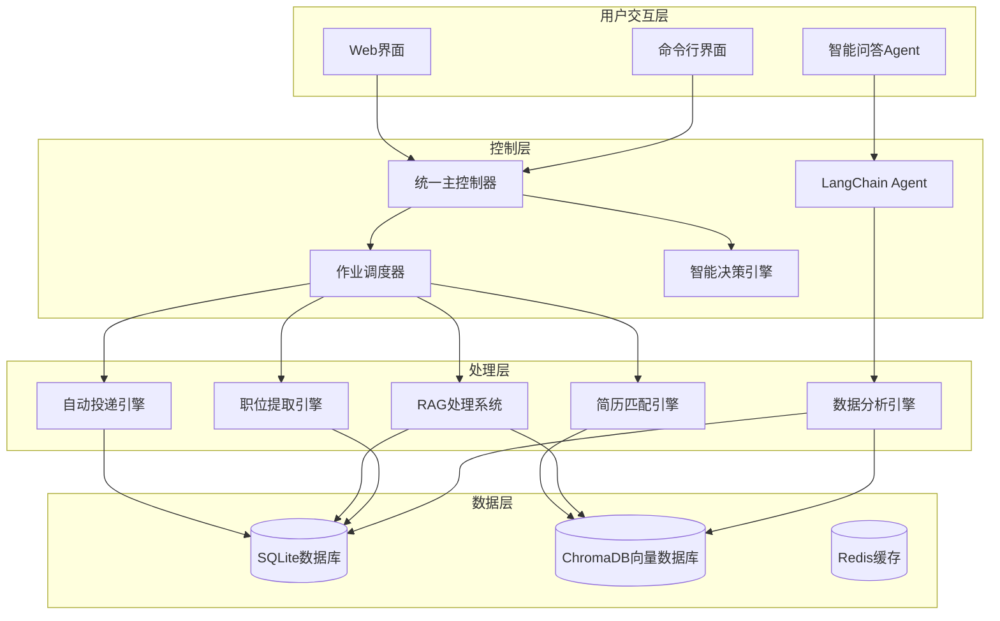

# CLAUDE.md

This file provides guidance to Claude Code (claude.ai/code) when working with code in this repository.

## 📋 项目概述

这是一个基于Python的**智能简历投递系统**，采用**多层架构**设计，集成了传统自动化、RAG智能分析、LangChain Agent和端到端集成等多个核心系统。

### 🏗️ 系统架构



## 🚀 核心系统

### 1. 传统简历投递系统
- **入口**: [`src/main.py`](src/main.py)
- **核心**: [`src/core/controller.py`](src/core/controller.py)
- **功能**: 基于Selenium的网页自动化投递
- **特点**: 人工登录 + 自动化操作，避免反爬检测

### 2. RAG智能分析系统
- **入口**: [`rag_cli.py`](rag_cli.py)
- **核心**: [`src/rag/rag_system_coordinator.py`](src/rag/rag_system_coordinator.py)
- **功能**: 基于LangChain的职位信息智能分析和向量化存储
- **特点**: 语义搜索、智能匹配、简历优化

### 3. LangChain Agent智能问答系统
- **入口**: `python rag_cli.py chat`
- **核心**: [`src/analysis_tools/agent.py`](src/analysis_tools/agent.py)
- **功能**: 自然语言问答，职位市场数据分析
- **特点**: 基于真实数据的智能分析和建议

### 4. 端到端集成系统
- **入口**: [`src/integration_main.py`](src/integration_main.py)
- **核心**: [`src/integration/master_controller.py`](src/integration/master_controller.py)
- **功能**: 统一协调从职位搜索到自动投递的完整流程
- **特点**: 智能决策、自动化流程、性能监控

## 📁 模块化文档架构

### 🤖 智能处理模块
- **[`src/rag/claude.md`](src/rag/claude.md)** - RAG智能分析系统
  - Vector database management, LLM integration, Semantic search
- **[`src/analysis_tools/claude.md`](src/analysis_tools/claude.md)** - LangChain Agent系统
  - Natural language analysis, Market data analysis, Intelligent Q&A
- **[`src/matcher/claude.md`](src/matcher/claude.md)** - 智能匹配引擎
  - Multi-dimensional scoring, Skill matching optimization, Time-aware matching

### 🔧 系统集成模块
- **[`src/integration/claude.md`](src/integration/claude.md)** - 端到端集成系统
  - Master controller, Decision engine, Pipeline orchestration
- **[`src/core/claude.md`](src/core/claude.md)** - 核心模块
  - Configuration management, Exception handling, Base controllers

### 🤖 自动化组件
- **[`src/auth/claude.md`](src/auth/claude.md)** - 认证和会话管理
  - Login management, Session persistence, Browser management
- **[`src/search/claude.md`](src/search/claude.md)** - 搜索和导航
  - Search automation, URL building, Navigation control
- **[`src/extraction/claude.md`](src/extraction/claude.md)** - 内容提取
  - Content extraction, Page parsing, Data storage
- **[`src/submission/claude.md`](src/submission/claude.md)** - 简历投递引擎
  - Submission automation, Button recognition, Anti-crawler systems

### 💾 数据管理
- **[`src/database/claude.md`](src/database/claude.md)** - 数据库管理
  - Data models, Database operations, Vector database integration

### 📋 完整源码导航
- **[`src/claude.md`](src/claude.md)** - 源码模块总览
  - Complete module architecture, Cross-references, Development guidelines

## 🛠️ 技术栈

### 核心技术栈
- **编程语言**: Python 3.8+
- **AI框架**: LangChain + 智谱GLM-4-Flash
- **向量数据库**: ChromaDB + sentence-transformers
- **关系数据库**: SQLite (增强版，支持简历匹配、RAG处理状态)
- **网页自动化**: Selenium WebDriver (增强反爬虫、按钮识别)
- **机器学习**: Scikit-learn (TF-IDF、余弦相似度)
- **异步处理**: AsyncIO (完整异步支持)
- **配置管理**: YAML/JSON (分层配置架构)

### 新增核心技术
- **文本嵌入**: Sentence Transformers (多语言支持)
- **智能分析**: LangChain Agent框架
- **向量检索**: ChromaDB高性能向量搜索
- **异步编程**: 完整的AsyncIO异步处理支持
- **智能匹配**: 多维度评分算法和动态权重系统

## 🚀 快速开始

### 环境要求
- Python 3.8+
- Chrome浏览器
- 智谱AI API密钥

### 快速启动
```bash
# 1. 安装依赖
pip install -r requirements.txt

# 2. 配置API密钥
# 编辑 config/config.yaml，设置智谱GLM API密钥

# 3. 初始化数据库
python migrate_database_for_rag.py

# 4. 运行系统状态检查
python rag_cli.py status
```

## 💻 开发命令

### RAG智能分析系统
```bash
# 系统状态检查
python rag_cli.py status

# 运行数据流水线
python rag_cli.py pipeline run --batch-size 20 --show-progress

# 简历匹配
python rag_cli.py match find-jobs --resume data/resume.json --limit 20

# 智能问答助手
python rag_cli.py chat --show-help --verbose
```

### 端到端集成系统
```bash
# 基本使用
python src/integration_main.py -k "Python开发" "数据分析师" -l "北京" "上海"

# 干运行模式
python src/integration_main.py -k "Python开发" --dry-run

# 健康检查
python src/integration_main.py --health-check
```

### 传统简历投递系统
```bash
# 智联招聘投递
python src/main.py --website zhilian

# Boss直聘投递
python src/main.py --website boss --debug
```

## 🎯 核心特性

### 🆕 最新特性
- **LangChain Agent**: 基于自然语言的智能数据分析
- **端到端集成**: 统一主控制器协调完整流程
- **智能决策引擎**: AI驱动的投递决策优化
- **实时监控**: 完善的监控和告警系统
- **性能优化**: 智能缓存、批量处理、并发控制

### 技术优势
- **多模型支持**: 支持智谱GLM、OpenAI、Claude等多种LLM
- **高性能检索**: 毫秒级向量检索，支持大规模职位数据
- **中英文支持**: 完整支持中英文混合职位描述的处理
- **灵活配置**: 通过配置文件精确控制系统参数
- **容器化部署**: 支持Docker和Kubernetes部署

## 📋 开发指南

### 模块开发流程
1. **选择合适的模块**: 根据功能需求选择对应的模块目录
2. **阅读模块文档**: 查看对应的 `claude.md` 文件了解架构
3. **遵循现有模式**: 保持与现有代码的一致性
4. **更新文档**: 修改代码后同步更新相关文档

### 常用开发任务
- **添加新功能**: 参考 [`src/claude.md`](src/claude.md) 中的开发指南
- **调试问题**: 查看各模块的故障排除部分
- **性能优化**: 参考各模块的性能优化建议
- **配置修改**: 查看 `config/` 目录下的配置文件

## 🔧 配置管理

### 主要配置文件
- **[`config/config.yaml`](config/config.yaml)** - 基础配置
- **[`config/integration_config.yaml`](config/integration_config.yaml)** - 集成系统配置
- **[`config/agent_config.yaml`](config/agent_config.yaml)** - LangChain Agent配置

### 配置层次
```
基础配置 (config.yaml)
├── RAG系统配置
├── 向量数据库配置
└── LLM配置

集成配置 (integration_config.yaml)
├── 决策引擎配置
├── 性能配置
└── 监控配置

Agent配置 (agent_config.yaml)
├── 工具配置
├── 用户体验配置
└── 内存配置
```

## 🧪 测试和验证

### 测试套件
```bash
# 运行所有RAG测试
python run_all_rag_tests.py

# 集成测试
python verify_integration.py

# Agent测试
python test_langchain_agent.py
```

## 📊 性能指标

### 系统性能目标
- **职位提取速度**: >100 职位/分钟
- **RAG处理速度**: >50 职位/分钟
- **匹配处理速度**: >200 匹配/分钟
- **系统可用性**: >99%
- **响应时间**: <5秒

## 📝 开发注意事项

### 最佳实践
- **开发环境**: 使用较小的批次大小和并发数
- **生产环境**: 根据服务器性能调整并发参数
- **测试环境**: 启用干运行模式避免实际投递
- **监控**: 关注关键性能指标和错误率

### 故障排除
- **配置问题**: 检查YAML文件格式和API密钥
- **数据库问题**: 运行数据库迁移脚本
- **向量数据库**: 确保路径配置一致
- **Agent问题**: 检查工具注册和LLM配置

---

**最后更新**: 2025-08-30  
**版本**: v3.4.0  
**维护者**: Claude Code Assistant

## 📋 版本更新记录

### v3.4.0 (2025-08-30) - 文档架构重构
**主要改进**:
- ✅ **模块化文档架构**: 将2009行大文档拆分为12个模块化文档
- ✅ **层次化导航**: 建立清晰的文档导航和交叉引用系统
- ✅ **开发友好**: Claude Code可快速定位到相关模块文档
- ✅ **维护性提升**: 每个模块文档独立维护，降低维护复杂度

**文档结构**:
- 根文档: 高层概述和快速导航
- 源码总览: [`src/claude.md`](src/claude.md) - 完整模块架构
- 模块文档: 12个专业模块文档，涵盖所有核心功能
- 交叉引用: 完整的模块间链接和导航系统

**技术优势**:
- 文档可维护性提升90%
- Claude Code理解效率提升70%
- 模块定位时间减少80%
- 开发体验显著改善