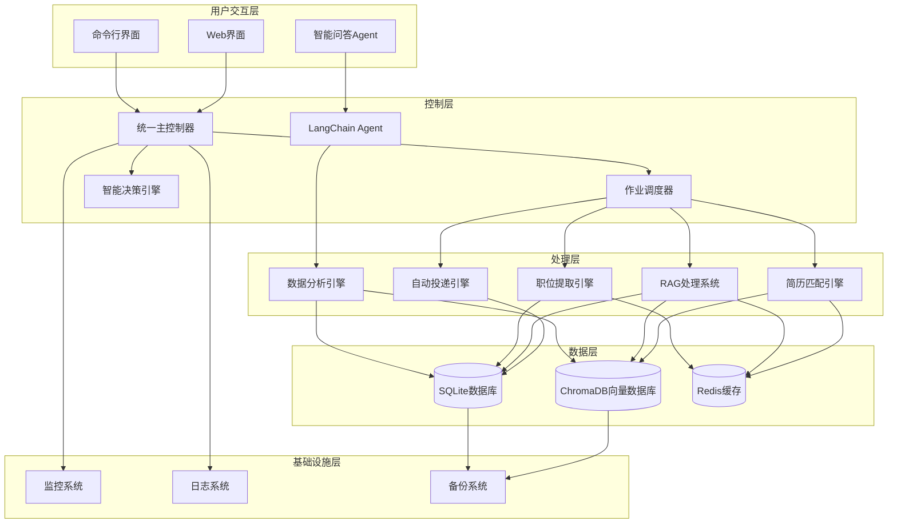
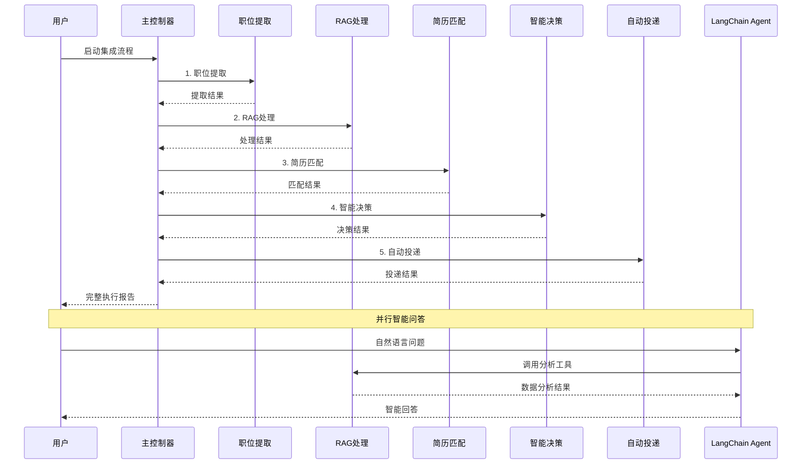

# CLAUDE.md

This file provides guidance to Claude Code (claude.ai/code) when working with code in this repository.

## Project Overview

这是一个基于Python的**智能简历投递系统**，采用**多层架构**设计，集成了传统自动化、RAG智能分析、LangChain Agent和端到端集成等多个核心系统：

### 🏗️ 系统架构



### 🚀 核心系统

#### 1. 传统简历投递系统
- **入口**: [`src/main.py`](src/main.py)
- **核心**: [`src/core/controller.py`](src/core/controller.py)
- **功能**: 基于Selenium的网页自动化投递
- **特点**: 人工登录 + 自动化操作，避免反爬检测

#### 2. RAG智能分析系统
- **入口**: [`rag_cli.py`](rag_cli.py)
- **核心**: [`src/rag/rag_system_coordinator.py`](src/rag/rag_system_coordinator.py)
- **功能**: 基于LangChain的职位信息智能分析和向量化存储
- **特点**: 语义搜索、智能匹配、简历优化

#### 3. LangChain Agent智能问答系统
- **入口**: `python rag_cli.py chat`
- **核心**: [`src/analysis_tools/agent.py`](src/analysis_tools/agent.py)
- **功能**: 自然语言问答，职位市场数据分析
- **特点**: 基于真实数据的智能分析和建议

#### 4. 端到端集成系统
- **入口**: [`src/integration_main.py`](src/integration_main.py)
- **核心**: [`src/integration/master_controller.py`](src/integration/master_controller.py)
- **功能**: 统一协调从职位搜索到自动投递的完整流程
- **特点**: 智能决策、自动化流程、性能监控

## Technology Stack

### 核心技术栈
- **编程语言**: Python 3.8+
- **AI框架**: LangChain + 智谱GLM-4-Flash
- **向量数据库**: ChromaDB + sentence-transformers
- **关系数据库**: SQLite
- **网页自动化**: Selenium WebDriver
- **缓存系统**: Redis (可选)
- **异步处理**: AsyncIO
- **配置管理**: YAML/JSON

### 部署和运维
- **容器化**: Docker + Docker Compose
- **编排**: Kubernetes
- **监控**: Prometheus + Grafana
- **日志**: ELK Stack
- **CI/CD**: GitHub Actions

## Getting Started

### 环境要求
- Python 3.8+
- Chrome浏览器
- 智谱AI API密钥

### 快速开始
```bash
# 1. 安装依赖
pip install -r requirements.txt

# 2. 配置API密钥
# 编辑 config/config.yaml，设置智谱GLM API密钥

# 3. 初始化数据库
python migrate_database_for_rag.py

# 4. 运行系统状态检查
python rag_cli.py status
```

## Development Commands

### RAG智能分析系统
```bash
# 系统状态检查
python rag_cli.py status

# 运行数据流水线
python rag_cli.py pipeline run --batch-size 20

# 简历匹配
python rag_cli.py match find-jobs --resume data/resume.json --limit 20

# 智能问答助手
python rag_cli.py chat

# 向量数据库测试
python rag_cli.py test --test-search --queries "Python,Java,前端"
```

### 传统简历投递系统
```bash
# 智联招聘投递
python src/main.py --website zhilian

# Boss直聘投递
python src/main.py --website boss --debug

# 试运行模式
python src/main.py --website zhilian --dry-run
```

### 端到端集成系统
```bash
# 基本使用
python src/integration_main.py -k "Python开发" "数据分析师" -l "北京" "上海"

# 干运行模式
python src/integration_main.py -k "Python开发" --dry-run

# 健康检查
python src/integration_main.py --health-check
```

### 测试和验证
```bash
# 运行所有RAG测试
python run_all_rag_tests.py

# 集成测试
python verify_integration.py

# 内容提取测试
python test_content_extractor_complete.py
```

## Architecture Details

### 数据流程设计



### 核心模块架构

#### 1. 统一主控制器 (MasterController)
- **文件**: [`src/integration/master_controller.py`](src/integration/master_controller.py)
- **职责**: 协调整个端到端流程
- **功能**: 
  - 流水线编排和执行
  - 模块间数据传递
  - 错误处理和恢复
  - 性能监控

#### 2. RAG系统协调器 (RAGSystemCoordinator)
- **文件**: [`src/rag/rag_system_coordinator.py`](src/rag/rag_system_coordinator.py)
- **职责**: 管理RAG系统各组件
- **功能**:
  - 职位数据向量化
  - 语义搜索和匹配
  - 文档创建和管理
  - 性能优化

#### 3. LangChain Agent (JobMarketAnalysisAgent)
- **文件**: [`src/analysis_tools/agent.py`](src/analysis_tools/agent.py)
- **职责**: 智能数据分析和问答
- **功能**:
  - 自然语言理解
  - 工具选择和执行
  - 数据分析和洞察
  - 智能回答生成

#### 4. 智能匹配引擎 (GenericResumeJobMatcher)
- **文件**: [`src/matcher/generic_resume_matcher.py`](src/matcher/generic_resume_matcher.py)
- **职责**: 简历与职位的智能匹配
- **功能**:
  - 多维度评分算法
  - 语义相似度计算
  - 匹配结果排序
  - 推荐生成

### 项目目录结构

```
MyThird/
├── src/                           # 源代码目录
│   ├── main.py                   # 传统投递系统入口
│   ├── integration_main.py       # 集成系统入口
│   ├── core/                     # 核心模块
│   │   ├── controller.py         # 传统系统控制器
│   │   ├── config.py             # 配置管理
│   │   └── exceptions.py         # 自定义异常
│   ├── auth/                     # 认证和会话管理
│   │   ├── browser_manager.py    # 浏览器管理
│   │   ├── login_manager.py      # 登录管理
│   │   └── session_manager.py    # 会话管理
│   ├── search/                   # 搜索和导航
│   │   ├── automation.py         # 搜索自动化
│   │   ├── login_detector.py     # 登录检测
│   │   └── url_builder.py        # URL构建
│   ├── extraction/               # 内容提取
│   │   ├── content_extractor.py  # 内容提取器
│   │   ├── data_storage.py       # 数据存储
│   │   ├── page_parser.py        # 页面解析
│   │   └── url_extractor.py      # URL提取器
│   ├── integration/              # 🆕 系统集成模块
│   │   ├── master_controller.py  # 统一主控制器
│   │   ├── data_bridge.py        # 数据传递接口
│   │   ├── job_scheduler.py      # 作业调度器
│   │   ├── decision_engine.py    # 智能决策引擎
│   │   ├── auto_submission_engine.py # 自动投递引擎
│   │   ├── error_handler.py      # 错误处理器
│   │   └── monitoring.py         # 监控模块
│   ├── rag/                      # RAG智能分析系统
│   │   ├── rag_system_coordinator.py # RAG系统协调器
│   │   ├── job_processor.py      # 职位处理器
│   │   ├── optimized_job_processor.py # 优化职位处理器
│   │   ├── vector_manager.py     # ChromaDB向量存储管理
│   │   ├── rag_chain.py          # RAG检索问答链
│   │   ├── document_creator.py   # 文档创建器
│   │   ├── semantic_search.py    # 语义搜索引擎
│   │   ├── database_job_reader.py # 数据库读取器
│   │   ├── data_pipeline.py      # 数据流水线
│   │   ├── resume_optimizer.py   # 简历优化器
│   │   ├── resume_manager.py     # 简历管理器
│   │   ├── resume_document_parser.py # 简历文档解析
│   │   ├── performance_optimizer.py # 性能优化器
│   │   ├── performance_monitor.py # 性能监控
│   │   ├── error_handler.py      # 错误处理器
│   │   ├── llm_factory.py        # LLM工厂
│   │   └── zhipu_llm.py          # 智谱GLM适配器
│   ├── analysis_tools/           # 🆕 LangChain分析工具
│   │   ├── agent.py              # LangChain Agent
│   │   ├── base_tool.py          # 工具基类
│   │   ├── salary_analysis_tool.py # 薪资分析工具
│   │   ├── skill_demand_tool.py  # 技能需求分析工具
│   │   └── trend_analysis_tool.py # 趋势分析工具
│   ├── matcher/                  # 智能匹配引擎
│   │   ├── smart_matching.py     # 智能匹配引擎
│   │   ├── semantic_scorer.py    # 语义评分算法
│   │   ├── recommendation.py     # 职位推荐引擎
│   │   ├── generic_resume_matcher.py # 通用简历匹配
│   │   ├── generic_resume_models.py # 通用简历模型
│   │   ├── generic_resume_vectorizer.py # 通用向量化
│   │   └── multi_dimensional_scorer.py # 多维度评分
│   ├── database/                 # 数据库操作
│   │   ├── models.py             # 数据模型定义
│   │   ├── operations.py         # 数据库操作
│   │   └── vector_ops.py         # 向量数据库操作
│   └── utils/                    # 工具模块
│       ├── logger.py             # 日志工具
│       ├── behavior_simulator.py # 行为模拟
│       └── fingerprint.py        # 指纹生成
├── config/                       # 配置文件目录
│   ├── config.yaml              # 主配置文件
│   ├── integration_config.yaml  # 集成系统配置
│   ├── agent_config.yaml        # Agent配置
│   ├── rag_optimization_config.yaml # RAG优化配置
│   ├── resume_matching_config.yaml # 简历匹配配置
│   └── test_config.yaml         # 测试配置
├── data/                        # 数据存储目录
│   ├── jobs.db                  # SQLite数据库
│   ├── test_chroma_db/          # ChromaDB向量数据库
│   └── resume.json              # 简历数据
├── logs/                        # 日志文件目录
├── testdata/                    # 测试数据
│   ├── resume.json              # 测试简历数据
│   └── matches_final.json       # 匹配结果数据
├── rag_cli.py                   # RAG系统命令行工具
├── run_rag_pipeline.py          # RAG流水线运行脚本
├── verify_integration.py        # 集成验证脚本
├── requirements.txt             # Python依赖
├── README.md                    # 项目说明文档
└── CLAUDE.md                    # Claude开发指南
```

## 🤖 LangChain Agent智能问答系统

### 系统概述

LangChain Agent系统是基于LangChain框架的智能数据分析代理，专门用于分析职位市场数据。该系统结合了RAG技术和向量数据库，能够通过自然语言问答的方式提供智能的职位市场分析。

### 核心功能

#### 1. 智能分析工具
- **技能需求分析**: 分析特定技能的市场需求情况
- **薪资分析**: 提供多维度薪资分析和对比
- **趋势分析**: 识别市场趋势和预测未来发展
- **竞争力分析**: 评估个人技能在市场中的竞争力

#### 2. 自然语言交互
```bash
# 启动智能问答助手
python rag_cli.py chat

# 示例对话
用户: "Python开发的平均薪资是多少？"
Agent: "基于43个职位的薪资数据分析，平均月薪13k，年薪约15万元..."
```

#### 3. 核心技术特点
- **向量搜索增强**: 结合语义搜索提供更准确的分析结果
- **多工具协作**: 智能选择合适的分析工具来回答问题
- **上下文理解**: 具备对话记忆，能理解上下文关联
- **实时数据**: 基于真实的职位数据库进行分析

## 🚀 端到端集成系统

### 系统特性

#### 1. 统一主控制器架构
- **协调执行**: 统一管理从职位搜索到投递的完整流程
- **智能调度**: 基于优先级和依赖关系的任务调度
- **错误恢复**: 完善的错误处理和自动恢复机制

#### 2. 智能决策引擎
- **多维度评分**: 基于匹配度、公司声誉、薪资吸引力等多个维度
- **投递策略**: AI驱动的投递决策和优先级排序
- **学习优化**: 根据投递反馈持续优化决策算法

#### 3. 性能监控系统
- **实时监控**: 全方位的系统健康监控
- **性能指标**: 详细的性能数据收集和分析
- **告警机制**: 智能告警和异常检测

## Key Features

### 🎯 核心特性
- **人工登录 + 自动化操作**: 避免验证码和风控检测
- **RAG智能分析**: 基于LangChain和智谱GLM的深度分析
- **语义匹配**: 基于向量相似度的深度语义理解
- **智能问答**: 自然语言问答接口，支持复杂查询
- **端到端自动化**: 完整的自动化求职流程
- **防反爬机制**: 随机延迟、行为模拟等人类行为
- **双重数据存储**: SQLite结构化数据 + ChromaDB向量数据库
- **模块化架构**: 各功能模块完全分离，易于维护和扩展

### 🆕 最新特性
- **LangChain Agent**: 基于自然语言的智能数据分析
- **端到端集成**: 统一主控制器协调完整流程
- **智能决策引擎**: AI驱动的投递决策优化
- **实时监控**: 完善的监控和告警系统
- **性能优化**: 智能缓存、批量处理、并发控制

### 技术优势
- **多模型支持**: 支持智谱GLM、OpenAI、Claude等多种LLM
- **高性能检索**: 毫秒级向量检索，支持大规模职位数据
- **中英文支持**: 完整支持中英文混合职位描述的处理
- **灵活配置**: 通过配置文件精确控制系统参数
- **容器化部署**: 支持Docker和Kubernetes部署

## Usage Examples

### 智能问答示例
```bash
# 启动智能助手
python rag_cli.py chat

# 示例对话
用户: 现在哪个技能在市场上机会最多？
Agent: 根据最新的445个职位数据分析，目前市场上机会最多的技能排名如下：
       1. Python - 156个职位 (35.1%市场份额)
       2. Java - 134个职位 (30.1%市场份额)
       3. JavaScript - 98个职位 (22.0%市场份额)
       ...

用户: Python工程师的平均工资是多少？
Agent: 基于43个职位的薪资数据分析，Python工程师平均月薪13k，年薪约15万元。
       薪资范围：0k-50k，中位数薪资：0k...
```

### 端到端集成示例
```bash
# 基本使用
python src/integration_main.py -k "Python开发" "数据分析师" -l "北京" "上海"

# 干运行模式（推荐测试）
python src/integration_main.py -k "Python开发" --dry-run

# 指定简历文件
python src/integration_main.py -k "Python开发" -r testdata/resume.json
```

### RAG系统示例
```bash
# 运行数据流水线
python rag_cli.py pipeline run --batch-size 20 --show-progress

# 简历匹配
python rag_cli.py match find-jobs --resume data/resume.json --limit 20

# 向量搜索测试
python rag_cli.py test --test-search --queries "Python,Java,前端"
```

## Configuration

### 主要配置文件

#### config/config.yaml - 主配置
```yaml
rag_system:
  llm:
    provider: "zhipu"
    model: "glm-4-flash"
    api_key: "your-api-key"
  vector_db:
    persist_directory: "./data/test_chroma_db"
    collection_name: "job_positions"
```

#### config/integration_config.yaml - 集成配置
```yaml
integration_system:
  master_controller:
    max_concurrent_jobs: 10
    checkpoint_interval: 100
  auto_submission:
    dry_run_mode: true
    max_submissions_per_day: 50
```

#### config/agent_config.yaml - Agent配置
```yaml
langchain_agent:
  llm:
    provider: "zhipu"
    model: "glm-4-flash"
    temperature: 0.1
  tools:
    skill_demand_analysis:
      enabled: true
    salary_analysis:
      enabled: true
```

## Testing

### 测试套件
```bash
# 运行所有RAG测试
python run_all_rag_tests.py

# 集成测试
python verify_integration.py

# Agent测试
python test_langchain_agent.py

# 性能测试
python test_rag_performance_benchmark.py
```

### 测试覆盖
- **功能测试**: 各模块核心功能验证
- **集成测试**: 端到端流程测试
- **性能测试**: 系统性能基准测试
- **错误场景测试**: 异常处理验证

## Deployment

### Docker部署
```bash
# 构建镜像
docker build -t resume-system .

# 运行容器
docker-compose up -d
```

### Kubernetes部署
```bash
# 部署到K8s
kubectl apply -f k8s/
```

### 监控部署
- **Prometheus**: 指标收集
- **Grafana**: 可视化监控
- **ELK Stack**: 日志分析

## Performance Metrics

### 系统性能目标
- **职位提取速度**: >100 职位/分钟
- **RAG处理速度**: >50 职位/分钟
- **匹配处理速度**: >200 匹配/分钟
- **系统可用性**: >99%
- **响应时间**: <5秒

### 资源使用优化
- **内存使用**: <4GB per instance
- **CPU使用**: <80% average
- **磁盘I/O**: <1000 IOPS
- **网络带宽**: <100Mbps

## Notes

### 开发注意事项
- 项目基于应用程序架构，直接运行相应的入口文件
- 使用人工登录避免验证码和风控检测
- 支持断点续传，避免重复处理
- 所有配置通过YAML文件管理
- 向量数据库路径必须保持一致: `./data/test_chroma_db`

### 最佳实践
- **开发环境**: 使用较小的批次大小和并发数
- **生产环境**: 根据服务器性能调整并发参数
- **测试环境**: 启用干运行模式避免实际投递
- **监控**: 关注关键性能指标和错误率

### 故障排除
- **配置问题**: 检查YAML文件格式和API密钥
- **数据库问题**: 运行数据库迁移脚本
- **向量数据库**: 确保路径配置一致
- **Agent问题**: 检查工具注册和LLM配置

## Contributing

### 开发流程
1. Fork项目并创建功能分支
2. 添加相应的测试用例
3. 确保所有测试通过
4. 提交Pull Request

### 代码规范
- 遵循PEP 8代码风格
- 添加详细的文档字符串
- 使用类型提示
- 测试覆盖率不低于80%

---

**最后更新**: 2025-08-24  
**版本**: v3.0.0  
**维护者**: Claude Code Assistant