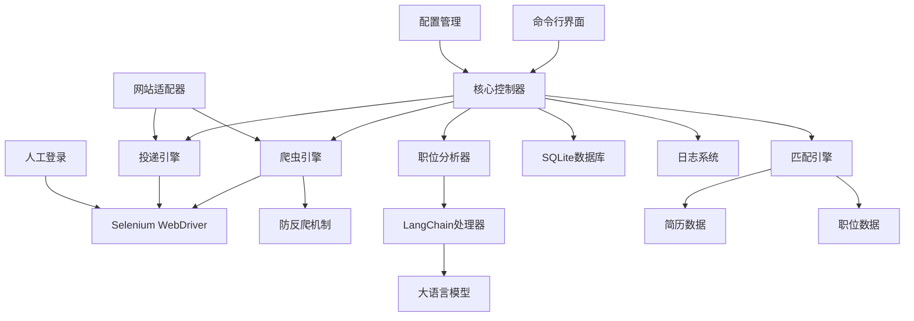

# CLAUDE.md

This file provides guidance to Claude Code (claude.ai/code) when working with code in this repository.

## Project Overview

这是一个基于Python的自动投递简历工具，支持智联招聘、前程无忧、Boss直聘等主流招聘网站。工具使用Selenium进行网页自动化，采用人工登录后自动化操作的方式，LangChain进行职位信息结构化分析，并通过多维度匹配算法评估简历匹配度。

## Technology Stack

- **核心语言**: Python 3.8+
- **网页自动化**: Selenium WebDriver
- **AI分析**: LangChain + OpenAI/本地LLM
- **数据库**: SQLite
- **配置管理**: YAML/JSON
- **命令行界面**: Click/argparse
- **日志**: Python logging
- **测试**: pytest

## Getting Started

When setting up this project:

1. Initialize version control: `git init`
2. Install Python dependencies: `pip install -r requirements.txt`
3. Configure settings in `config/config.yaml`
4. Run the tool: `python src/main.py --website zhilian`

## Development Commands

```bash
# 安装依赖
pip install -r requirements.txt

# 运行工具
python src/main.py --website zhilian

# 运行测试
pytest tests/

# 生成需求文件
pip freeze > requirements.txt
```

## Architecture

### 系统架构图



### 模块架构

#### 1. 核心控制器 (Core Controller)
- **职责**: 协调各个模块，控制整体流程
- **主要功能**: 初始化组件、控制爬取流程、异常处理、状态管理

#### 2. 网站适配器 (Website Adapters)
- **职责**: 为不同招聘网站提供统一接口
- **设计模式**: 策略模式 + 工厂模式
- **支持网站**: 智联招聘、前程无忧、Boss直聘

#### 3. 爬虫引擎 (Crawler Engine)
- **职责**: 基于Selenium执行网页自动化操作，包含会话管理
- **主要功能**: 启动浏览器、等待人工登录、检测登录状态、页面导航、数据提取

#### 4. 职位分析器 (Job Analyzer)
- **职责**: 使用AI分析职位信息
- **主要功能**: 职位描述结构化、技能标签提取、薪资范围解析

#### 5. 匹配引擎 (Matching Engine)
- **职责**: 评估简历与职位的匹配度
- **匹配维度**: 技能匹配(50%)、工作经验(30%)、薪资范围(20%)

#### 6. 投递引擎 (Submission Engine)
- **职责**: 执行简历投递操作
- **主要功能**: 定位投递按钮、模拟点击投递、状态确认

### 项目目录结构

```
resume_auto_submitter/
├── src/
│   ├── main.py                 # 主入口
│   ├── core/
│   │   ├── controller.py       # 核心控制器
│   │   ├── config.py          # 配置管理
│   │   └── exceptions.py      # 自定义异常
│   ├── adapters/
│   │   ├── base.py            # 基础适配器
│   │   ├── zhilian.py         # 智联招聘适配器
│   │   ├── qiancheng.py       # 前程无忧适配器
│   │   └── boss.py            # Boss直聘适配器
│   ├── crawler/
│   │   ├── engine.py          # 爬虫引擎
│   │   ├── anti_bot.py        # 防反爬机制
│   │   └── selenium_utils.py   # Selenium工具函数
│   ├── analyzer/
│   │   ├── job_analyzer.py    # 职位分析器
│   │   ├── prompts.py         # LangChain提示词
│   │   └── llm_client.py      # LLM客户端
│   ├── matcher/
│   │   ├── matching_engine.py # 匹配引擎
│   │   └── scoring.py         # 评分算法
│   ├── submitter/
│   │   └── submission_engine.py # 投递引擎
│   ├── database/
│   │   ├── models.py          # 数据模型
│   │   └── operations.py      # 数据库操作
│   ├── cli/
│   │   ├── commands.py        # 命令行命令
│   │   └── utils.py           # CLI工具函数
│   └── utils/
│       ├── logger.py          # 日志工具
│       └── helpers.py         # 辅助函数
├── config/
│   ├── config.yaml            # 主配置文件
│   ├── config.example.yaml    # 配置示例
│   └── prompts/
│       ├── job_analysis.txt   # 职位分析提示词
│       └── matching.txt       # 匹配分析提示词
├── data/                      # 数据库文件
├── logs/                      # 日志文件
├── tests/                     # 测试文件
├── docs/                      # 文档
├── requirements.txt
└── README.md
```

### 数据库设计

#### 职位信息表 (jobs)
```sql
CREATE TABLE jobs (
    id INTEGER PRIMARY KEY AUTOINCREMENT,
    job_id VARCHAR(100) UNIQUE NOT NULL,  -- 职位唯一标识
    title VARCHAR(200) NOT NULL,          -- 职位标题
    company VARCHAR(200) NOT NULL,        -- 公司名称
    url VARCHAR(500) NOT NULL,            -- 职位详情页URL
    application_status VARCHAR(50) DEFAULT 'pending',  -- 投递状态
    match_score FLOAT,                     -- 匹配度评分
    website VARCHAR(50) NOT NULL,         -- 来源网站
    created_at TIMESTAMP DEFAULT CURRENT_TIMESTAMP,
    submitted_at TIMESTAMP                 -- 投递时间
);
```

### 核心流程

1. **启动浏览器**: 打开指定招聘网站
2. **人工登录**: 等待用户手动完成登录
3. **自动爬取**: 获取职位列表，逐个分析
4. **AI分析**: 使用LangChain结构化职位信息
5. **匹配评分**: 计算简历与职位的匹配度
6. **自动投递**: 根据匹配度决定是否投递
7. **记录保存**: 将结果保存到数据库

### 配置示例

```yaml
# 基础配置
app:
  name: "Resume Auto Submitter"
  version: "1.0.0"

# 网站配置
websites:
  zhilian:
    enabled: true
    base_url: "https://www.zhaopin.com"
    submit_button_selector: ".btn-apply"

# 匹配算法配置
matching:
  weights:
    skills: 0.5
    experience: 0.3
    salary: 0.2
  thresholds:
    auto_submit: 0.8
    manual_review: 0.6
    skip: 0.3

# 简历配置
resume:
  skills: ["Python", "Java", "React", "Node.js"]
  experience_years: 3
  expected_salary_min: 15000
  expected_salary_max: 25000
  preferred_locations: ["上海"]
```

## Notes

- 使用人工登录避免验证码和风控检测
- 通过随机延迟和行为模拟防止反爬
- 支持断点续传，避免重复处理
- 可配置匹配算法权重和阈值
- 简化投递流程，只需点击按钮即可