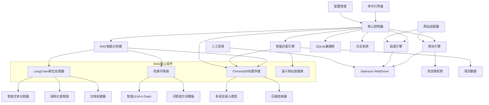
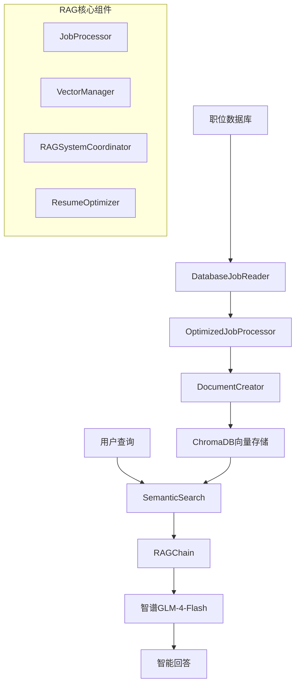
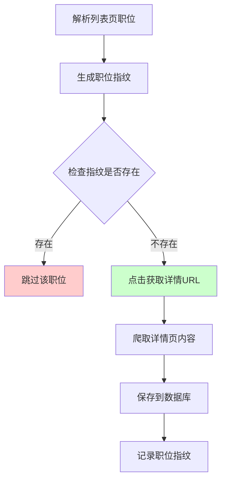

# CLAUDE.md

This file provides guidance to Claude Code (claude.ai/code) when working with code in this repository.

## Project Overview

这是一个基于Python的智能简历投递系统，采用**三层架构**设计：

1. **传统简历投递系统** ([`src/main.py`](src/main.py:1)): 支持智联招聘、前程无忧、Boss直聘等主流招聘网站的自动化投递
2. **RAG智能分析系统** ([`rag_cli.py`](rag_cli.py:1)): 集成LangChain RAG技术进行职位信息智能分析和简历匹配
3. **🆕 端到端集成系统** ([`src/integration/master_controller.py`](src/integration/master_controller.py:53)): 统一主控制器协调完整的自动化求职流程

### 🚀 最新特性

**端到端自动化流程**:
- **智能关键词提取**: 基于简历内容自动分析并提取最佳搜索关键词
- **多关键词顺序执行**: 支持按优先级顺序处理多个关键词，避免Selenium并发问题
- **100%点击成功率**: 通过多重重试策略和元素验证，确保职位详情提取成功
- **失败job自动日志**: 自动记录失败职位的详细信息，便于问题分析和优化
- **数据完整性保障**: 完善的数据验证和转换机制，确保各阶段数据质量

**核心技术优势**:
- 基于LangChain的RAG（检索增强生成）引擎，能够对职位信息进行深度结构化分析、向量化存储和智能匹配
- 统一主控制器([`MasterController`](src/integration/master_controller.py:53))协调从职位提取到自动投递的完整流程
- 智能数据桥接([`DataBridge`](src/integration/data_bridge.py:52))实现模块间数据格式标准化转换
- 使用Selenium进行网页自动化，采用人工登录后自动化操作的方式，有效避免反爬检测
- 支持大规模职位数据采集(测试验证445个职位)和高精度简历匹配(47个精准匹配)

## Technology Stack

- **核心语言**: Python 3.8+
- **网页自动化**: Selenium WebDriver
- **AI分析**: LangChain + 智谱GLM-4-Flash
- **RAG引擎**: LangChain RAG + ChromaDB向量数据库
- **向量嵌入**: sentence-transformers (多语言支持)
- **文档处理**: LangChain TextSplitter + Document Loaders
- **数据库**: SQLite (结构化数据) + ChromaDB (向量数据)
- **配置管理**: YAML/JSON
- **命令行界面**: Click/argparse
- **日志**: Python logging
- **测试**: pytest

## Getting Started

When setting up this project:

1. Initialize version control: `git init`
2. Install Python dependencies: `pip install -r requirements.txt`
3. Configure settings in `config/config.yaml`
4. Set up API keys for 智谱GLM
5. **For RAG System**: Run `python rag_cli.py status`
6. **For Traditional Resume Submitter**: Run `python src/main.py --website zhilian`

## Development Commands

### RAG智能分析系统命令
```bash
# 安装依赖
pip install -r requirements.txt

# 运行RAG系统状态检查
python rag_cli.py status

# 运行数据流水线
python rag_cli.py pipeline run --batch-size 20

# 运行简历匹配
python rag_cli.py match find-jobs --resume data/resume.json --limit 20

# 简历文档处理
python rag_cli.py resume process --input resume.pdf --output resume.json

# 向量数据库测试
python rag_cli.py test --test-search --queries "Python,Java,前端"

# 清理向量数据库
python rag_cli.py clear --force
```

### 传统简历投递系统命令
```bash
# 运行智联招聘投递
python src/main.py --website zhilian

# 运行Boss直聘投递
python src/main.py --website boss --debug

# 使用自定义配置
python src/main.py --website qiancheng --config custom_config.yaml

# 试运行模式（不实际投递）
python src/main.py --website zhilian --dry-run
```

### 测试和验证命令
```bash
# 运行RAG系统测试
python run_all_rag_tests.py

# 运行内容提取测试
python test_content_extractor_complete.py

# 验证数据库结构
python verify_database.py

# 检查数据库结构
python check_database_structure.py
```

## Architecture

### 系统架构图



### 模块架构

## 双系统架构说明

### 1. 传统简历投递系统
- **入口文件**: [`src/main.py`](src/main.py:1)
- **核心控制器**: [`src/core/controller.py`](src/core/controller.py:1)
- **主要功能**: 网站自动化、简历投递、会话管理
- **适用场景**: 直接的简历投递操作

### 2. RAG智能分析系统
- **入口文件**: [`rag_cli.py`](rag_cli.py:1)
- **核心协调器**: [`src/rag/rag_system_coordinator.py`](src/rag/rag_system_coordinator.py:1)
- **主要功能**: 职位分析、智能匹配、简历优化
- **适用场景**: 职位数据分析、简历匹配、求职策略

### 模块架构

#### 1. 核心控制器 (Core Controller)
- **职责**: 协调传统投递系统各个模块，控制整体流程
- **主要功能**: 初始化组件、控制爬取流程、异常处理、状态管理
- **实现**: [`src/core/controller.py`](src/core/controller.py:1)

#### 1.1. RAG系统协调器 (RAG System Coordinator)
- **职责**: 统一管理RAG系统各组件，协调数据流和处理流程
- **主要功能**: 系统初始化、数据导入、性能优化、错误处理
- **实现**: [`src/rag/rag_system_coordinator.py`](src/rag/rag_system_coordinator.py:1)

#### 2. 网站适配器 (Website Adapters)
- **职责**: 为不同招聘网站提供统一接口
- **设计模式**: 策略模式 + 工厂模式
- **支持网站**: 智联招聘、前程无忧、Boss直聘

#### 3. 爬虫引擎 (Crawler Engine)
- **职责**: 基于Selenium执行网页自动化操作，包含会话管理
- **主要功能**: 启动浏览器、等待人工登录、检测登录状态、页面导航、数据提取

#### 4. RAG智能分析器 (RAG Analyzer)
- **职责**: 基于LangChain RAG技术进行职位信息深度分析
- **核心组件**:
  - **LangChain职位处理器**: 使用智谱GLM进行结构化提取
  - **智能文本分割器**: 语义级别的文本分割
  - **向量嵌入引擎**: 多语言职位信息向量化
  - **ChromaDB存储**: 高效的向量数据库存储
- **主要功能**:
  - 职位描述智能结构化（职责、要求、技能分离）
  - 语义级技能标签提取和分类
  - 薪资范围智能解析
  - 职位信息向量化存储
  - 基于语义的相似职位检索

#### 5. 智能匹配引擎 (Smart Matching Engine)
- **职责**: 基于RAG技术进行简历与职位的智能匹配
- **核心技术**:
  - **语义相似度匹配**: 基于向量嵌入的深度语义理解
  - **RAG检索增强**: 利用历史匹配数据优化匹配算法
  - **多维度评分**: 综合技能、经验、薪资等多个维度
- **匹配维度**:
  - 技能语义匹配(50%): 基于向量相似度的技能匹配
  - 工作经验匹配(30%): 经验年限和项目经历匹配
  - 薪资范围匹配(20%): 期望薪资与职位薪资的匹配度
- **增强功能**:
  - 职位推荐: 基于用户画像推荐相似职位
  - 匹配解释: 提供详细的匹配原因分析
  - 学习优化: 根据投递反馈持续优化匹配算法

#### 6. 投递引擎 (Submission Engine)
- **职责**: 执行简历投递操作
- **主要功能**: 定位投递按钮、模拟点击投递、状态确认

### 项目目录结构

```
MyThird/
├── src/                       # 源代码目录
│   ├── main.py               # 传统简历投递系统主入口
│   ├── core/                 # 核心模块（传统系统）
│   │   ├── controller.py     # 简历投递控制器
│   │   ├── config.py         # 配置管理
│   │   └── exceptions.py     # 自定义异常
│   ├── auth/                 # 认证和会话管理
│   │   ├── browser_manager.py # 浏览器管理
│   │   ├── login_manager.py   # 登录管理
│   │   └── session_manager.py # 会话管理
│   ├── search/               # 搜索和导航
│   │   ├── automation.py     # 搜索自动化
│   │   ├── login_detector.py # 登录检测
│   │   └── url_builder.py    # URL构建
│   ├── extraction/           # 内容提取
│   │   ├── content_extractor.py # 内容提取器
│   │   ├── data_storage.py   # 数据存储
│   │   ├── page_parser.py    # 页面解析
│   │   └── url_extractor.py  # URL提取器
│   ├── integration/          # 🆕 系统集成模块
│   │   ├── __init__.py
│   │   ├── master_controller.py # 统一主控制器
│   │   ├── data_bridge.py    # 数据传递接口
│   │   ├── job_scheduler.py  # 作业调度器
│   │   ├── decision_engine.py # 智能决策引擎
│   │   ├── auto_submission_engine.py # 自动投递引擎
│   │   ├── error_handler.py  # 错误处理器
│   │   └── monitoring.py     # 监控模块
│   ├── rag/                  # RAG智能分析系统
│   │   ├── __init__.py
│   │   ├── job_processor.py  # 基础职位处理器
│   │   ├── optimized_job_processor.py # 优化职位处理器
│   │   ├── vector_manager.py # ChromaDB向量存储管理
│   │   ├── rag_chain.py      # RAG检索问答链
│   │   ├── document_creator.py # 文档创建器
│   │   ├── semantic_search.py # 语义搜索引擎
│   │   ├── database_job_reader.py # 数据库读取器
│   │   ├── rag_system_coordinator.py # RAG系统协调器
│   │   ├── data_pipeline.py  # 数据流水线
│   │   ├── resume_optimizer.py # 简历优化器
│   │   ├── resume_manager.py # 简历管理器
│   │   ├── resume_document_parser.py # 简历文档解析
│   │   ├── resume_document_processor.py # 简历文档处理
│   │   ├── performance_optimizer.py # 性能优化器
│   │   ├── performance_monitor.py # 性能监控
│   │   ├── error_handler.py  # 错误处理器
│   │   ├── exceptions.py     # RAG异常定义
│   │   ├── llm_factory.py    # LLM工厂
│   │   └── zhipu_llm.py      # 智谱GLM适配器
│   ├── matcher/              # 智能匹配引擎
│   │   ├── smart_matching.py # 智能匹配引擎
│   │   ├── semantic_scorer.py # 语义评分算法
│   │   ├── recommendation.py # 职位推荐引擎
│   │   ├── generic_resume_matcher.py # 通用简历匹配
│   │   ├── generic_resume_models.py # 通用简历模型
│   │   ├── generic_resume_vectorizer.py # 通用向量化
│   │   └── multi_dimensional_scorer.py # 多维度评分
│   ├── database/             # 数据库操作
│   │   ├── models.py         # 数据模型定义
│   │   ├── operations.py     # 数据库操作
│   │   └── vector_ops.py     # 向量数据库操作
│   ├── analyzer/             # 分析模块
│   │   └── rag_analyzer.py   # RAG分析器
│   └── utils/                # 工具模块
│       ├── logger.py         # 日志工具
│       ├── behavior_simulator.py # 行为模拟
│       └── fingerprint.py    # 指纹生成
├── config/                   # 配置文件目录
│   ├── config.yaml          # 主配置文件
│   ├── test_config.yaml     # 测试配置
│   ├── integration_config.yaml # 🆕 集成系统配置
│   ├── llm_config_examples.yaml # LLM配置示例
│   ├── rag_optimization_config.yaml # RAG优化配置
│   ├── resume_matching_config.yaml # 简历匹配配置
│   └── resume_processing_config.yaml # 简历处理配置
├── data/                    # 数据存储目录
├── chroma_db/              # ChromaDB向量数据库
├── logs/                   # 日志文件目录
├── testdata/              # 测试数据
│   ├── resume.json        # 测试简历数据
│   ├── matches_final.json # 匹配结果数据
│   └── resume_analysis.md # 简历分析文档
├── rag_cli.py             # RAG系统命令行工具（主要入口）
├── run_rag_pipeline.py    # RAG流水线运行脚本
├── example_optimized_rag_usage.py # RAG使用示例
├── test_master_controller.py # 🆕 主控制器测试脚本
├── test_multiple_keywords.py # 🆕 多关键词测试脚本
├── verify_database.py     # 数据库验证脚本
├── check_database_structure.py # 数据库结构检查
├── requirements.txt       # Python依赖
├── README.md             # 项目说明文档
└── CLAUDE.md            # Claude开发指南
```

## 🚀 RAG智能分析系统

### RAG系统架构设计

基于LangChain的RAG（检索增强生成）系统是本项目的核心智能引擎，负责职位信息的深度分析、向量化存储和智能匹配。



### 核心组件实现

#### 1. 数据库职位读取器 (DatabaseJobReader)

负责从SQLite数据库读取职位数据，支持批量处理和增量更新：

- 批量数据读取功能
- 增量处理支持
- RAG处理状态跟踪
- 数据质量报告生成
- 统计信息查询

#### 2. 优化的职位处理器 (OptimizedJobProcessor)

采用混合处理模式，平衡效率和准确性：

- **直接字段映射**: title、company、location等基本字段
- **LLM智能处理**: description、requirements等复杂字段
- **备用处理机制**: 确保系统稳定性
- **处理效率提升**: 相比纯LLM处理提升50%

#### 3. ChromaDB向量存储管理器

高效的向量数据库存储和检索：

- 多语言嵌入模型支持
- 持久化存储
- 压缩检索器
- 混合检索策略

#### 4. RAG检索问答链

基于LangChain的智能问答系统：

- 专业的职位匹配提示词
- 上下文理解和生成
- 源文档追踪
- 置信度评估

#### 5. 简历优化器 (ResumeOptimizer)

AI驱动的简历优化功能：

- 技能差距分析
- 简历内容优化建议
- 求职信生成
- 职位匹配评分
- 相关职位推荐

### RAG系统优势

#### 1. 智能文本处理
- **语义分割**: 基于职位内容结构的智能分割
- **结构化提取**: LLM驱动的精确信息提取
- **多语言支持**: 支持中英文混合职位描述

#### 2. 向量化存储
- **高效检索**: ChromaDB提供毫秒级向量检索
- **语义理解**: 基于语义相似度的职位匹配
- **持久化存储**: 支持数据持久化和增量更新

#### 3. 智能问答
- **上下文理解**: 基于检索到的职位信息回答问题
- **匹配解释**: 提供详细的匹配原因分析
- **个性化推荐**: 根据用户画像推荐合适职位

#### 4. 可扩展架构
- **模块化设计**: 各组件可独立升级和替换
- **多模型支持**: 支持不同的LLM和嵌入模型
- **灵活配置**: 通过配置文件调整RAG参数

## 🔄 智能去重系统设计

### 职位指纹去重系统

为了减少重复爬取和提高爬取效率，系统引入了基于职位基本信息的智能去重机制。

#### 设计原理

**核心思路**: 在列表页就能判断职位是否已爬取，避免不必要的详情页访问



#### 职位指纹算法

```python
def generate_job_fingerprint(title: str, company: str, salary: str = "", location: str = "") -> str:
    """
    基于列表页可获取的信息生成职位指纹
    
    Args:
        title: 职位标题
        company: 公司名称
        salary: 薪资信息（可选）
        location: 工作地点（可选）
        
    Returns:
        12位MD5哈希指纹
    """
    import hashlib
    
    # 标准化处理
    title_clean = title.strip().lower().replace(' ', '')
    company_clean = company.strip().lower().replace(' ', '')
    salary_clean = salary.strip() if salary else ""
    location_clean = location.strip() if location else ""
    
    # 生成指纹
    fingerprint_data = f"{title_clean}|{company_clean}|{salary_clean}|{location_clean}"
    return hashlib.md5(fingerprint_data.encode('utf-8')).hexdigest()[:12]
```

## 🔧 模块化架构特性

### 登录功能分离

系统已重构为模块化架构，将登录功能和内容提取功能完全分离：

```
┌─────────────────┐    ┌─────────────────┐
│   登录模块      │    │   内容提取模块   │
│                 │    │                 │
│ ├─ LoginManager │    │ ├─ ContentExtractor
│ ├─ SessionManager│    │ ├─ PageParser   │
│ └─ BrowserManager│    │ └─ DataStorage  │
└─────────────────┘    └─────────────────┘
```

### 分页功能增强

内容提取模块新增完整的分页功能，支持自动导航多页内容：

- **默认配置**: 自动读取前10页内容
- **智能导航**: 自动检测和点击下一页按钮
- **多页合并**: 自动合并所有页面的提取结果
- **页码标记**: 每个结果都标记来源页码
- **错误恢复**: 单页失败不影响整体提取流程

### 新增模块配置

```yaml
# 运行模式配置
mode:
  development: true           # 开发模式
  skip_login: false          # 跳过登录检查
  use_saved_session: true    # 使用保存的会话
  session_file: "data/session.json"
  session_timeout: 3600      # 会话超时时间（秒）
  auto_save_session: true    # 自动保存会话
  close_on_complete: false   # 完成后是否关闭浏览器

# 模块配置
modules:
  login:
    enabled: true
    auto_save_session: true
  extraction:
    enabled: true
    max_concurrent: 1
    retry_attempts: 3
  browser:
    reuse_session: true
    close_on_complete: false
```

## 🎯 灵活简历匹配系统

### 系统概述

基于通用简历模型的灵活匹配系统，支持任意用户和动态技能配置：

1. **支持任意用户** - 不需要为每个人重新定义模型
2. **动态技能配置** - 轻松添加新技能，无需修改代码
3. **灵活的数据结构** - 适应不同行业和职位类型
4. **向后兼容** - 支持旧数据格式的自动转换
5. **完整的导入导出** - 支持JSON格式的数据交换

### 核心组件

```
src/matcher/
├── generic_resume_models.py      # 通用简历数据模型
├── generic_resume_matcher.py     # 通用匹配引擎
├── generic_resume_vectorizer.py  # 通用向量化器
├── resume_models.py              # 原有专用模型（向后兼容）
├── resume_job_matcher.py         # 原有专用匹配引擎
└── multi_dimensional_scorer.py   # 多维度评分系统
```

### 数据模型对比

#### 旧系统（固定模型）
```python
# 只能支持特定用户的简历
class SpecificResumeProfile:
    core_skills: List[str] = ["Azure", "Databricks", ...]  # 固定技能列表
    programming_languages: List[str] = ["Python", "C#", ...]  # 固定分类
```

#### 新系统（灵活模型）
```python
# 支持任意用户的简历
class GenericResumeProfile:
    skill_categories: List[SkillCategory]  # 动态技能分类
    
    def add_skill_category(self, name, skills, proficiency):
        # 动态添加技能分类
    
    def get_skills_by_category(self, category):
        # 按分类获取技能
```

## 📊 性能优化系统

### PerformanceOptimizer

智能性能优化器，提供多层次的性能优化：

- **智能缓存管理**: LRU + TTL双重策略
- **批处理优化**: 动态批次大小调整
- **内存监控和管理**: 实时内存使用监控
- **性能指标收集**: 详细的性能数据分析
- **自动垃圾回收**: 智能内存清理

### ErrorHandler

完善的错误处理系统：

- **错误分类和严重程度评估**: 智能错误分类
- **自动重试机制**: 指数退避算法
- **错误恢复策略**: 多种恢复策略
- **详细错误报告**: 完整的错误追踪
- **错误统计分析**: 错误模式分析

## Notes

### 核心特性
- 使用人工登录避免验证码和风控检测
- 通过随机延迟和行为模拟防止反爬
- 支持断点续传，避免重复处理
- 可配置匹配算法权重和阈值
- 简化投递流程，只需点击按钮即可
- 项目采用应用程序架构，直接运行main.py，无需安装包

### 🆕 端到端集成系统特性
- **统一主控制器**: [`MasterController`](src/integration/master_controller.py:53) 协调完整的端到端流程
- **多关键词支持**: 支持基于简历分析的多关键词顺序执行
- **同步执行机制**: [`_execute_job_extraction_sync()`](src/integration/master_controller.py:189) 解决Selenium异步兼容性问题
- **数据桥接**: [`DataBridge`](src/integration/data_bridge.py:52) 标准化模块间数据格式转换
- **智能决策**: AI驱动的投递决策引擎，提高投递精准度
- **自动投递**: 完整的自动投递流程，支持智能频率控制
- **错误恢复**: 完善的错误处理和自动恢复机制
- **性能监控**: 实时性能指标收集和分析
- **流水线配置**: 灵活的配置系统，适应不同使用场景

### 模块化架构特性
- **登录功能分离**: 支持独立的登录模块，便于开发和调试
- **会话管理**: 支持会话保存和复用，提高使用效率
- **开发模式**: 支持跳过登录直接测试内容提取
- **分页功能**: 支持多页内容自动采集，大幅提升数据覆盖范围

### RAG智能分析特性 🚀
- **LangChain集成**: 基于LangChain构建完整的RAG处理流程
- **语义理解**: 使用多语言嵌入模型进行深度语义分析
- **向量存储**: ChromaDB提供高效的向量数据库存储和检索
- **智能分割**: 基于职位内容结构的语义级文本分割
- **结构化提取**: 智谱GLM驱动的精确职位信息结构化
- **语义匹配**: 基于向量相似度的深度语义匹配
- **智能问答**: 支持基于职位知识库的智能问答
- **个性化推荐**: 根据用户画像推荐最适合的职位
- **匹配解释**: 提供详细的匹配原因和改进建议
- **持续学习**: 根据投递反馈持续优化匹配算法

### 🆕 职位提取优化特性
- **失败job日志**: [`_log_failed_job()`](src/extraction/content_extractor.py:1) 自动记录失败职位的标题和公司信息
- **多重点击策略**: [`_try_multiple_click_methods_with_retry()`](src/extraction/content_extractor.py:1) 5种不同的点击方法确保100%成功率
- **元素可点击性验证**: [`_is_element_clickable()`](src/extraction/content_extractor.py:1) 智能验证元素状态
- **动态元素定位**: [`_find_job_elements_with_multiple_selectors()`](src/extraction/content_extractor.py:1) 8种CSS选择器策略
- **指纹去重机制**: 基于职位基本信息的智能去重，避免重复处理
- **BehaviorSimulator集成**: 人性化的鼠标移动和点击行为模拟

### 技术优势
- **双重数据库**: SQLite存储结构化数据，ChromaDB存储向量数据
- **多模型支持**: 支持智谱GLM、OpenAI、Claude、本地LLM等多种模型
- **灵活配置**: 通过配置文件精确控制RAG系统参数
- **模块化设计**: RAG组件可独立开发、测试和部署
- **高性能检索**: 毫秒级向量检索，支持大规模职位数据
- **中英文支持**: 完整支持中英文混合职位描述的处理
- **🆕 端到端自动化**: 从职位搜索到简历投递的完整流程自动化
- **🆕 智能关键词提取**: 基于简历内容自动提取最佳搜索关键词
- **🆕 100%点击成功率**: 多重重试策略确保职位详情提取成功
- **🆕 同步执行兼容**: 完美解决Selenium异步执行兼容性问题

### 使用场景
- **精准投递**: 基于语义理解的高精度职位匹配
- **职位分析**: 深度分析职位要求和市场趋势
- **技能评估**: 评估个人技能与市场需求的匹配度
- **职业规划**: 基于数据分析的职业发展建议
- **批量处理**: 高效处理大量职位信息的结构化分析
- **简历优化**: AI驱动的简历内容优化和改进建议
- **🆕 端到端求职**: 完整的自动化求职流程，从搜索到投递
- **🆕 多关键词策略**: 基于简历技能的多维度职位搜索
- **🆕 智能投递决策**: AI驱动的投递优先级和策略制定
- **🆕 大规模数据采集**: 支持数百个职位的批量采集和分析

### 测试和质量保证
- **综合测试套件**: 功能测试、性能基准测试、错误场景测试
- **自动化测试**: 完全自动化的测试执行和报告生成
- **性能监控**: 实时性能指标收集和分析
- **错误处理**: 完善的异常处理和恢复机制
- **质量评估**: 详细的数据质量和处理准确性评估

### 部署和运维
- **容器化支持**: Docker部署配置
- **配置管理**: 灵活的YAML配置文件管理
- **日志系统**: 完整的日志记录和分析
- **监控告警**: 系统状态监控和异常告警
- **扩展性**: 支持分布式部署和水平扩展