# CLAUDE.md

This file provides guidance to Claude Code (claude.ai/code) when working with code in this repository.

## Project Overview

这是一个基于Python的智能简历投递系统，集成了LangChain RAG技术进行职位信息智能分析。系统支持智联招聘、前程无忧、Boss直聘等主流招聘网站，使用Selenium进行网页自动化，采用人工登录后自动化操作的方式。核心特色是基于LangChain的RAG（检索增强生成）引擎，能够对职位信息进行深度结构化分析、向量化存储和智能匹配，大幅提升简历投递的精准度和效率。

## Technology Stack

- **核心语言**: Python 3.8+
- **网页自动化**: Selenium WebDriver
- **AI分析**: LangChain + OpenAI/本地LLM
- **RAG引擎**: LangChain RAG + ChromaDB向量数据库
- **向量嵌入**: sentence-transformers (多语言支持)
- **文档处理**: LangChain TextSplitter + Document Loaders
- **数据库**: SQLite (结构化数据) + ChromaDB (向量数据)
- **配置管理**: YAML/JSON
- **命令行界面**: Click/argparse
- **日志**: Python logging
- **测试**: pytest

## Getting Started

When setting up this project:

1. Initialize version control: `git init`
2. Install Python dependencies: `pip install -r requirements.txt`
3. Configure settings in `config/config.yaml`
4. Run the tool: `python src/main.py --website zhilian`

## Development Commands

```bash
# 安装依赖
pip install -r requirements.txt

# 运行工具
python src/main.py --website zhilian

# 运行测试
pytest tests/

# 生成需求文件
pip freeze > requirements.txt
```

## Architecture

### 系统架构图

```mermaid
graph TB
    CLI[命令行界面] --> Core[核心控制器]
    Config[配置管理] --> Core
    
    Core --> Crawler[爬虫引擎]
    Core --> RAGAnalyzer[RAG智能分析器]
    Core --> Matcher[智能匹配引擎]
    Core --> Submitter[投递引擎]
    
    Crawler --> WebDriver[Selenium WebDriver]
    Crawler --> AntiBot[防反爬机制]
    Submitter --> WebDriver
    
    RAGAnalyzer --> JobProcessor[LangChain职位处理器]
    JobProcessor --> TextSplitter[智能文本分割器]
    JobProcessor --> StructureExtractor[结构化提取链]
    JobProcessor --> DocumentCreator[文档创建器]
    
    RAGAnalyzer --> VectorStore[ChromaDB向量存储]
    VectorStore --> Embeddings[多语言嵌入模型]
    VectorStore --> Retriever[压缩检索器]
    
    RAGAnalyzer --> RAGChain[检索问答链]
    RAGChain --> LLM[大语言模型]
    RAGChain --> QAPrompts[问答提示词模板]
    
    Matcher --> Resume[简历数据]
    Matcher --> VectorStore
    Matcher --> SemanticSearch[语义相似度搜索]
    
    Core --> Database[SQLite数据库]
    Core --> VectorStore
    Core --> Logger[日志系统]
    
    Adapters[网站适配器] --> Crawler
    Adapters --> Submitter
    
    HumanLogin[人工登录] --> WebDriver
    
    subgraph "RAG核心组件"
        JobProcessor
        VectorStore
        RAGChain
        SemanticSearch
    end
```



### 模块架构

#### 1. 核心控制器 (Core Controller)
- **职责**: 协调各个模块，控制整体流程
- **主要功能**: 初始化组件、控制爬取流程、异常处理、状态管理

#### 2. 网站适配器 (Website Adapters)
- **职责**: 为不同招聘网站提供统一接口
- **设计模式**: 策略模式 + 工厂模式
- **支持网站**: 智联招聘、前程无忧、Boss直聘

#### 3. 爬虫引擎 (Crawler Engine)
- **职责**: 基于Selenium执行网页自动化操作，包含会话管理
- **主要功能**: 启动浏览器、等待人工登录、检测登录状态、页面导航、数据提取

#### 4. RAG智能分析器 (RAG Analyzer)
- **职责**: 基于LangChain RAG技术进行职位信息深度分析
- **核心组件**:
  - **LangChain职位处理器**: 使用LLM进行结构化提取
  - **智能文本分割器**: 语义级别的文本分割
  - **向量嵌入引擎**: 多语言职位信息向量化
  - **ChromaDB存储**: 高效的向量数据库存储
- **主要功能**:
  - 职位描述智能结构化（职责、要求、技能分离）
  - 语义级技能标签提取和分类
  - 薪资范围智能解析
  - 职位信息向量化存储
  - 基于语义的相似职位检索

#### 5. 智能匹配引擎 (Smart Matching Engine)
- **职责**: 基于RAG技术进行简历与职位的智能匹配
- **核心技术**:
  - **语义相似度匹配**: 基于向量嵌入的深度语义理解
  - **RAG检索增强**: 利用历史匹配数据优化匹配算法
  - **多维度评分**: 综合技能、经验、薪资等多个维度
- **匹配维度**:
  - 技能语义匹配(50%): 基于向量相似度的技能匹配
  - 工作经验匹配(30%): 经验年限和项目经历匹配
  - 薪资范围匹配(20%): 期望薪资与职位薪资的匹配度
- **增强功能**:
  - 职位推荐: 基于用户画像推荐相似职位
  - 匹配解释: 提供详细的匹配原因分析
  - 学习优化: 根据投递反馈持续优化匹配算法

#### 6. 投递引擎 (Submission Engine)
- **职责**: 执行简历投递操作
- **主要功能**: 定位投递按钮、模拟点击投递、状态确认

### 项目目录结构

```
resume_auto_submitter/
├── src/
│   ├── main.py                 # 主入口
│   ├── core/
│   │   ├── controller.py       # 核心控制器
│   │   ├── config.py          # 配置管理
│   │   └── exceptions.py      # 自定义异常
│   ├── adapters/
│   │   ├── base.py            # 基础适配器
│   │   ├── zhilian.py         # 智联招聘适配器
│   │   ├── qiancheng.py       # 前程无忧适配器
│   │   └── boss.py            # Boss直聘适配器
│   ├── crawler/
│   │   ├── engine.py          # 爬虫引擎
│   │   ├── anti_bot.py        # 防反爬机制
│   │   └── selenium_utils.py   # Selenium工具函数
│   ├── rag/                   # RAG智能分析模块
│   │   ├── __init__.py
│   │   ├── job_processor.py   # LangChain职位处理器
│   │   ├── vector_manager.py  # ChromaDB向量存储管理
│   │   ├── rag_chain.py       # RAG检索问答链
│   │   ├── document_creator.py # 文档创建器
│   │   └── semantic_search.py # 语义搜索引擎
│   ├── analyzer/
│   │   ├── rag_analyzer.py    # RAG智能分析器
│   │   ├── prompts.py         # LangChain提示词模板
│   │   └── llm_client.py      # LLM客户端
│   ├── matcher/
│   │   ├── smart_matching.py  # 智能匹配引擎
│   │   ├── semantic_scorer.py # 语义评分算法
│   │   └── recommendation.py  # 职位推荐引擎
│   ├── submitter/
│   │   └── submission_engine.py # 投递引擎
│   ├── database/
│   │   ├── models.py          # 数据模型
│   │   ├── operations.py      # 数据库操作
│   │   └── vector_ops.py      # 向量数据库操作
│   ├── cli/
│   │   ├── commands.py        # 命令行命令
│   │   └── utils.py           # CLI工具函数
│   └── utils/
│       ├── logger.py          # 日志工具
## 🚀 LangChain RAG智能分析系统

### RAG系统架构设计

基于LangChain的RAG（检索增强生成）系统是本项目的核心智能引擎，负责职位信息的深度分析、向量化存储和智能匹配。

```mermaid
graph TD
    A[职位JSON数据] --> B[LangChain文档加载器]
    B --> C[LLM语义分割器]
    C --> D[结构化提取链]
    D --> E[向量嵌入]
    E --> F[ChromaDB存储]
    
    G[用户查询] --> H[检索链]
    H --> I[重排序]
    I --> J[生成回答]
    
    F --> H
    
    subgraph "LangChain组件"
        K[TextSplitter]
        L[LLMChain]
        M[VectorStore]
        N[RetrievalQA]
    end
```



### 核心组件实现

#### 1. LangChain职位处理器 (JobProcessor)

```python
from langchain.text_splitter import RecursiveCharacterTextSplitter
from langchain.schema import Document
from langchain.llms import OpenAI
from langchain.chains import LLMChain
from langchain.prompts import PromptTemplate
from langchain.output_parsers import PydanticOutputParser
from pydantic import BaseModel, Field
from typing import List, Dict

class JobStructure(BaseModel):
    """职位结构化数据模型"""
    job_title: str = Field(description="职位名称")
    company: str = Field(description="公司名称")
    responsibilities: List[str] = Field(description="岗位职责列表")
    requirements: List[str] = Field(description="人员要求列表")
    skills: List[str] = Field(description="技能要求列表")
    education: str = Field(description="学历要求")
    experience: str = Field(description="经验要求")

class LangChainJobProcessor:
    """基于LangChain的职位数据处理器"""
    
    def __init__(self, llm_model="gpt-3.5-turbo"):
        self.llm = OpenAI(model_name=llm_model, temperature=0.1)
        self.output_parser = PydanticOutputParser(pydantic_object=JobStructure)
        self.extraction_chain = self._build_extraction_chain()
        self.semantic_splitter = self._build_semantic_splitter()
    
    def _build_extraction_chain(self) -> LLMChain:
        """构建结构化提取链"""
        prompt_template = """
你是专业的HR数据分析师。请分析以下职位描述，将其结构化提取。

职位文本：
{job_text}

提取要求：
1. 准确分离岗位职责和人员要求
2. 提取所有技能关键词
3. 识别学历和经验要求
4. 确保信息完整且不重复

{format_instructions}

结构化输出：
"""
        
        prompt = PromptTemplate(
            template=prompt_template,
            input_variables=["job_text"],
            partial_variables={"format_instructions": self.output_parser.get_format_instructions()}
        )
        
        return LLMChain(llm=self.llm, prompt=prompt, output_parser=self.output_parser)
```

#### 2. ChromaDB向量存储管理器

```python
from langchain.vectorstores import Chroma
from langchain.embeddings import HuggingFaceEmbeddings
from langchain.retrievers import ContextualCompressionRetriever
from langchain.retrievers.document_compressors import LLMChainExtractor

class ChromaDBManager:
    """ChromaDB向量存储管理器"""
    
    def __init__(self, persist_directory="./chroma_db"):
        # 初始化中文嵌入模型
        self.embeddings = HuggingFaceEmbeddings(
            model_name="sentence-transformers/paraphrase-multilingual-MiniLM-L12-v2",
            model_kwargs={'device': 'cpu'},
            encode_kwargs={'normalize_embeddings': True}
        )
        
        # 初始化ChromaDB
        self.vectorstore = Chroma(
            persist_directory=persist_directory,
            embedding_function=self.embeddings,
            collection_name="job_positions"
        )
        
        # 初始化压缩检索器
        self.compressor = LLMChainExtractor.from_llm(OpenAI(temperature=0))
        self.compression_retriever = ContextualCompressionRetriever(
            base_compressor=self.compressor,
            base_retriever=self.vectorstore.as_retriever(search_kwargs={"k": 10})
        )
    
    def add_job_documents(self, documents: List[Document]) -> List[str]:
        """添加职位文档到向量数据库"""
        doc_ids = self.vectorstore.add_documents(documents)
        self.vectorstore.persist()
        return doc_ids
    
    def search_similar_jobs(self, query: str, k: int = 5) -> List[Document]:
        """搜索相似职位"""
        compressed_docs = self.compression_retriever.get_relevant_documents(query)
        return compressed_docs[:k]
```

#### 3. RAG检索问答链

```python
from langchain.chains import RetrievalQA
from langchain.chains.question_answering import load_qa_chain
from langchain.prompts import PromptTemplate

class JobRAGSystem:
    """职位信息RAG系统"""
    
    def __init__(self, vectorstore_manager: ChromaDBManager):
        self.vectorstore_manager = vectorstore_manager
        self.llm = OpenAI(temperature=0.2)
        
        # 构建检索QA链
        self.retrieval_qa = RetrievalQA.from_chain_type(
            llm=self.llm,
            chain_type="stuff",
            retriever=vectorstore_manager.vectorstore.as_retriever(search_kwargs={"k": 5}),
            return_source_documents=True,
            chain_type_kwargs={"prompt": self._build_qa_prompt()}
        )
    
    def _build_qa_prompt(self) -> PromptTemplate:
        """构建问答Prompt"""
        template = """
你是专业的职位匹配顾问。基于以下职位信息回答用户问题。

职位信息：
{context}

用户问题：{question}

回答要求：
1. 基于提供的职位信息回答
2. 如果信息不足，明确说明
3. 提供具体的职位匹配建议
4. 回答要专业且有帮助

回答：
"""
        
        return PromptTemplate(
            template=template,
            input_variables=["context", "question"]
        )
    
    async def ask_question(self, question: str, filters: Dict = None) -> Dict:
        """问答接口"""
        relevant_docs = self.vectorstore_manager.hybrid_search(question, filters)
        
        result = await self.retrieval_qa.arun(
            query=question,
            source_documents=relevant_docs
        )
        
        return {
            "answer": result["result"],
            "source_documents": [
                {
                    "content": doc.page_content,
                    "metadata": doc.metadata
                }
                for doc in result["source_documents"]
            ]
        }
```

#### 4. 完整的RAG处理流程

```python
class JobRAGPipeline:
    """完整的职位RAG处理流程"""
    
    def __init__(self):
        self.processor = LangChainJobProcessor()
        self.vectorstore_manager = ChromaDBManager()
        self.rag_system = JobRAGSystem(self.vectorstore_manager)
    
    async def process_and_store_job(self, job_json: Dict) -> str:
        """处理并存储职位信息"""
        
        # 1. 结构化提取
        job_structure = await self.processor.process_job_data(job_json)
        
        # 2. 创建文档
        documents = self.processor.create_documents(job_structure)
        
        # 3. 存储到向量数据库
        doc_ids = self.vectorstore_manager.add_job_documents(documents)
        
        return job_structure.job_title
    
    async def query_jobs(self, question: str) -> Dict:
        """查询职位信息"""
        return await self.rag_system.ask_question(question)
    
    async def match_jobs(self, user_profile: str) -> List[Dict]:
        """职位匹配"""
        return await self.rag_system.find_matching_jobs(user_profile)
```

### RAG系统优势

#### 1. 智能文本处理
- **语义分割**: 基于职位内容结构的智能分割
- **结构化提取**: LLM驱动的精确信息提取
- **多语言支持**: 支持中英文混合职位描述

#### 2. 向量化存储
- **高效检索**: ChromaDB提供毫秒级向量检索
- **语义理解**: 基于语义相似度的职位匹配
- **持久化存储**: 支持数据持久化和增量更新

#### 3. 智能问答
- **上下文理解**: 基于检索到的职位信息回答问题
- **匹配解释**: 提供详细的匹配原因分析
- **个性化推荐**: 根据用户画像推荐合适职位

#### 4. 可扩展架构
- **模块化设计**: 各组件可独立升级和替换
- **多模型支持**: 支持不同的LLM和嵌入模型
- **灵活配置**: 通过配置文件调整RAG参数

│       └── helpers.py         # 辅助函数
├── config/
│   ├── config.yaml            # 主配置文件
│   ├── config.example.yaml    # 配置示例
│   └── prompts/
│       ├── job_analysis.txt   # 职位分析提示词
│       ├── matching.txt       # 匹配分析提示词
│       ├── rag_extraction.txt # RAG结构化提取提示词
│       └── qa_template.txt    # 问答模板提示词
├── data/                      # 数据库文件
├── chroma_db/                 # ChromaDB向量数据库
├── logs/                      # 日志文件
├── tests/                     # 测试文件
├── docs/                      # 文档
├── requirements.txt
└── README.md
```

### RAG增强的数据库设计

#### 职位信息表 (jobs) - 扩展版
```sql
CREATE TABLE jobs (
    id INTEGER PRIMARY KEY AUTOINCREMENT,
    job_id VARCHAR(100) UNIQUE NOT NULL,  -- 职位唯一标识
    title VARCHAR(200) NOT NULL,          -- 职位标题
    company VARCHAR(200) NOT NULL,        -- 公司名称
    url VARCHAR(500) NOT NULL,            -- 职位详情页URL
    application_status VARCHAR(50) DEFAULT 'pending',  -- 投递状态
    match_score FLOAT,                     -- 传统匹配度评分
    semantic_score FLOAT,                  -- RAG语义匹配度评分
    vector_id VARCHAR(100),                -- ChromaDB向量ID
    structured_data TEXT,                  -- JSON格式的结构化数据
    website VARCHAR(50) NOT NULL,         -- 来源网站
    created_at TIMESTAMP DEFAULT CURRENT_TIMESTAMP,
    submitted_at TIMESTAMP,               -- 投递时间
    rag_processed BOOLEAN DEFAULT FALSE   -- 是否已进行RAG处理
);
```

#### 向量匹配记录表 (vector_matches)
```sql
CREATE TABLE vector_matches (
    id INTEGER PRIMARY KEY AUTOINCREMENT,
    job_id VARCHAR(100) NOT NULL,
    user_query TEXT NOT NULL,
    similarity_score FLOAT NOT NULL,
    matched_content TEXT,
    match_type VARCHAR(50),  -- 'skill', 'responsibility', 'requirement'
    created_at TIMESTAMP DEFAULT CURRENT_TIMESTAMP,
    FOREIGN KEY (job_id) REFERENCES jobs(job_id)
);
```

### 数据库设计

#### 职位信息表 (jobs)
```sql
CREATE TABLE jobs (
    id INTEGER PRIMARY KEY AUTOINCREMENT,
    job_id VARCHAR(100) UNIQUE NOT NULL,  -- 职位唯一标识
    title VARCHAR(200) NOT NULL,          -- 职位标题
    company VARCHAR(200) NOT NULL,        -- 公司名称
    url VARCHAR(500) NOT NULL,            -- 职位详情页URL
    application_status VARCHAR(50) DEFAULT 'pending',  -- 投递状态
    match_score FLOAT,                     -- 匹配度评分
    website VARCHAR(50) NOT NULL,         -- 来源网站
    created_at TIMESTAMP DEFAULT CURRENT_TIMESTAMP,
    submitted_at TIMESTAMP                 -- 投递时间
);
```

### RAG增强的核心流程

1. **启动浏览器**: 打开指定招聘网站
2. **人工登录**: 等待用户手动完成登录
3. **自动爬取**: 获取职位列表，逐个分析
4. **RAG智能分析**:
   - 使用LangChain进行职位信息结构化提取
   - 创建语义文档并向量化存储到ChromaDB
   - 建立职位知识库，支持语义检索
5. **智能匹配评分**:
   - 基于向量相似度进行语义匹配
   - 结合RAG检索增强匹配精度
   - 生成详细的匹配分析报告
6. **自动投递**: 根据智能匹配度决定是否投递
7. **知识库更新**: 将职位信息和匹配结果存储到向量数据库
8. **记录保存**: 将结构化数据保存到SQLite，向量数据保存到ChromaDB

### RAG增强的配置示例

```yaml
# 基础配置
app:
  name: "Smart Resume Auto Submitter"
  version: "2.0.0"
  description: "基于LangChain RAG的智能简历投递系统"

# 网站配置
websites:
  zhilian:
    enabled: true
    base_url: "https://www.zhaopin.com"
    submit_button_selector: ".btn-apply"

# RAG系统配置
rag:
  # LLM配置
  llm:
    provider: "openai"  # openai, claude, local
    model: "gpt-3.5-turbo"
    temperature: 0.1
    max_tokens: 2000
    
  # 向量数据库配置
  vectorstore:
    provider: "chromadb"
    persist_directory: "./chroma_db"
    collection_name: "job_positions"
    
  # 嵌入模型配置
  embeddings:
    model_name: "sentence-transformers/paraphrase-multilingual-MiniLM-L12-v2"
    device: "cpu"
    normalize_embeddings: true
    
  # 文本分割配置
  text_splitter:
    chunk_size: 500
    chunk_overlap: 50
    separators: ["\n岗位职责：", "\n人员要求：", "\n任职要求：", "\n\n", "\n", "。"]
    
  # 检索配置
  retrieval:
    search_type: "similarity"
    k: 5
    score_threshold: 0.7
    use_compression: true

# 智能匹配算法配置
matching:
  # 传统权重配置
  traditional_weights:
    skills: 0.5
    experience: 0.3
    salary: 0.2
    
  # RAG增强权重配置
  rag_weights:
    semantic_similarity: 0.6  # 语义相似度
    traditional_score: 0.4    # 传统评分
    
  # 匹配阈值
  thresholds:
    auto_submit: 0.85         # RAG增强后提高阈值
    manual_review: 0.7
    skip: 0.4

# 简历配置
resume:
  skills: ["Python", "Java", "React", "Node.js", "LangChain", "RAG"]
  experience_years: 3
  expected_salary_min: 15000
  expected_salary_max: 25000
  preferred_locations: ["上海"]
  
  # 简历向量化配置
  profile_description: |
    具有3年Python开发经验，熟悉机器学习和LLM应用开发，
    有RAG系统构建经验，擅长使用LangChain进行AI应用开发。

# 提示词模板配置
prompts:
  job_extraction: "config/prompts/rag_extraction.txt"
  matching_analysis: "config/prompts/matching.txt"
  qa_template: "config/prompts/qa_template.txt"
```

## RAG增强的AI提示词模板

### RAG结构化提取提示词 (config/prompts/rag_extraction.txt)
```
你是专业的HR数据分析师。请分析以下职位描述，将其结构化提取。

职位文本：
{job_text}

提取要求：
1. 准确分离岗位职责和人员要求
2. 提取所有技能关键词
3. 识别学历和经验要求
4. 确保信息完整且不重复

{format_instructions}

结构化输出：
```

### RAG问答模板提示词 (config/prompts/qa_template.txt)
```
你是专业的职位匹配顾问。基于以下职位信息回答用户问题。

职位信息：
{context}

用户问题：{question}

回答要求：
1. 基于提供的职位信息回答
2. 如果信息不足，明确说明
3. 提供具体的职位匹配建议
4. 回答要专业且有帮助

回答：
```

### 智能匹配分析提示词 (config/prompts/matching.txt)
```
你是一个专业的简历匹配分析师。请基于RAG检索到的职位信息分析候选人匹配度。

候选人信息：
{resume_info}

检索到的相关职位信息：
{retrieved_context}

职位要求：
{job_requirements}

请从以下维度分析匹配度（0-1分）：
1. 语义相似度匹配（权重60%）：基于向量相似度的深度语义理解
2. 技能匹配度（权重25%）：具体技能要求的匹配
3. 经验匹配度（权重15%）：工作经验和项目经历匹配

输出格式：
{
  "semantic_match": 0.85,
  "skills_match": 0.8,
  "experience_match": 0.7,
  "overall_score": 0.82,
  "match_reasons": ["匹配原因1", "匹配原因2"],
  "improvement_suggestions": ["改进建议1", "改进建议2"],
  "analysis": "详细分析说明"
}
```

### 职位推荐提示词 (config/prompts/recommendation.txt)
```
你是专业的职位推荐专家。基于用户画像和RAG检索结果，推荐最适合的职位。

用户画像：
{user_profile}

检索到的职位信息：
{retrieved_jobs}

推荐要求：
1. 根据语义相似度排序
2. 考虑用户的技能匹配度
3. 分析职业发展潜力
4. 提供推荐理由

输出格式：
{
  "recommended_jobs": [
    {
      "job_title": "职位名称",
      "company": "公司名称",
      "match_score": 0.9,
      "recommendation_reason": "推荐理由",
      "growth_potential": "发展潜力分析"
    }
  ],
  "summary": "推荐总结"
}
```

## 重构后的模块化架构

### 登录功能分离

系统已重构为模块化架构，将登录功能和内容提取功能完全分离：

```
┌─────────────────┐    ┌─────────────────┐
│   登录模块      │    │   内容提取模块   │
│                 │    │                 │
│ ├─ LoginManager │    │ ├─ ContentExtractor
│ ├─ SessionManager│    │ ├─ PageParser   │
│ └─ BrowserManager│    │ └─ DataStorage  │
└─────────────────┘    └─────────────────┘
```

### 最新更新：分页功能增强 (2025-01-18)

#### 🚀 分页功能概述

内容提取模块新增完整的分页功能，支持自动导航多页内容，大幅提升数据采集覆盖范围：

- **默认配置**: 自动读取前10页内容
- **智能导航**: 自动检测和点击下一页按钮
- **多页合并**: 自动合并所有页面的提取结果
- **页码标记**: 每个结果都标记来源页码
- **错误恢复**: 单页失败不影响整体提取流程

#### 📄 分页配置

```yaml
# 搜索策略配置 (config/config.yaml)
search:
  strategy:
    max_pages: 10              # 默认最大页数
    enable_pagination: true    # 是否启用分页
    page_delay: 2              # 页面间延迟时间（秒）
    page_delay_max: 5          # 页面间最大延迟时间（秒）
```

#### 🔧 核心分页方法

**PageParser 新增方法：**

1. **`has_next_page(driver)`** - 检测下一页按钮
   - 支持多种选择器：`.btn_next`, `.next-page`, `.page-next`, `.pager-next`等
   - 智能判断按钮是否可用（非禁用状态）

2. **`navigate_to_next_page(driver)`** - 导航到下一页
   - 模拟人类点击行为（悬停、滚动等）
   - 验证页面跳转是否成功
   - 支持AJAX加载的页面

3. **`get_current_page_info(driver)`** - 获取页面信息
   - 从URL参数和页面元素中提取页码
   - 返回当前页码和页面状态

**ContentExtractor 增强方法：**

1. **`extract_from_search_url()`** - 支持多页提取
   - 新增 `max_pages` 参数
   - 实现页面循环逻辑
   - 为每个结果添加 `page_number` 字段

2. **`extract_from_keyword()`** - 关键词多页搜索
   - 支持 `max_pages` 参数传递

3. **`extract_multiple_keywords()`** - 批量多页提取
   - 新增 `max_pages_per_keyword` 参数

#### 💡 使用示例

```python
# 使用默认配置（10页）
results = extractor.extract_from_keyword("AI工程师")

# 自定义页数
results = extractor.extract_from_keyword("AI工程师", max_pages=5)

# 批量提取多个关键词，每个最多3页
results = extractor.extract_multiple_keywords(
    ["AI工程师", "数据工程师"],
    max_pages_per_keyword=3
)

# 检查结果中的页码信息
for job in results:
    print(f"职位: {job['title']} - 来源: 第{job['page_number']}页")
```

#### 🧪 测试验证

创建了专门的测试脚本验证分页功能：

```bash
# 运行分页功能测试
python simple_pagination_test.py

# 测试结果示例：
# 📊 测试结果: 3/3 通过
# 🎉 所有分页功能测试通过！
#
# 📝 分页功能特性:
#   ✅ 配置文件支持分页参数
#   ✅ PageParser 具备分页导航能力
#   ✅ ContentExtractor 支持多页提取
#   ✅ 多种下一页按钮选择器
```

#### 🎯 技术特性

1. **智能分页检测** - 自动识别多种下一页按钮样式
2. **人性化延迟** - 页面间2-5秒随机延迟，避免反爬检测
3. **灵活配置** - 可通过配置文件或参数控制分页行为
4. **结果追踪** - 每个职位都标记来源页码
5. **错误恢复** - 单页失败不影响整体提取
6. **资源优化** - 达到限制时自动停止，避免无效请求

#### 📈 性能提升

- **数据覆盖范围**: 从单页提升到多页（默认10页）
- **采集效率**: 自动化分页导航，无需人工干预
- **数据完整性**: 支持页码标记，便于数据溯源
- **稳定性**: 智能错误恢复，提高采集成功率

### 新增模块配置

```yaml
# 运行模式配置
mode:
  development: true           # 开发模式
  skip_login: false          # 跳过登录检查
  use_saved_session: true    # 使用保存的会话
  session_file: "data/session.json"
  session_timeout: 3600      # 会话超时时间（秒）
  auto_save_session: true    # 自动保存会话
  close_on_complete: false   # 完成后是否关闭浏览器

# 模块配置
modules:
  login:
    enabled: true
    auto_save_session: true
  extraction:
    enabled: true
    max_concurrent: 1
    retry_attempts: 3
  browser:
    reuse_session: true
    close_on_complete: false
```

### 使用方式

#### 1. 独立登录测试
```bash
# 基本登录测试
python test_login.py

# 登录并保存会话
python test_login.py --save-session

# 检查登录状态
python test_login.py --check-status
```

#### 2. 独立内容提取测试
```bash
# 基于关键词提取
python test_extraction.py --keyword "AI工程师"

# 跳过登录检查（开发模式）
python test_extraction.py --keyword "数据架构师" --skip-login

# 批量提取多个关键词
python test_extraction.py --multiple "AI工程师,数据架构师,Python工程师"
```

#### 3. 编程接口使用

**独立登录管理：**
```python
from src.auth.login_manager import LoginManager

with LoginManager(config) as login_manager:
    success = login_manager.start_login_session(save_session=True)
    if success:
        print("登录成功，会话已保存")
```

**独立内容提取：**
```python
from src.extraction.content_extractor import ContentExtractor

# 开发模式：跳过登录
config['mode']['skip_login'] = True

with ContentExtractor(config) as extractor:
    results = extractor.extract_from_keyword("AI工程师", max_results=30)
    print(f"提取到 {len(results)} 个职位")
```

**使用保存的会话：**
```python
# 配置使用保存的会话
config['mode']['use_saved_session'] = True
config['mode']['session_file'] = 'data/my_session.json'

with ContentExtractor(config) as extractor:
    results = extractor.extract_from_keyword("数据架构师")
```

### 重构优势

1. **独立开发**: 登录和内容提取可以独立开发和测试
2. **会话管理**: 支持会话保存和复用，提高效率
3. **开发友好**: 支持跳过登录的开发模式
4. **模块化配置**: 细粒度的配置控制
5. **易于维护**: 清晰的职责分离

### 迁移指南

从旧版本迁移：
```python
# 旧版本
automation = JobSearchAutomation()
automation.start_search_session(keyword="AI工程师")

# 新版本 - 分离式
# 1. 先登录
with LoginManager(config) as login_manager:
    login_manager.start_login_session(save_session=True)

# 2. 再提取内容
with ContentExtractor(config) as extractor:
    results = extractor.extract_from_keyword("AI工程师")
```

## Notes

### 核心特性
- 使用人工登录避免验证码和风控检测
- 通过随机延迟和行为模拟防止反爬
- 支持断点续传，避免重复处理
- 可配置匹配算法权重和阈值
- 简化投递流程，只需点击按钮即可
- 项目采用应用程序架构，直接运行main.py，无需安装包

### 模块化架构特性
- **登录功能分离**: 支持独立的登录模块，便于开发和调试
- **会话管理**: 支持会话保存和复用，提高使用效率
- **开发模式**: 支持跳过登录直接测试内容提取
- **分页功能**: 支持多页内容自动采集，大幅提升数据覆盖范围

### RAG智能分析特性 🚀
- **LangChain集成**: 基于LangChain构建完整的RAG处理流程
- **语义理解**: 使用多语言嵌入模型进行深度语义分析
- **向量存储**: ChromaDB提供高效的向量数据库存储和检索
- **智能分割**: 基于职位内容结构的语义级文本分割
- **结构化提取**: LLM驱动的精确职位信息结构化
- **语义匹配**: 基于向量相似度的深度语义匹配
- **智能问答**: 支持基于职位知识库的智能问答
- **个性化推荐**: 根据用户画像推荐最适合的职位
- **匹配解释**: 提供详细的匹配原因和改进建议
- **持续学习**: 根据投递反馈持续优化匹配算法

### 技术优势
- **双重数据库**: SQLite存储结构化数据，ChromaDB存储向量数据
- **多模型支持**: 支持OpenAI、Claude、本地LLM等多种模型
- **灵活配置**: 通过配置文件精确控制RAG系统参数
- **模块化设计**: RAG组件可独立开发、测试和部署
- **高性能检索**: 毫秒级向量检索，支持大规模职位数据
- **中英文支持**: 完整支持中英文混合职位描述的处理

### 使用场景
- **精准投递**: 基于语义理解的高精度职位匹配
- **职位分析**: 深度分析职位要求和市场趋势
- **技能评估**: 评估个人技能与市场需求的匹配度
- **职业规划**: 基于数据分析的职业发展建议
- **批量处理**: 高效处理大量职位信息的结构化分析

## 🔄 智能去重系统设计 (2025-01-20)

### 📋 职位指纹去重系统

为了减少重复爬取和提高爬取效率，系统引入了基于职位基本信息的智能去重机制。

#### 🎯 设计原理

**核心思路**: 在列表页就能判断职位是否已爬取，避免不必要的详情页访问

```mermaid
graph TD
    A[解析列表页职位] --> B[生成职位指纹]
    B --> C{检查指纹是否存在}
    C -->|存在| D[跳过该职位]
    C -->|不存在| E[点击获取详情URL]
    E --> F[爬取详情页内容]
    F --> G[保存到数据库]
    G --> H[记录职位指纹]
    
    style D fill:#ffcccc
    style E fill:#ccffcc
```



#### 🔧 职位指纹算法

```python
def generate_job_fingerprint(title: str, company: str, salary: str = "", location: str = "") -> str:
    """
    基于列表页可获取的信息生成职位指纹
    
    Args:
        title: 职位标题
        company: 公司名称
        salary: 薪资信息（可选）
        location: 工作地点（可选）
        
    Returns:
        12位MD5哈希指纹
    """
    import hashlib
    
    # 标准化处理
    title_clean = title.strip().lower().replace(' ', '')
    company_clean = company.strip().lower().replace(' ', '')
    salary_clean = salary.strip() if salary else ""
    location_clean = location.strip() if location else ""
    
    # 生成指纹
    fingerprint_data = f"{title_clean}|{company_clean}|{salary_clean}|{location_clean}"
    return hashlib.md5(fingerprint_data.encode('utf-8')).hexdigest()[:12]
```

#### 🗄️ 数据库表结构扩展

```sql
-- 在jobs表中添加job_fingerprint字段和RAG处理状态字段
ALTER TABLE jobs ADD COLUMN job_fingerprint VARCHAR(12) UNIQUE;
ALTER TABLE jobs ADD COLUMN rag_processed BOOLEAN DEFAULT FALSE;
ALTER TABLE jobs ADD COLUMN rag_processed_at TIMESTAMP;
ALTER TABLE jobs ADD COLUMN vector_doc_count INTEGER DEFAULT 0;

CREATE INDEX IF NOT EXISTS idx_jobs_fingerprint ON jobs(job_fingerprint);
CREATE INDEX IF NOT EXISTS idx_jobs_rag_processed ON jobs(rag_processed);
CREATE INDEX IF NOT EXISTS idx_jobs_rag_processed_at ON jobs(rag_processed_at);

-- 更新后的jobs表结构
CREATE TABLE jobs (
    id INTEGER PRIMARY KEY AUTOINCREMENT,
    job_id VARCHAR(100) UNIQUE NOT NULL,
    title VARCHAR(200) NOT NULL,
    company VARCHAR(200) NOT NULL,
    url VARCHAR(500) NOT NULL,
    job_fingerprint VARCHAR(12) UNIQUE,  -- 职位指纹（去重用）
    application_status VARCHAR(50) DEFAULT 'pending',
    match_score FLOAT,
    semantic_score FLOAT,
    vector_id VARCHAR(100),
    structured_data TEXT,
    website VARCHAR(50) NOT NULL,
    created_at TIMESTAMP DEFAULT CURRENT_TIMESTAMP,
    submitted_at TIMESTAMP,
    rag_processed BOOLEAN DEFAULT FALSE,  -- RAG处理状态
    rag_processed_at TIMESTAMP,          -- RAG处理时间
    vector_doc_count INTEGER DEFAULT 0   -- 生成的向量文档数量
);
```

#### 🔄 爬取流程优化

**优化前流程**:
1. 解析列表页 → 2. 逐个点击职位 → 3. 爬取详情页 → 4. 保存数据

**优化后流程**:
1. 解析列表页 → 2. 生成职位指纹 → 3. 检查是否已存在 → 4. 仅爬取新职位

#### 📊 性能提升预期

- **重复检测准确率**: >95% (基于标题+公司的组合唯一性)
- **爬取效率提升**: 50-80% (跳过重复职位的详情页访问)
- **数据库查询性能**: <1ms (基于索引的指纹查询)
- **存储空间节省**: 避免重复数据存储

#### 🛠️ 实施计划

**阶段1: 数据库模式更新**
- 更新 `models.py` 添加 `job_fingerprint` 字段
- 创建数据库迁移脚本
- 添加指纹相关的数据库操作方法

**阶段2: 指纹生成集成**
- 在 `PageParser._parse_job_element()` 中集成指纹生成
- 在 `ContentExtractor` 中添加去重检查逻辑
- 实现指纹存储和查询接口

**阶段3: 存储方式改造**
- 将JSON文件保存改为直接数据库存储
- 优化数据库批量插入性能
- 添加数据完整性检查

**阶段4: 测试验证**
- 创建去重功能测试用例
- 验证指纹算法的准确性
- 性能基准测试

#### 💡 技术特性

**智能指纹生成**:
- 基于核心信息（标题+公司）确保唯一性
- 标准化处理避免格式差异影响
- 12位哈希长度平衡存储和冲突率

**高效去重检查**:
- 列表页即可判断，避免不必要的点击
- 数据库索引优化，毫秒级查询
- 批量检查支持，提升处理效率

**数据一致性**:
- 唯一约束确保指纹不重复
- 事务处理保证数据完整性
- 错误恢复机制处理异常情况

#### 🎯 配置示例

```yaml
# 去重系统配置
deduplication:
  enabled: true
  fingerprint_algorithm: "md5"
  fingerprint_length: 12
  check_batch_size: 100
  
  # 指纹生成配置
  fingerprint_fields:
    title: true          # 职位标题（必需）
    company: true        # 公司名称（必需）
    salary: true         # 薪资信息（可选）
    location: true       # 工作地点（可选）
  
  # 标准化配置
  normalization:
    lowercase: true      # 转换为小写
    remove_spaces: true  # 移除空格
    remove_punctuation: false  # 保留标点符号
```

#### 📈 预期效果

**效率提升**:
- 减少50-80%的重复详情页访问
- 降低网络请求和页面加载时间
- 提升整体爬取速度

**数据质量**:
- 避免重复数据存储
- 保持数据库整洁
- 提升后续分析准确性

**系统稳定性**:
- 减少不必要的网络请求
- 降低被反爬检测的风险
- 提升系统整体稳定性

#### 🔍 使用示例

```python
# 在ContentExtractor中的使用
class ContentExtractor:
    def _process_job_list(self, job_elements):
        """处理职位列表，集成去重检查"""
        new_jobs = []
        skipped_count = 0
        
        for job_element in job_elements:
            # 解析基本信息
            job_data = self.page_parser._parse_job_element(job_element)
            
            # 生成指纹
            fingerprint = generate_job_fingerprint(
                job_data['title'],
                job_data['company'],
                job_data.get('salary', ''),
                job_data.get('location', '')
            )
            
            # 检查是否已存在
            if self.data_storage.fingerprint_exists(fingerprint):
                skipped_count += 1
                self.logger.info(f"跳过重复职位: {job_data['title']} - {job_data['company']}")
                continue
            
            # 添加指纹信息
            job_data['job_fingerprint'] = fingerprint
            new_jobs.append(job_data)
        
        self.logger.info(f"去重结果: 新职位 {len(new_jobs)} 个，跳过重复 {skipped_count} 个")
        return new_jobs
```

这个智能去重系统将显著提升爬取效率，减少重复工作，同时保持数据质量和系统稳定性。

## 🤖 RAG系统数据抽取分析与实现方案 (2025-01-20)

### 📊 数据库结构分析

基于现有代码分析，当前系统具备完整的数据存储基础：

#### 主要数据表结构

**jobs表** - 存储职位基本信息：
```sql
CREATE TABLE jobs (
    id INTEGER PRIMARY KEY AUTOINCREMENT,
    job_id VARCHAR(100) UNIQUE NOT NULL,
    title VARCHAR(200) NOT NULL,
    company VARCHAR(200) NOT NULL,
    url VARCHAR(500) NOT NULL,
    job_fingerprint VARCHAR(12) UNIQUE,
    application_status VARCHAR(50) DEFAULT 'pending',
    match_score FLOAT,
    website VARCHAR(50) NOT NULL,
    created_at TIMESTAMP DEFAULT CURRENT_TIMESTAMP,
    submitted_at TIMESTAMP
)
```

**job_details表** - 存储职位详细信息：
```sql
CREATE TABLE job_details (
    id INTEGER PRIMARY KEY AUTOINCREMENT,
    job_id VARCHAR(100) NOT NULL,
    salary TEXT,
    location TEXT,
    experience TEXT,
    education TEXT,
    description TEXT,        -- 职位描述（RAG核心数据）
    requirements TEXT,       -- 职位要求（RAG核心数据）
    benefits TEXT,
    publish_time TEXT,
    company_scale TEXT,
    industry TEXT,
    keyword TEXT,
    extracted_at TEXT,
    FOREIGN KEY (job_id) REFERENCES jobs (job_id)
)
```

#### 数据完整性评估

✅ **数据源确认**：
- 数据库中包含少量测试职位数据
- 包含完整的职位描述和要求信息
- 具备之前JSON文件需要的所有信息字段
- 数据结构适合RAG系统处理

### 🏗️ RAG系统架构设计

#### 系统组件架构图

```mermaid
graph TB
    subgraph "数据层"
        DB[(SQLite数据库)]
        VDB[(ChromaDB向量数据库)]
    end
    
    subgraph "数据抽取层"
        DBReader[数据库读取器]
        DataProcessor[数据处理器]
        VectorImporter[向量导入器]
    end
    
    subgraph "RAG核心层"
        RAGCoordinator[RAG协调器]
        JobProcessor[职位处理器]
        VectorManager[向量管理器]
        DocumentCreator[文档创建器]
    end
    
    subgraph "应用层"
        JobMatcher[职位匹配器]
        ResumeOptimizer[简历优化器]
        JobQA[职位问答系统]
    end
    
    subgraph "接口层"
        API[统一API接口]
        CLI[命令行接口]
    end
    
    DB --> DBReader
    DBReader --> DataProcessor
    DataProcessor --> VectorImporter
    VectorImporter --> VDB
    
    VDB --> RAGCoordinator
    RAGCoordinator --> JobProcessor
    RAGCoordinator --> VectorManager
    RAGCoordinator --> DocumentCreator
    
    RAGCoordinator --> JobMatcher
    RAGCoordinator --> ResumeOptimizer
    RAGCoordinator --> JobQA
    
    JobMatcher --> API
    ResumeOptimizer --> API
    JobQA --> API
    API --> CLI
```



### 🔧 核心组件设计

#### 1. 数据库职位读取器 (DatabaseJobReader)

**功能职责**：
- 从SQLite数据库读取职位数据
- 支持批量读取和增量更新
- 数据预处理和清洗
- 合并主表和详情表数据

**接口设计**：
```python
class DatabaseJobReader:
    """数据库职位数据读取器"""
    
    def __init__(self, db_path: str, config: Dict = None):
        self.db_manager = DatabaseManager(db_path)
        self.config = config or {}
    
    def read_all_jobs(self) -> List[Dict]:
        """读取所有职位数据"""
        
    def read_jobs_by_batch(self, batch_size: int = 100) -> Iterator[List[Dict]]:
        """批量读取职位数据"""
        
    def read_new_jobs(self, since: datetime) -> List[Dict]:
        """读取指定时间后的新职位"""
        
    def get_job_with_details(self, job_id: str) -> Optional[Dict]:
        """获取包含详细信息的完整职位数据"""
        
    def get_jobs_for_rag_processing(self, limit: int = None) -> List[Dict]:
        """获取需要RAG处理的职位数据（未处理的职位）"""
        
    def get_unprocessed_jobs(self, batch_size: int = 100) -> Iterator[List[Dict]]:
        """批量获取未进行RAG处理的职位"""
        
    def mark_job_as_processed(self, job_id: str, doc_count: int = 0) -> bool:
        """标记职位为已RAG处理"""
        
    def get_rag_processing_stats(self) -> Dict[str, int]:
        """获取RAG处理统计信息"""
        
    def reset_rag_processing_status(self, job_ids: List[str] = None) -> int:
        """重置RAG处理状态（用于重新处理）"""
```

#### 优化的JobProcessor设计

**核心思路**：
- 数据库中的基本字段（title、company、location、experience、education等）直接映射
- 使用LLM处理需要智能解析的字段：description → responsibilities、requirements、skills + salary → salary_min、salary_max
- 平衡处理效率和准确性

**优化后的JobProcessor**：
```python
class OptimizedJobProcessor:
    """优化的职位处理器 - 混合处理模式"""
    
    def __init__(self, llm_config: Dict = None, config: Dict = None):
        self.config = config or {}
        self.llm_config = llm_config or {}
        
        # 初始化LLM
        provider = self.llm_config.get('provider', 'zhipu')
        self.llm = create_llm(
            provider=provider,
            model=self.llm_config.get('model', 'glm-4-flash'),
            temperature=self.llm_config.get('temperature', 0.1),
            max_tokens=self.llm_config.get('max_tokens', 1500),
            **{k: v for k, v in self.llm_config.items() if k not in ['provider', 'model', 'temperature', 'max_tokens']}
        )
        
        # 构建智能提取链
        self.smart_extraction_chain = self._build_smart_extraction_chain()
        
        logger.info(f"优化职位处理器初始化完成，使用提供商: {provider}")
    
    def _build_smart_extraction_chain(self):
        """构建智能提取链 - 处理description和salary"""
        
        prompt_template = """
你是专业的HR数据分析师。请分析以下职位信息，提取岗位职责、人员要求、技能要求和薪资信息。

职位信息：
标题：{job_title}
公司：{company}
薪资：{salary_text}
职位描述：{description_text}
职位要求：{requirements_text}

请严格按照以下JSON格式输出，不要包含任何其他内容：

{{
    "responsibilities": ["职责1", "职责2", "职责3"],
    "requirements": ["要求1", "要求2", "要求3"],
    "skills": ["技能1", "技能2", "技能3"],
    "salary_min": 最低薪资数字或null,
    "salary_max": 最高薪资数字或null
}}

提取要求：
1. 从职位描述中提取岗位职责到responsibilities数组
2. 从职位要求中提取人员要求到requirements数组
3. 识别所有技术技能、工具、编程语言等到skills数组
4. 从薪资文本中提取数字范围：
   - "10k-15k" → salary_min: 10000, salary_max: 15000
   - "面议" → salary_min: null, salary_max: null
   - "15000以上" → salary_min: 15000, salary_max: null
   - "8000-12000元/月" → salary_min: 8000, salary_max: 12000
5. 每个数组包含3-8个具体明确的条目
6. 只输出JSON，不要其他解释文字

JSON输出：
"""
        
        prompt = PromptTemplate(
            template=prompt_template,
            input_variables=["job_title", "company", "salary_text", "description_text", "requirements_text"]
        )
        
        return prompt | self.llm | StrOutputParser()
    
    async def process_database_job(self, db_record: Dict) -> JobStructure:
        """
        处理数据库职位记录 - 混合处理模式
        
        Args:
            db_record: 数据库记录（包含jobs和job_details的合并数据）
            
        Returns:
            JobStructure: 结构化的职位信息
        """
        try:
            # 1. 直接映射基本字段（无需LLM处理）
            job_data = {
                'job_title': db_record.get('title', ''),
                'company': db_record.get('company', ''),
                'location': db_record.get('location', ''),
                'education': db_record.get('education', '不限'),
                'experience': db_record.get('experience', '不限'),
                'company_size': db_record.get('company_scale', ''),
            }
            
            # 2. 使用LLM处理需要智能解析的字段
            llm_result = await self.smart_extraction_chain.ainvoke({
                "job_title": db_record.get('title', ''),
                "company": db_record.get('company', ''),
                "salary_text": db_record.get('salary', ''),
                "description_text": db_record.get('description', ''),
                "requirements_text": db_record.get('requirements', '')
            })
            
            # 3. 解析LLM结果并合并
            extracted_data = self._parse_llm_result(llm_result)
            job_data.update(extracted_data)
            
            # 4. 创建JobStructure对象
            job_structure = JobStructure(**job_data)
            
            logger.info(f"成功处理职位: {job_structure.job_title} - {job_structure.company}")
            return job_structure
            
        except Exception as e:
            logger.error(f"处理职位失败，使用备用方案: {e}")
            return self._fallback_extraction_from_db(db_record)
    
    def _parse_llm_result(self, llm_result: str) -> Dict:
        """解析LLM返回的结果"""
        try:
            # 清理结果字符串
            cleaned_result = llm_result.strip()
            
            # 提取JSON部分
            if "```json" in cleaned_result:
                start = cleaned_result.find("```json") + 7
                end = cleaned_result.find("```", start)
                if end != -1:
                    cleaned_result = cleaned_result[start:end].strip()
            elif "```" in cleaned_result:
                start = cleaned_result.find("```") + 3
                end = cleaned_result.find("```", start)
                if end != -1:
                    cleaned_result = cleaned_result[start:end].strip()
            
            # 解析JSON
            parsed = json.loads(cleaned_result)
            
            # 验证和清理字段
            result = {
                'responsibilities': parsed.get('responsibilities', []),
                'requirements': parsed.get('requirements', []),
                'skills': parsed.get('skills', []),
                'salary_min': parsed.get('salary_min'),
                'salary_max': parsed.get('salary_max')
            }
            
            # 确保列表字段都是列表
            for key in ['responsibilities', 'requirements', 'skills']:
                if not isinstance(result[key], list):
                    result[key] = []
            
            # 确保薪资字段是数字或None
            for key in ['salary_min', 'salary_max']:
                if result[key] is not None:
                    try:
                        result[key] = int(result[key])
                    except (ValueError, TypeError):
                        result[key] = None
            
            return result
            
        except Exception as e:
            logger.error(f"LLM结果解析失败: {e}")
            return {
                'responsibilities': [],
                'requirements': [],
                'skills': [],
                'salary_min': None,
                'salary_max': None
            }
    
    def _fallback_extraction_from_db(self, db_record: Dict) -> JobStructure:
        """从数据库记录的备用提取方案"""
        return JobStructure(
            job_title=db_record.get('title', '未知职位'),
            company=db_record.get('company', '未知公司'),
            location=db_record.get('location'),
            education=db_record.get('education', '不限'),
            experience=db_record.get('experience', '不限'),
            company_size=db_record.get('company_scale'),
            responsibilities=[],
            requirements=[],
            skills=[],
            salary_min=None,
            salary_max=None
        )
```

#### 处理字段分类

**直接映射字段**（无需LLM）：
- `title` → `job_title`
- `company` → `company`
- `location` → `location`
- `education` → `education`
- `experience` → `experience`
- `company_scale` → `company_size`

**LLM智能处理字段**：
- `description` + `requirements` → `responsibilities`、`requirements`、`skills`
- `salary` → `salary_min`、`salary_max`

**性能优化效果**：
- **减少LLM处理字段**：从11个字段减少到5个字段
- **提升处理准确性**：基本信息直接映射，避免LLM解析错误
- **保持智能解析**：复杂字段（职责、技能、薪资）仍使用LLM处理
- **降低成本**：减少约50%的LLM token消耗

#### 2. RAG系统协调器 (RAGSystemCoordinator)

**功能职责**：
- 统一管理RAG系统各组件
- 协调数据流和处理流程
- 提供统一的API接口
- 管理系统配置和状态

**接口设计**：
```python
class RAGSystemCoordinator:
    """RAG系统协调器"""
    
    def __init__(self, config: Dict):
        self.config = config
        self.db_reader = DatabaseJobReader(config['database']['path'])
        self.job_processor = LangChainJobProcessor(config['llm'])
        self.vector_manager = ChromaDBManager(config['vector_db'])
        self.document_creator = DocumentCreator(config.get('documents', {}))
    
    def initialize_system(self) -> bool:
        """初始化RAG系统"""
        
    def import_database_jobs(self, batch_size: int = 100, force_reprocess: bool = False) -> Dict[str, int]:
        """从数据库导入职位数据到向量数据库"""
        
    def process_single_job(self, job_data: Dict) -> bool:
        """处理单个职位数据"""
        
    def get_processing_progress(self) -> Dict[str, Any]:
        """获取RAG处理进度"""
        
    def resume_processing(self, batch_size: int = 100) -> Dict[str, int]:
        """恢复中断的RAG处理"""
        
    def match_jobs(self, resume: Dict, top_k: int = 10) -> List[Dict]:
        """智能职位匹配"""
        
    def optimize_resume(self, resume: Dict, target_jobs: List[str]) -> Dict:
        """简历优化建议"""
        
    def query_jobs(self, question: str, filters: Dict = None) -> str:
        """职位智能问答"""
        
    def get_system_status(self) -> Dict:
        """获取系统状态"""
```

#### 3. 智能应用组件

**职位匹配器 (IntelligentJobMatcher)**：
```python
class IntelligentJobMatcher:
    """智能职位匹配器"""
    
    def __init__(self, vector_manager: ChromaDBManager, config: Dict):
        self.vector_manager = vector_manager
        self.config = config
    
    def match_by_skills(self, skills: List[str], top_k: int = 10) -> List[Dict]:
        """基于技能匹配职位"""
        
    def match_by_experience(self, experience: str, top_k: int = 10) -> List[Dict]:
        """基于经验匹配职位"""
        
    def comprehensive_match(self, user_profile: Dict, top_k: int = 10) -> List[Dict]:
        """综合匹配分析"""
        
    def explain_match(self, job_id: str, user_profile: Dict) -> Dict:
        """解释匹配原因"""
```

**简历优化器 (ResumeOptimizer)**：
```python
class ResumeOptimizer:
    """简历优化器"""
    
    def __init__(self, rag_coordinator: RAGSystemCoordinator):
        self.rag_coordinator = rag_coordinator
    
    def analyze_resume_gaps(self, resume: Dict, target_jobs: List[str]) -> Dict:
        """分析简历与目标职位的差距"""
        
    def suggest_skill_improvements(self, resume: Dict, market_data: Dict) -> List[str]:
        """建议技能提升方向"""
        
    def optimize_resume_content(self, resume: Dict, target_job: str) -> Dict:
        """优化简历内容"""
        
    def generate_cover_letter(self, resume: Dict, job_id: str) -> str:
        """生成求职信"""
```

**职位问答系统 (JobQASystem)**：
```python
class JobQASystem:
    """职位智能问答系统"""
    
    def __init__(self, rag_coordinator: RAGSystemCoordinator):
        self.rag_coordinator = rag_coordinator
        self.qa_chain = self._build_qa_chain()
    
    def ask_about_job(self, job_id: str, question: str) -> str:
        """询问特定职位信息"""
        
    def ask_about_market(self, question: str, filters: Dict = None) -> str:
        """询问市场趋势信息"""
        
    def compare_jobs(self, job_ids: List[str], criteria: str) -> str:
        """比较多个职位"""
        
    def get_job_insights(self, job_id: str) -> Dict:
        """获取职位深度洞察"""
```

### 📋 数据抽取流程设计

#### 数据抽取步骤

```mermaid
graph TD
    A[读取数据库数据] --> B[数据预处理]
    B --> C[合并主表和详情表]
    C --> D[数据清洗和验证]
    D --> E[结构化处理]
    E --> F[创建文档对象]
    F --> G[向量化处理]
    G --> H[存储到ChromaDB]
    H --> I[更新处理状态]
    
    style A fill:#e1f5fe
    style E fill:#f3e5f5
    style G fill:#e8f5e8
    style H fill:#fff3e0
```



#### 数据处理流水线

```python
async def extract_and_import_jobs(coordinator: RAGSystemCoordinator, batch_size: int = 50, force_reprocess: bool = False):
    """数据抽取和导入流水线（支持增量处理）"""
    
    # 1. 获取处理统计
    db_reader = coordinator.db_reader
    stats = db_reader.get_rag_processing_stats()
    logger.info(f"RAG处理统计: 总计 {stats['total']} 个职位，已处理 {stats['processed']} 个，待处理 {stats['unprocessed']} 个")
    
    total_imported = 0
    total_skipped = 0
    total_errors = 0
    
    # 2. 批量处理未处理的职位
    batch_iterator = db_reader.get_unprocessed_jobs(batch_size) if not force_reprocess else db_reader.read_jobs_by_batch(batch_size)
    
    for batch in batch_iterator:
        batch_results = []
        
        for job_data in batch:
            try:
                # 3. 检查是否需要跳过（非强制重处理模式）
                if not force_reprocess and job_data.get('rag_processed'):
                    total_skipped += 1
                    continue
                
                # 4. 结构化处理
                job_structure = await coordinator.job_processor.process_job_data(job_data)
                
                # 5. 创建文档
                documents = coordinator.document_creator.create_job_documents(
                    job_structure,
                    job_data['job_id'],
                    job_data.get('url')
                )
                
                # 6. 向量化存储
                doc_ids = coordinator.vector_manager.add_job_documents(
                    documents,
                    job_data['job_id']
                )
                
                # 7. 更新处理状态（记录文档数量）
                coordinator.db_reader.mark_job_as_processed(job_data['job_id'], len(documents))
                
                batch_results.append({
                    'job_id': job_data['job_id'],
                    'title': job_data['title'],
                    'documents_created': len(documents),
                    'doc_ids': doc_ids
                })
                
                total_imported += 1
                
            except Exception as e:
                logger.error(f"处理职位失败 {job_data.get('job_id', 'unknown')}: {e}")
                total_errors += 1
                continue
        
        # 批量完成日志
        logger.info(f"批量处理完成: 导入 {len(batch_results)} 个职位")
        
        # 如果没有更多未处理的职位，退出循环
        if not batch_results and not force_reprocess:
            logger.info("所有职位已处理完成")
            break
    
    # 最终统计
    final_stats = db_reader.get_rag_processing_stats()
    
    return {
        'total_imported': total_imported,
        'total_skipped': total_skipped,
        'total_errors': total_errors,
        'success_rate': total_imported / (total_imported + total_errors) if (total_imported + total_errors) > 0 else 0,
        'processing_stats': final_stats
    }
```

### ⚙️ 配置管理设计

#### RAG系统配置结构

```yaml
# RAG系统配置 (config/config.yaml 扩展)
rag_system:
  # 数据库配置
  database:
    path: "./data/jobs.db"
    batch_size: 100
    enable_incremental: true
    
  # RAG处理配置
  processing:
    skip_processed: true          # 跳过已处理的职位
    force_reprocess: false        # 强制重新处理所有职位
    auto_resume: true             # 自动恢复中断的处理
    checkpoint_interval: 50       # 检查点间隔（处理多少个职位后保存进度）
    max_retry_attempts: 3         # 单个职位最大重试次数
    
  # LLM配置
  llm:
    provider: "zhipu"  # zhipu, openai, claude
    model: "glm-4-flash"
    api_key: "${ZHIPU_API_KEY}"
    temperature: 0.1
    max_tokens: 2000
    
  # 向量数据库配置
  vector_db:
    persist_directory: "./chroma_db"
    collection_name: "job_positions"
    embeddings:
      model_name: "sentence-transformers/paraphrase-multilingual-MiniLM-L12-v2"
      device: "cpu"
      normalize_embeddings: true
      
  # 文档创建配置
  documents:
    types: ["overview", "responsibility", "requirement", "skills", "basic_requirements"]
    create_comprehensive_doc: false
    max_chunk_size: 500
    chunk_overlap: 50
    
  # 应用配置
  applications:
    job_matching:
      enabled: true
      top_k: 10
      similarity_threshold: 0.7
      use_reranking: true
      
    resume_optimization:
      enabled: true
      max_suggestions: 5
      include_market_analysis: true
      
    job_qa:
      enabled: true
      context_window: 5
      max_response_length: 1000
      
  # 性能配置
  performance:
    max_concurrent_jobs: 5
    cache_embeddings: true
    batch_vector_operations: true
```

### 🚀 实现计划

#### 开发阶段规划

**阶段1：数据抽取基础设施** (优先级：高)
- [x] 分析数据库中的职位数据结构和内容
- [ ] 创建DatabaseJobReader类
- [ ] 实现数据读取和预处理功能
- [ ] 测试数据抽取流程

**阶段2：RAG系统核心** (优先级：高)
- [ ] 实现RAGSystemCoordinator
- [ ] 集成现有的JobProcessor和VectorManager
- [ ] 实现批量数据导入功能
- [ ] 添加系统状态监控

**阶段3：智能应用开发** (优先级：中)
- [ ] 开发IntelligentJobMatcher
- [ ] 开发ResumeOptimizer
- [ ] 开发JobQASystem
- [ ] 实现应用间的协调机制

**阶段4：系统集成与优化** (优先级：中)
- [ ] 创建统一API接口
- [ ] 编写测试用例
- [ ] 性能优化和错误处理
- [ ] 创建使用示例和文档

#### 技术实现要点

**数据处理优化**：
- 使用批量处理减少内存占用
- 实现增量更新机制，避免重复处理
- 添加数据验证和错误恢复
- 支持断点续传功能

**性能优化**：
- 向量检索缓存机制
- 异步处理支持
- 数据库连接池管理
- 内存使用优化

**可扩展性设计**：
- 插件化架构设计
- 多种LLM提供商支持
- 灵活的配置管理
- 模块化组件设计

### 📊 预期效果

#### 功能特性
- ✅ **智能职位匹配**：基于语义理解的精准匹配，匹配准确率提升30%
- ✅ **简历优化建议**：个性化的简历改进方案，提升投递成功率
- ✅ **职位智能问答**：自然语言查询职位信息，支持复杂查询
- ✅ **实时数据更新**：支持新职位数据的自动导入和处理

#### 技术优势
- 🚀 **高性能**：批量处理和向量检索优化，处理速度提升50%
- 🔧 **易扩展**：模块化设计，支持功能扩展和模型替换
- 🛡️ **高可靠**：完善的错误处理和数据验证机制
- 📊 **可监控**：详细的日志和性能指标，便于系统监控

#### 业务价值
- **提升投递精准度**：通过语义匹配减少无效投递
- **优化求职体验**：智能问答和简历优化提升用户体验
- **数据价值挖掘**：将爬取数据转化为智能应用价值
- **系统可持续性**：建立可持续的数据处理和应用框架

### 🎯 下一步行动

1. **立即执行**：完成数据库内容分析，确认数据质量和结构
2. **优先开发**：DatabaseJobReader和数据抽取流程实现
3. **逐步实现**：按阶段完成各个组件的开发和集成
4. **持续优化**：根据使用反馈不断改进系统性能和用户体验

这个RAG系统将把现有的爬虫数据有效转换为智能应用，实现从数据收集到智能分析的完整闭环，为用户提供更精准、更智能的求职服务。