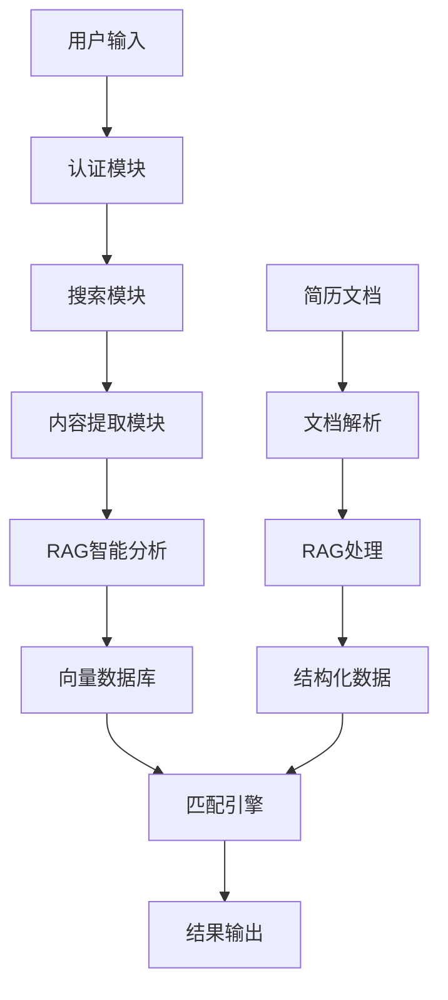

# 智能简历投递系统

基于Python的智能简历投递系统，集成了LangChain RAG技术进行职位信息智能分析。支持智联招聘、前程无忧、Boss直聘等主流招聘网站，使用Selenium进行网页自动化，采用人工登录后自动化操作的方式。

## 🌟 核心特性

- 🤖 **人工登录 + 自动化操作**: 避免验证码和风控检测
- 🧠 **RAG智能分析**: 使用LangChain和智谱GLM-4-Flash分析职位信息
- 📊 **语义匹配**: 基于向量相似度的深度语义理解和职位匹配
- 🛡️ **防反爬机制**: 随机延迟、鼠标轨迹模拟等人类行为
- 💾 **双重数据存储**: SQLite结构化数据 + ChromaDB向量数据库
- ⚙️ **模块化架构**: 登录、提取、分析功能完全分离
- 🔄 **智能去重**: 基于职位指纹的去重机制
- 📈 **性能优化**: 智能缓存、批量处理、并发控制
- 🎯 **简历优化**: AI驱动的简历分析和优化建议
- 📋 **灵活匹配**: 支持任意用户的通用简历匹配系统

## 🚀 快速开始

### 1. 环境要求

- Python 3.8+
- Chrome浏览器（推荐）
- 智谱AI API密钥

### 2. 安装依赖

```bash
# 克隆项目
git clone <repository-url>
cd MyThird

# 创建虚拟环境
python -m venv venv

# 激活虚拟环境
# Windows:
venv\Scripts\activate
# Linux/Mac:
source venv/bin/activate

# 安装依赖
pip install -r requirements.txt
```

### 3. 配置设置

```bash
# 复制配置文件模板
cp config/config.example.yaml config/config.yaml

# 编辑配置文件，设置API密钥等
```

配置智谱AI API密钥：
```yaml
rag_system:
  llm:
    provider: "zhipu"
    model: "glm-4-flash"
    api_key: "your-zhipu-api-key"
```

### 4. 数据库初始化

```bash
# 运行数据库迁移（如果需要）
python migrate_database_for_rag.py
```

## 📋 主要功能

### 🔧 RAG系统管理

#### 查看系统状态
```bash
# 查看完整系统状态
python rag_cli.py status
```

#### 数据流水线操作
```bash
# 运行RAG数据流水线
python rag_cli.py pipeline run --batch-size 20 --show-progress

# 恢复中断的处理
python rag_cli.py pipeline resume --batch-size 10

# 强制重新处理所有数据
python rag_cli.py pipeline run --force-reprocess
```

#### 向量数据库管理
```bash
# 测试向量数据库
python rag_cli.py test --test-search --queries "Python,Java,前端"

# 搜索职位
python rag_cli.py search "Python开发工程师" --limit 5

# 清理向量数据库
python rag_cli.py clear --force

# 查看数据库统计
python rag_cli.py status
```

### 🎯 简历匹配系统

#### 职位匹配
```bash
# 使用通用简历格式匹配
python rag_cli.py match find-jobs --resume data/generic_resume_example.json --limit 20

# 生成匹配报告
python rag_cli.py match generate-report --resume data/resume.json --output report.html

# 分析特定职位匹配度
python rag_cli.py match analyze-fit --resume data/resume.json --job-id job123
```

#### 简历优化
```bash
# 简历优化建议
python rag_cli.py optimize --resume-file resume.json --target-job "Python开发工程师"

# 批量优化多个简历
python rag_cli.py optimize --resume-dir ./resumes/ --output-dir ./optimized/
```

#### 简历文档处理
```bash
# 处理单个简历文档
python rag_cli.py resume process \
    --input resume.md \
    --output resume.json \
    --format markdown

# 批量处理简历文档
python rag_cli.py resume batch-process \
    --input-dir ./resumes/ \
    --output-dir ./processed/ \
    --formats md,docx,pdf \
    --parallel 3

# 验证简历JSON格式
python rag_cli.py resume validate \
    --input resume.json \
    --schema-check \
    --completeness-check

# 完整流程：文档处理 + 职位匹配
python rag_cli.py resume match \
    --input resume.md \
    --limit 20 \
    --output matches.json \
    --include-analysis
```

### 🕷️ 网页内容提取

#### 独立登录测试
```bash
# 基本登录测试
python test_login.py

# 登录并保存会话
python test_login.py --save-session

# 检查登录状态
python test_login.py --check-status
```

#### 内容提取测试
```bash
# 基于关键词提取
python test_extraction.py --keyword "AI工程师"

# 跳过登录检查（开发模式）
python test_extraction.py --keyword "数据架构师" --skip-login

# 批量提取多个关键词
python test_extraction.py --multiple "AI工程师,数据架构师,Python工程师"
```

#### 完整内容提取测试
```bash
# 运行完整的内容提取测试
python test_content_extractor_complete.py
```

### 🧪 测试系统

#### 运行所有测试
```bash
# 运行完整测试套件
python run_all_rag_tests.py

# 运行特定测试套件
python run_all_rag_tests.py --suites functional performance

# 详细日志模式
python run_all_rag_tests.py --verbose
```

#### 单独测试模块
```bash
# 功能测试
python test_rag_system_complete.py

# 性能基准测试
python test_rag_performance_benchmark.py

# 错误场景测试
python test_rag_error_scenarios.py
```

#### 快速测试
```bash
# 快速向量数据库测试
python quick_vector_test.py

# 验证数据库内容
python verify_database.py
```

## 🏗️ 系统架构

### 核心组件

```
智能简历投递系统
├── 🔐 认证模块 (src/auth/)
│   ├── 浏览器管理 (browser_manager.py)
│   ├── 登录管理 (login_manager.py)
│   └── 会话管理 (session_manager.py)
├── 🔍 搜索模块 (src/search/)
│   ├── 搜索自动化 (automation.py)
│   ├── 登录检测 (login_detector.py)
│   └── URL构建 (url_builder.py)
├── 📄 内容提取模块 (src/extraction/)
│   ├── 内容提取器 (content_extractor.py)
│   ├── 页面解析器 (page_parser.py)
│   └── 数据存储 (data_storage.py)
├── 🧠 RAG智能分析模块 (src/rag/)
│   ├── 职位处理器 (job_processor.py, optimized_job_processor.py)
│   ├── 向量管理器 (vector_manager.py)
│   ├── 系统协调器 (rag_system_coordinator.py)
│   ├── 数据流水线 (data_pipeline.py)
│   ├── 简历优化器 (resume_optimizer.py)
│   ├── 简历管理器 (resume_manager.py)
│   ├── 文档解析器 (resume_document_parser.py)
│   ├── 性能优化器 (performance_optimizer.py)
│   └── 错误处理器 (error_handler.py)
├── 🎯 匹配引擎 (src/matcher/)
│   ├── 智能匹配 (smart_matching.py)
│   ├── 语义评分 (semantic_scorer.py)
│   ├── 通用简历匹配 (generic_resume_matcher.py)
│   └── 多维度评分 (multi_dimensional_scorer.py)
├── 💾 数据库模块 (src/database/)
│   ├── 数据模型 (models.py)
│   ├── 数据库操作 (operations.py)
│   └── 向量操作 (vector_ops.py)
└── 🛠️ 工具模块 (src/utils/)
    ├── 日志工具 (logger.py)
    ├── 行为模拟 (behavior_simulator.py)
    └── 指纹生成 (fingerprint.py)
```

### 数据流程



## ⚙️ 配置说明

### 主要配置文件

#### config/config.yaml - 主配置
```yaml
# RAG系统配置
rag_system:
  llm:
    provider: "zhipu"
    model: "glm-4-flash"
    api_key: "your-api-key"
    temperature: 0.1
    max_tokens: 2000
  
  vector_db:
    persist_directory: "./chroma_db"
    collection_name: "job_positions"
  
  processing:
    skip_processed: true
    batch_size: 20
    max_retry_attempts: 3

# 搜索配置
search:
  strategy:
    max_pages: 10
    enable_pagination: true
    page_delay: 2
    max_results_per_keyword: 50

# 去重配置
deduplication:
  enabled: true
  fingerprint_algorithm: "md5"
  fingerprint_length: 12

# 匹配算法配置
matching:
  weights:
    semantic_similarity: 0.35
    skills_match: 0.30
    experience_match: 0.20
    industry_match: 0.10
    salary_match: 0.05
  
  thresholds:
    excellent: 0.85
    good: 0.70
    fair: 0.50
```

#### config/resume_matching_config.yaml - 简历匹配配置
```yaml
resume_matching:
  skills_weights:
    RAG: 2.0
    AI/ML: 1.9
    Azure: 1.8
    LangChain: 1.8
    Python: 1.6
    
  performance:
    batch_size: 50
    max_candidates: 100
    cache_ttl: 3600
```

## 📊 使用示例

### 编程接口使用

#### RAG系统基础使用
```python
import asyncio
from src.rag.rag_system_coordinator import RAGSystemCoordinator

async def main():
    # 初始化RAG系统
    coordinator = RAGSystemCoordinator()
    
    # 运行数据流水线
    result = await coordinator.run_data_pipeline(batch_size=20)
    print(f"处理完成: {result}")
    
    # 搜索职位
    results = coordinator.search_jobs("Python开发工程师", limit=5)
    for job in results:
        print(f"职位: {job.page_content}")

asyncio.run(main())
```

#### 简历匹配使用
```python
from src.matcher.generic_resume_matcher import GenericResumeJobMatcher
from src.matcher.generic_resume_models import GenericResumeProfile

# 创建简历档案
resume = GenericResumeProfile(
    name="张三",
    current_position="高级Python工程师"
)
resume.add_skill_category("编程语言", ["Python", "Java"], "advanced")
resume.add_skill_category("AI/ML", ["TensorFlow", "PyTorch"], "intermediate")

# 执行匹配
matcher = GenericResumeJobMatcher()
matches = matcher.find_matching_jobs(resume, limit=10)

for match in matches:
    print(f"职位: {match['job_title']}")
    print(f"匹配度: {match['overall_score']:.2f}")
    print(f"公司: {match['company']}")
```

#### 内容提取使用
```python
from src.extraction.content_extractor import ContentExtractor

# 独立内容提取
config = {'mode': {'skip_login': True}}
with ContentExtractor(config) as extractor:
    results = extractor.extract_from_keyword("AI工程师", max_results=30)
    print(f"提取到 {len(results)} 个职位")
```

### 简历格式示例

#### 通用格式简历 (data/generic_resume_example.json)
```json
{
  "name": "张三",
  "current_position": "高级前端工程师",
  "total_experience_years": 5,
  "skill_categories": [
    {
      "category_name": "前端技术",
      "skills": ["JavaScript", "React", "Vue.js"],
      "proficiency_level": "advanced",
      "years_experience": 5
    },
    {
      "category_name": "后端技术", 
      "skills": ["Node.js", "Python"],
      "proficiency_level": "intermediate",
      "years_experience": 3
    }
  ],
  "work_history": [
    {
      "company": "某科技公司",
      "position": "高级前端工程师",
      "start_date": "2022-01",
      "end_date": null,
      "duration_years": 2.0,
      "responsibilities": ["负责前端架构设计", "团队技术指导"],
      "achievements": ["性能优化提升50%", "团队效率提升30%"],
      "technologies": ["React", "TypeScript", "Webpack"],
      "industry": "互联网"
    }
  ],
  "profile_type": "frontend_engineer"
}
```

## 🔧 高级功能

### 性能优化

#### 智能缓存
```bash
# 启用缓存优化
python rag_cli.py pipeline run --enable-cache --cache-ttl 3600
```

#### 批量处理优化
```bash
# 调整批处理大小
python rag_cli.py pipeline run --batch-size 50 --parallel 3
```

#### 内存监控
```bash
# 启用内存监控
python rag_cli.py pipeline run --monitor-memory --memory-limit 2048
```

### 错误处理和恢复

#### 自动重试
```bash
# 设置重试次数
python rag_cli.py pipeline run --max-retries 5 --retry-delay 10
```

#### 错误恢复
```bash
# 从检查点恢复
python rag_cli.py pipeline resume --checkpoint-file last_checkpoint.json
```

### 数据质量控制

#### 数据验证
```bash
# 验证数据完整性
python rag_cli.py validate --check-completeness --check-quality
```

#### 质量报告
```bash
# 生成质量报告
python rag_cli.py report --type quality --output quality_report.html
```

## 📈 监控和分析

### 系统监控
```bash
# 查看系统性能指标
python rag_cli.py monitor --metrics performance memory cache

# 生成性能报告
python rag_cli.py report --type performance --period 7d
```

### 数据分析
```bash
# 分析职位数据趋势
python rag_cli.py analyze --type trends --period 30d

# 技能需求分析
python rag_cli.py analyze --type skills --output skills_analysis.json
```

## 🚨 故障排除

### 常见问题

#### 1. API密钥错误
```
错误: Invalid API key
解决: 检查config/config.yaml中的API密钥配置
```

#### 2. 数据库连接失败
```
错误: sqlite3.OperationalError: no such file
解决: 运行 python migrate_database_for_rag.py 初始化数据库
```

#### 3. 向量数据库权限错误
```
错误: PermissionError: Permission denied
解决: 检查chroma_db目录权限，或使用管理员权限运行
```

#### 4. 内存不足
```
错误: MemoryError: Out of memory
解决: 减少批处理大小 --batch-size 10，或增加系统内存
```

### 调试模式
```bash
# 启用详细日志
python rag_cli.py --verbose pipeline run

# 启用调试模式
python rag_cli.py --debug test --test-search
```

### 日志查看
```bash
# 查看最新日志
tail -f logs/rag_system.log

# 查看错误日志
grep ERROR logs/rag_system.log
```

## 🔄 更新和维护

### 系统更新
```bash
# 更新依赖
pip install -r requirements.txt --upgrade

# 数据库迁移
python migrate_database_for_rag.py --upgrade
```

### 数据备份
```bash
# 备份数据库
cp data/jobs.db data/jobs_backup_$(date +%Y%m%d).db

# 备份向量数据库
cp -r chroma_db chroma_db_backup_$(date +%Y%m%d)
```

### 清理和维护
```bash
# 清理临时文件
python rag_cli.py cleanup --temp-files --old-logs

# 优化数据库
python rag_cli.py optimize --vacuum-db --rebuild-index
```

## 📚 扩展开发

### 添加新的网站支持
1. 在 `src/adapters/` 目录下创建新的适配器文件
2. 继承 `BaseAdapter` 类并实现必要方法
3. 在配置文件中添加网站配置
4. 在 `AdapterFactory` 中注册新适配器

### 自定义匹配算法
1. 修改 `src/matcher/scoring.py` 中的评分逻辑
2. 调整配置文件中的权重和阈值
3. 更新AI分析提示词以提取更多维度信息

### 添加新的LLM支持
1. 在 `src/rag/llm_factory.py` 中添加新的LLM适配器
2. 实现LangChain兼容的接口
3. 在配置文件中添加新的LLM配置选项

## 🤝 贡献指南

### 提交代码
1. Fork项目并创建功能分支
2. 添加相应的测试用例
3. 确保所有测试通过
4. 提交Pull Request

### 测试要求
- 新功能必须包含单元测试
- 测试覆盖率不低于80%
- 通过所有现有测试

### 代码规范
- 遵循PEP 8代码风格
- 添加详细的文档字符串
- 使用类型提示

## 📄 许可证

MIT License

## ⚠️ 免责声明

本工具仅供学习和研究使用，使用者需自行承担使用风险，遵守相关法律法规和网站条款。

## 📞 支持

如有问题或建议，请：
- 查看文档: [项目文档链接]
- 提交Issue: [GitHub Issues链接]
- 联系维护者: [联系方式]

---

**最后更新**: 2025-08-22  
**版本**: v2.0.0  
**维护者**: Claude Code Assistant