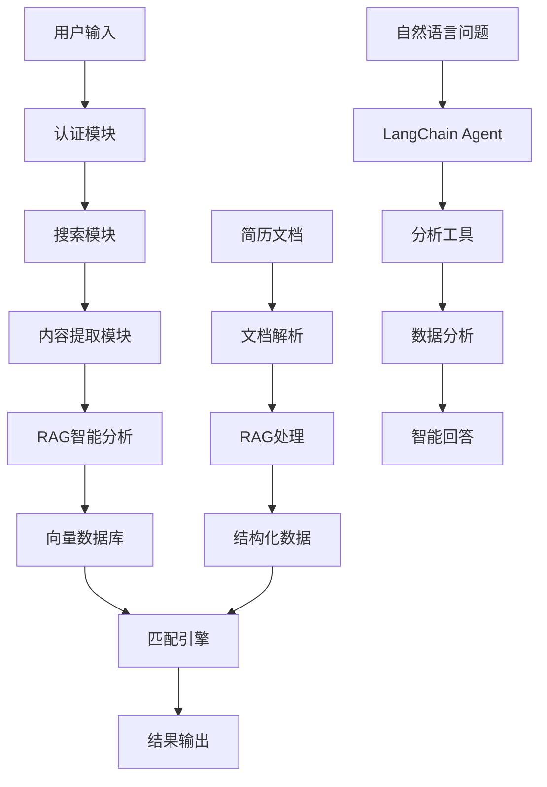

# 智能简历投递系统

基于Python的智能简历投递系统，集成了LangChain RAG技术进行职位信息智能分析。支持智联招聘、前程无忧、Boss直聘等主流招聘网站，使用Selenium进行网页自动化，采用人工登录后自动化操作的方式。

## 🌟 核心特性

- 🤖 **人工登录 + 自动化操作**: 避免验证码和风控检测
- 🧠 **RAG智能分析**: 使用LangChain和智谱GLM-4-Flash分析职位信息
- 💬 **智能问答助手**: 基于自然语言的职位市场数据分析
- 📊 **语义匹配**: 基于向量相似度的深度语义理解和职位匹配
- 🔄 **端到端自动化**: 从职位搜索到简历投递的完整自动化流程
- 🛡️ **防反爬机制**: 随机延迟、鼠标轨迹模拟等人类行为
- 💾 **双重数据存储**: SQLite结构化数据 + ChromaDB向量数据库
- ⚙️ **模块化架构**: 登录、提取、分析功能完全分离
- 🔄 **智能去重**: 基于职位指纹的去重机制
- 📈 **性能优化**: 智能缓存、批量处理、并发控制
- 🎯 **简历优化**: AI驱动的简历分析和优化建议
- 📋 **灵活匹配**: 支持任意用户的通用简历匹配系统
- 🔌 **离线模型支持**: 支持本地向量模型，无需网络依赖

## 📚 文档架构

本项目采用**模块化文档架构**，为Claude Code提供更好的理解和开发体验：

### 🎯 主要文档
- **[`CLAUDE.md`](CLAUDE.md)** - 🏠 **项目总览和快速导航**
  - 系统架构概述
  - 核心特性介绍
  - 快速开始指南
  - 模块文档导航

- **[`src/claude.md`](src/claude.md)** - 📁 **源码模块总览**
  - 完整模块架构图
  - 模块间依赖关系
  - 开发指南和最佳实践
  - 交叉引用导航

### 🔧 模块化专业文档

#### 🤖 智能处理模块
- **[`src/rag/claude.md`](src/rag/claude.md)** - RAG智能分析系统
  - Vector database management, LLM integration, Semantic search
- **[`src/analysis_tools/claude.md`](src/analysis_tools/claude.md)** - LangChain Agent系统
  - Natural language analysis, Market data analysis, Intelligent Q&A
- **[`src/matcher/claude.md`](src/matcher/claude.md)** - 智能匹配引擎
  - Multi-dimensional scoring, Skill matching optimization, Time-aware matching

#### 🔧 系统集成模块
- **[`src/integration/claude.md`](src/integration/claude.md)** - 端到端集成系统
  - Master controller, Decision engine, Pipeline orchestration
- **[`src/core/claude.md`](src/core/claude.md)** - 核心模块
  - Configuration management, Exception handling, Base controllers

#### 🤖 自动化组件
- **[`src/auth/claude.md`](src/auth/claude.md)** - 认证和会话管理
  - Login management, Session persistence, Browser management
- **[`src/search/claude.md`](src/search/claude.md)** - 搜索和导航
  - Search automation, URL building, Navigation control
- **[`src/extraction/claude.md`](src/extraction/claude.md)** - 内容提取
  - Content extraction, Page parsing, Data storage
- **[`src/submission/claude.md`](src/submission/claude.md)** - 简历投递引擎
  - Submission automation, Button recognition, Anti-crawler systems

#### 💾 数据管理
- **[`src/database/claude.md`](src/database/claude.md)** - 数据库管理
  - Data models, Database operations, Vector database integration

## 🚀 快速开始

### 1. 环境要求

- Python 3.8+
- Chrome浏览器（推荐）
- 智谱AI API密钥

### 2. 安装依赖

```bash
# 克隆项目
git clone <repository-url>
cd MyThird

# 创建虚拟环境
python -m venv venv

# 激活虚拟环境
# Windows:
venv\Scripts\activate
# Linux/Mac:
source venv/bin/activate

# 安装依赖
pip install -r requirements.txt
```

### 3. 配置设置

```bash
# 复制配置文件模板
cp config/config.example.yaml config/config.yaml

# 编辑配置文件，设置API密钥等
```

配置智谱AI API密钥：
```yaml
rag_system:
  llm:
    provider: "zhipu"
    model: "glm-4-flash"
    api_key: "your-zhipu-api-key"
```

### 4. 数据库初始化

```bash
# 运行数据库迁移（如果需要）
python migrate_database_for_rag.py
```

## 🔌 离线模型配置

本系统支持本地向量模型，实现完全离线运行，无需网络依赖。适用于企业内网、生产环境或网络受限的场景。

### 🚀 一键设置离线环境

最简单的方式是使用自动化设置脚本：

```bash
# 一键设置离线模型环境（推荐）
python scripts/setup_local_models.py

# 指定性能级别
python scripts/setup_local_models.py --performance balanced  # 平衡模式（默认）
python scripts/setup_local_models.py --performance fast     # 快速模式
python scripts/setup_local_models.py --performance high     # 高性能模式

# 仅检查环境依赖
python scripts/setup_local_models.py --check-only
```

### 📦 可用的离线模型

#### 📊 推荐模型列表

| 模型名称 | 模型ID | 大小 | 性能级别 | 描述 |
|---------|--------|------|----------|------|
| **text2vec-base-chinese** | shibing624/text2vec-base-chinese | ~400MB | balanced | 基础中文向量模型，适合中文语义搜索 |
| **m3e-base** | moka-ai/m3e-base | ~400MB | balanced | M3E中文向量模型，综合性能好 |
| **multilingual-minilm** | sentence-transformers/paraphrase-multilingual-MiniLM-L12-v2 | ~470MB | fast | 轻量级多语言模型，快速推理 |
| **text2vec-large-chinese** | GanymedeNil/text2vec-large-chinese | ~1.2GB | high | 大型中文向量模型，更高精度 |
| **multilingual-mpnet** | sentence-transformers/paraphrase-multilingual-mpnet-base-v2 | ~1GB | high | 多语言MPNet模型，支持中英文 |

#### 🎯 性能模式说明

- **fast（快速模式）**: 适合快速原型开发，推理速度快，内存占用小
- **balanced（平衡模式）**: 推荐生产使用，性能与资源消耗平衡
- **high（高性能模式）**: 适合对准确性要求高的场景，资源消耗较大

### 🛠️ 手动模型管理

#### 查看和下载模型
```bash
# 列出所有可用模型
python scripts/download_models.py list

# 下载指定模型
python scripts/download_models.py download text2vec-base-chinese
python scripts/download_models.py download m3e-base

# 下载推荐模型集合
python scripts/download_models.py download-set --performance balanced

# 验证已下载的模型
python scripts/download_models.py verify ./models/embeddings/text2vec-base-chinese

# 生成配置文件模板
python scripts/download_models.py generate-config --output config/local_models.yaml
```

#### 清理和管理
```bash
# 清理缓存文件
python scripts/download_models.py cleanup --cache

# 显示磁盘使用情况
python scripts/download_models.py info --disk-usage

# 更新模型（如果有新版本）
python scripts/download_models.py update text2vec-base-chinese
```

### ⚙️ 配置离线模式

#### 自动配置（推荐）
运行 `python scripts/setup_local_models.py` 会自动更新配置文件。

#### 手动配置
如果需要手动配置，编辑你的配置文件：

```yaml
# config/config.yaml 或 config/integration_config.yaml
rag_system:
  vector_db:
    embeddings:
      # 启用离线模式
      offline_mode: true
      
      # 指定本地模型路径
      local_model_path: "./models/embeddings/text2vec-base-chinese"
      
      # 模型缓存目录
      cache_folder: "./models/embeddings"
      
      # 设备配置
      device: "cpu"  # 或 "cuda" 如果有GPU
      normalize_embeddings: true
      batch_size: 32
      trust_remote_code: true
      
      # 中文优化设置
      chinese_optimized: true
      performance_level: "balanced"
```

### 🧪 验证离线模式

配置完成后，验证离线模式是否正常工作：

```bash
# 验证系统状态（应该显示离线模式）
python rag_cli.py status

# 测试向量搜索功能
python rag_cli.py test --test-search --queries "Python,Java,前端开发"

# 运行完整功能测试
python rag_cli.py pipeline run --batch-size 10 --dry-run
```

### 🚨 常见问题解决

#### 1. 模型下载失败
```bash
# 问题：网络连接超时
# 解决：使用代理或镜像源
export HF_ENDPOINT=https://hf-mirror.com
python scripts/download_models.py download text2vec-base-chinese

# 或者手动下载后放置到指定目录
```

#### 2. 权限错误
```bash
# 问题：Permission denied
# 解决：检查目录权限
chmod -R 755 ./models/
```

#### 3. 内存不足
```bash
# 问题：CUDA out of memory 或 RAM不足
# 解决：调整配置参数
# 在配置文件中设置：
# device: "cpu"
# batch_size: 16  # 减少批次大小
```

#### 4. 模型加载失败
```bash
# 问题：模型文件损坏或不完整
# 解决：重新下载模型
python scripts/download_models.py download text2vec-base-chinese --force

# 验证模型完整性
python scripts/download_models.py verify ./models/embeddings/text2vec-base-chinese
```

### 📈 性能优化建议

#### GPU加速（推荐）
```yaml
rag_system:
  vector_db:
    embeddings:
      device: "cuda"  # 启用GPU加速
      batch_size: 64  # GPU可以处理更大批次
```

#### 内存优化
```yaml
rag_system:
  vector_db:
    embeddings:
      device: "cpu"
      batch_size: 16  # 减少内存使用
      normalize_embeddings: true  # 启用归一化节省存储
```

#### 并发优化
```yaml
rag_system:
  processing:
    parallel_workers: 4  # 并发处理数量
    chunk_size: 100     # 数据块大小
```

### 🔄 从在线模式迁移

如果你已经使用在线模式，迁移到离线模式：

```bash
# 1. 备份现有向量数据库
cp -r data/test_chroma_db data/test_chroma_db_backup

# 2. 设置离线模型
python scripts/setup_local_models.py

# 3. 重新处理数据（使用新的离线模型）
python rag_cli.py pipeline run --force-reprocess

# 4. 验证迁移结果
python rag_cli.py status
python rag_cli.py test --test-search
```

### 💡 使用建议

1. **开发环境**: 使用 `fast` 模式，快速迭代开发
2. **生产环境**: 使用 `balanced` 模式，性能和资源平衡
3. **高精度需求**: 使用 `high` 模式，获得最佳效果
4. **内网部署**: 提前下载所有需要的模型到目标环境
5. **GPU资源**: 有GPU时优先使用CUDA加速

## 📋 主要功能

### 🤖 智能问答助手

最受欢迎的功能！通过自然语言与AI助手对话，获取职位市场分析：

```bash
# 启动智能问答助手
python rag_cli.py chat
```

**示例对话**：
```
💬 您的问题: 现在哪个技能在市场上机会最多？

🤖 回答:
   根据最新的445个职位数据分析，目前市场上机会最多的技能排名如下：
   • Python - 156个职位 (35.1%市场份额)
   • Java - 134个职位 (30.1%市场份额)
   • JavaScript - 98个职位 (22.0%市场份额)
   
💬 您的问题: Python开发的平均薪资是多少？

🤖 回答:
   基于43个职位的薪资数据分析，Python工程师平均月薪13k，年薪约15万元。
   薪资范围：0k-50k，中位数薪资：5k...
```

### 🔧 RAG系统管理

#### 查看系统状态
```bash
# 查看完整系统状态
python rag_cli.py status
```

#### 数据流水线操作
```bash
# 运行RAG数据流水线
python rag_cli.py pipeline run --batch-size 20 --show-progress

# 恢复中断的处理
python rag_cli.py pipeline resume --batch-size 10

# 强制重新处理所有数据
python rag_cli.py pipeline run --force-reprocess
```

#### 向量数据库管理
```bash
# 测试向量数据库
python rag_cli.py test --test-search --queries "Python,Java,前端"

# 搜索职位
python rag_cli.py search "Python开发工程师" --limit 5

# 清理向量数据库
python rag_cli.py clear --force

# 查看数据库统计
python rag_cli.py status
```

### 🎯 简历匹配系统

#### 职位匹配
```bash
# 使用通用简历格式匹配
python rag_cli.py match find-jobs --resume data/generic_resume_example.json --limit 20

# 生成匹配报告
python rag_cli.py match generate-report --resume data/resume.json --output report.html

# 分析特定职位匹配度
python rag_cli.py match analyze-fit --resume data/resume.json --job-id job123
```

#### 简历优化
```bash
# 简历优化建议
python rag_cli.py optimize --resume-file resume.json --target-job "Python开发工程师"

# 批量优化多个简历
python rag_cli.py optimize --resume-dir ./resumes/ --output-dir ./optimized/
```

#### 简历文档处理
```bash
# 处理单个简历文档
python rag_cli.py resume process \
    --input resume.md \
    --output resume.json \
    --format markdown

# 批量处理简历文档
python rag_cli.py resume batch-process \
    --input-dir ./resumes/ \
    --output-dir ./processed/ \
    --formats md,docx,pdf \
    --parallel 3

# 验证简历JSON格式
python rag_cli.py resume validate \
    --input resume.json \
    --schema-check \
    --completeness-check

# 完整流程：文档处理 + 职位匹配
python rag_cli.py resume match \
    --input resume.md \
    --limit 20 \
    --output matches.json \
    --include-analysis
```

### 🚀 端到端集成系统

完整的自动化求职流程，从职位搜索到简历投递：

```bash
# 基本使用
python src/integration_main.py -k "Python开发" "数据分析师" -l "北京" "上海"

# 干运行模式（推荐测试时使用）
python src/integration_main.py -k "Python开发" --dry-run

# 指定简历文件
python src/integration_main.py -k "Python开发" -r testdata/resume.json

# 健康检查
python src/integration_main.py --health-check
```

### 🕷️ 传统网页投递

#### 智联招聘
```bash
# 基本投递
python src/main.py --website zhilian

# 试运行模式
python src/main.py --website zhilian --dry-run
```

#### Boss直聘
```bash
# Boss直聘投递
python src/main.py --website boss --debug
```

#### 前程无忧
```bash
# 前程无忧投递
python src/main.py --website qiancheng --config custom_config.yaml
```

### 🧪 测试系统

#### 运行所有测试
```bash
# 运行完整测试套件
python run_all_rag_tests.py

# 运行特定测试套件
python run_all_rag_tests.py --suites functional performance

# 详细日志模式
python run_all_rag_tests.py --verbose
```

#### 单独测试模块
```bash
# 功能测试
python test_rag_system_complete.py

# 性能基准测试
python test_rag_performance_benchmark.py

# 错误场景测试
python test_rag_error_scenarios.py

# Agent测试
python test_langchain_agent.py
```

#### 快速测试
```bash
# 快速向量数据库测试
python quick_vector_test.py

# 验证数据库内容
python verify_database.py

# 集成验证
python verify_integration.py
```

## 🏗️ 系统架构

### 项目目录结构

```
MyThird/
├── 📋 文档系统
│   ├── CLAUDE.md                          # 项目总览文档
│   ├── README.md                          # 用户使用指南
│   └── src/claude.md                      # 源码模块总览
│
├── 🚀 系统入口
│   ├── rag_cli.py                         # RAG系统命令行工具
│   ├── src/main.py                        # 传统投递系统入口
│   └── src/integration_main.py            # 集成系统入口
│
├── 🏗️ 源代码目录 (src/)
│   ├── 🤖 智能处理模块
│   │   ├── rag/                          # RAG智能分析系统
│   │   │   ├── claude.md                 # 📋 RAG系统文档
│   │   │   ├── rag_system_coordinator.py # 系统协调器
│   │   │   ├── job_processor.py          # 职位处理器
│   │   │   ├── vector_manager.py         # 向量管理器
│   │   │   ├── semantic_search.py        # 语义搜索引擎
│   │   │   ├── resume_manager.py         # 简历管理器
│   │   │   ├── resume_optimizer.py       # 简历优化器
│   │   │   └── performance_monitor.py    # 性能监控
│   │   │
│   │   ├── analysis_tools/               # LangChain Agent系统
│   │   │   ├── claude.md                 # 📋 Agent系统文档
│   │   │   ├── agent.py                  # LangChain Agent核心
│   │   │   ├── salary_analysis_tool.py   # 薪资分析工具
│   │   │   ├── skill_demand_tool.py      # 技能需求分析工具
│   │   │   └── trend_analysis_tool.py    # 趋势分析工具
│   │   │
│   │   └── matcher/                      # 智能匹配引擎
│   │       ├── claude.md                 # 📋 匹配引擎文档
│   │       ├── generic_resume_matcher.py # 通用简历匹配器
│   │       ├── smart_matching.py         # 智能匹配引擎
│   │       ├── semantic_scorer.py        # 语义评分算法
│   │       └── multi_dimensional_scorer.py # 多维度评分器
│   │
│   ├── 🔧 系统集成模块
│   │   ├── integration/                  # 端到端集成系统
│   │   │   ├── claude.md                 # 📋 集成系统文档
│   │   │   ├── master_controller.py      # 统一主控制器
│   │   │   ├── decision_engine.py        # 智能决策引擎
│   │   │   ├── job_scheduler.py          # 作业调度器
│   │   │   └── monitoring.py             # 监控模块
│   │   │
│   │   └── core/                         # 核心模块
│   │       ├── claude.md                 # 📋 核心模块文档
│   │       ├── config.py                 # 配置管理
│   │       ├── controller.py             # 传统控制器
│   │       └── exceptions.py             # 自定义异常
│   │
│   ├── 🤖 自动化组件
│   │   ├── auth/                         # 认证和会话管理
│   │   │   ├── claude.md                 # 📋 认证系统文档
│   │   │   ├── login_manager.py          # 登录管理器
│   │   │   ├── session_manager.py        # 会话管理器
│   │   │   └── browser_manager.py        # 浏览器管理器
│   │   │
│   │   ├── search/                       # 搜索和导航
│   │   │   ├── claude.md                 # 📋 搜索系统文档
│   │   │   ├── automation.py             # 搜索自动化
│   │   │   ├── url_builder.py            # URL构建器
│   │   │   └── login_detector.py         # 登录检测器
│   │   │
│   │   ├── extraction/                   # 内容提取
│   │   │   ├── claude.md                 # 📋 提取系统文档
│   │   │   ├── content_extractor.py      # 内容提取器
│   │   │   ├── page_parser.py            # 页面解析器
│   │   │   └── data_storage.py           # 数据存储管理
│   │   │
│   │   └── submission/                   # 简历投递引擎
│   │       ├── claude.md                 # 📋 投递系统文档
│   │       ├── submission_engine.py      # 投递引擎核心
│   │       ├── button_recognition.py     # 按钮识别引擎
│   │       ├── job_status_detector.py    # 职位状态检测器
│   │       └── anti_crawler.py           # 反爬虫系统
│   │
│   ├── 💾 数据管理
│   │   └── database/                     # 数据库管理
│   │       ├── claude.md                 # 📋 数据库文档
│   │       ├── models.py                 # 数据模型定义
│   │       ├── operations.py             # 数据库操作
│   │       └── vector_ops.py             # 向量数据库操作
│   │
│   └── 🛠️ 工具模块
│       └── utils/                        # 通用工具
│           ├── logger.py                 # 日志工具
│           ├── behavior_simulator.py     # 行为模拟
│           └── fingerprint.py            # 指纹生成
│
├── ⚙️ 配置文件 (config/)
│   ├── config.yaml                       # 主配置文件
│   ├── integration_config.yaml           # 集成系统配置
│   └── agent_config.yaml                # LangChain Agent配置
│
├── 💾 数据存储 (data/)
│   ├── jobs.db                          # SQLite数据库
│   ├── test_chroma_db/                  # ChromaDB向量数据库
│   └── resume.json                      # 简历数据
│
├── 📊 测试数据 (testdata/)
│   ├── resume.json                      # 测试简历数据
│   └── matches_final.json               # 匹配结果数据
│
├── 🧪 测试脚本 (tests/)
│   ├── test_langchain_agent.py          # Agent测试
│   ├── test_optimized_matching.py       # 匹配测试
│   └── integration/                     # 集成测试
│
└── 📝 批量脚本
    ├── submit_all_jobs.py               # 快速投递脚本
    ├── batch_rematch_jobs.py            # 批量重匹配
    └── verify_integration.py            # 集成验证
```

### 数据流程



## ⚙️ 配置说明

### 主要配置文件

#### config/config.yaml - 主配置
```yaml
# RAG系统配置
rag_system:
  llm:
    provider: "zhipu"
    model: "glm-4-flash"
    api_key: "your-api-key"
    temperature: 0.1
    max_tokens: 2000
  
  vector_db:
    persist_directory: "./data/test_chroma_db"
    collection_name: "job_positions"
  
  processing:
    skip_processed: true
    batch_size: 20
    max_retry_attempts: 3

# 搜索配置
search:
  strategy:
    max_pages: 10
    enable_pagination: true
    page_delay: 2
    max_results_per_keyword: 50

# 去重配置
deduplication:
  enabled: true
  fingerprint_algorithm: "md5"
  fingerprint_length: 12

# 匹配算法配置
matching:
  weights:
    semantic_similarity: 0.35
    skills_match: 0.30
    experience_match: 0.20
    industry_match: 0.10
    salary_match: 0.05
  
  thresholds:
    excellent: 0.85
    good: 0.70
    fair: 0.50
```

#### config/agent_config.yaml - Agent配置
```yaml
langchain_agent:
  llm:
    provider: "zhipu"
    model: "glm-4-flash"
    temperature: 0.1
    max_tokens: 2000
  
  tools:
    skill_demand_analysis:
      enabled: true
      default_limit: 20
    salary_analysis:
      enabled: true
      include_percentiles: true
    trend_analysis:
      enabled: true
      default_period_days: 30
```

#### config/integration_config.yaml - 集成配置
```yaml
integration_system:
  master_controller:
    max_concurrent_jobs: 10
    checkpoint_interval: 100
    error_retry_attempts: 3
  
  auto_submission:
    enabled: true
    dry_run_mode: true  # 测试时设为true
    max_submissions_per_day: 50
    submission_delay: 5
```

## 📊 使用示例

### 编程接口使用

#### RAG系统基础使用
```python
import asyncio
from src.rag.rag_system_coordinator import RAGSystemCoordinator

async def main():
    # 初始化RAG系统
    coordinator = RAGSystemCoordinator()
    
    # 运行数据流水线
    result = await coordinator.run_data_pipeline(batch_size=20)
    print(f"处理完成: {result}")
    
    # 搜索职位
    results = coordinator.search_jobs("Python开发工程师", limit=5)
    for job in results:
        print(f"职位: {job.page_content}")

asyncio.run(main())
```

#### 智能问答使用
```python
from src.analysis_tools.agent import JobMarketAnalysisAgent
from src.rag.rag_system_coordinator import RAGSystemCoordinator

# 初始化系统
coordinator = RAGSystemCoordinator()
coordinator.initialize_system()

# 创建Agent
agent = JobMarketAnalysisAgent(coordinator)

# 进行分析
response = agent.analyze("Python工程师的市场需求如何？")
print(response)
```

#### 简历匹配使用
```python
from src.matcher.generic_resume_matcher import GenericResumeJobMatcher
from src.matcher.generic_resume_models import GenericResumeProfile

# 创建简历档案
resume = GenericResumeProfile(
    name="张三",
    current_position="高级Python工程师"
)
resume.add_skill_category("编程语言", ["Python", "Java"], "advanced")
resume.add_skill_category("AI/ML", ["TensorFlow", "PyTorch"], "intermediate")

# 执行匹配
matcher = GenericResumeJobMatcher()
matches = matcher.find_matching_jobs(resume, limit=10)

for match in matches:
    print(f"职位: {match['job_title']}")
    print(f"匹配度: {match['overall_score']:.2f}")
    print(f"公司: {match['company']}")
```

#### 端到端集成使用
```python
import asyncio
from src.integration_main import IntegratedResumeSystem

async def main():
    # 创建系统实例
    system = IntegratedResumeSystem()
    
    # 准备简历档案
    resume_profile = {
        'name': '张三',
        'skills': ['Python', '机器学习', '数据分析'],
        'experience': '3年',
        'location_preference': ['北京', '上海']
    }
    
    # 运行流水线
    result = await system.run_pipeline(
        search_keywords=['Python开发', '数据分析师'],
        resume_profile=resume_profile,
        submission_config={'dry_run_mode': True}
    )
    
    print(f"执行结果: {result}")

asyncio.run(main())
```

### 简历格式示例

#### 通用格式简历 (data/generic_resume_example.json)
```json
{
  "name": "张三",
  "current_position": "高级前端工程师",
  "total_experience_years": 5,
  "skill_categories": [
    {
      "category_name": "前端技术",
      "skills": ["JavaScript", "React", "Vue.js"],
      "proficiency_level": "advanced",
      "years_experience": 5
    },
    {
      "category_name": "后端技术", 
      "skills": ["Node.js", "Python"],
      "proficiency_level": "intermediate",
      "years_experience": 3
    }
  ],
  "work_history": [
    {
      "company": "某科技公司",
      "position": "高级前端工程师",
      "start_date": "2022-01",
      "end_date": null,
      "duration_years": 2.0,
      "responsibilities": ["负责前端架构设计", "团队技术指导"],
      "achievements": ["性能优化提升50%", "团队效率提升30%"],
      "technologies": ["React", "TypeScript", "Webpack"],
      "industry": "互联网"
    }
  ],
  "profile_type": "frontend_engineer"
}
```

## 🔧 高级功能

### 性能优化

#### 智能缓存
```bash
# 启用缓存优化
python rag_cli.py pipeline run --enable-cache --cache-ttl 3600
```

#### 批量处理优化
```bash
# 调整批处理大小
python rag_cli.py pipeline run --batch-size 50 --parallel 3
```

#### 内存监控
```bash
# 启用内存监控
python rag_cli.py pipeline run --monitor-memory --memory-limit 2048
```

### 错误处理和恢复

#### 自动重试
```bash
# 设置重试次数
python rag_cli.py pipeline run --max-retries 5 --retry-delay 10
```

#### 错误恢复
```bash
# 从检查点恢复
python rag_cli.py pipeline resume --checkpoint-file last_checkpoint.json
```

### 数据质量控制

#### 数据验证
```bash
# 验证数据完整性
python rag_cli.py validate --check-completeness --check-quality
```

#### 质量报告
```bash
# 生成质量报告
python rag_cli.py report --type quality --output quality_report.html
```

## 📈 监控和分析

### 系统监控
```bash
# 查看系统性能指标
python rag_cli.py monitor --metrics performance memory cache

# 生成性能报告
python rag_cli.py report --type performance --period 7d
```

### 数据分析
```bash
# 分析职位数据趋势
python rag_cli.py analyze --type trends --period 30d

# 技能需求分析
python rag_cli.py analyze --type skills --output skills_analysis.json
```

## 🚨 故障排除

### 常见问题

#### 1. API密钥错误
```
错误: Invalid API key
解决: 检查config/config.yaml中的API密钥配置
```

#### 2. 数据库连接失败
```
错误: sqlite3.OperationalError: no such file
解决: 运行 python migrate_database_for_rag.py 初始化数据库
```

#### 3. 向量数据库权限错误
```
错误: PermissionError: Permission denied
解决: 检查data/test_chroma_db目录权限，或使用管理员权限运行
```

#### 4. 内存不足
```
错误: MemoryError: Out of memory
解决: 减少批处理大小 --batch-size 10，或增加系统内存
```

#### 5. Agent工具调用失败
```
错误: Tool execution failed
解决: 检查工具注册和LLM配置，确保API密钥正确
```

### 调试模式
```bash
# 启用详细日志
python rag_cli.py --verbose pipeline run

# 启用调试模式
python rag_cli.py --debug test --test-search

# Agent调试
python rag_cli.py chat --verbose
```

### 日志查看
```bash
# 查看最新日志
tail -f logs/rag_system.log

# 查看错误日志
grep ERROR logs/rag_system.log

# 查看Agent日志
tail -f logs/agent.log
```

## 🔄 更新和维护

### 系统更新
```bash
# 更新依赖
pip install -r requirements.txt --upgrade

# 数据库迁移
python migrate_database_for_rag.py --upgrade
```

### 数据备份
```bash
# 备份数据库
cp data/jobs.db data/jobs_backup_$(date +%Y%m%d).db

# 备份向量数据库
cp -r data/test_chroma_db data/test_chroma_db_backup_$(date +%Y%m%d)
```

### 清理和维护
```bash
# 清理临时文件
python rag_cli.py cleanup --temp-files --old-logs

# 优化数据库
python rag_cli.py optimize --vacuum-db --rebuild-index
```

## 📚 扩展开发

### 添加新的网站支持
1. 在 `src/adapters/` 目录下创建新的适配器文件
2. 继承 `BaseAdapter` 类并实现必要方法
3. 在配置文件中添加网站配置
4. 在 `AdapterFactory` 中注册新适配器

### 自定义匹配算法
1. 修改 `src/matcher/scoring.py` 中的评分逻辑
2. 调整配置文件中的权重和阈值
3. 更新AI分析提示词以提取更多维度信息

### 添加新的LLM支持
1. 在 `src/rag/llm_factory.py` 中添加新的LLM适配器
2. 实现LangChain兼容的接口
3. 在配置文件中添加新的LLM配置选项

### 添加新的分析工具
1. 继承 `BaseAnalysisTool` 类
2. 实现必需的字段和方法
3. 在Agent中注册新工具
4. 更新配置文件

## 🤝 贡献指南

### 提交代码
1. Fork项目并创建功能分支
2. 添加相应的测试用例
3. 确保所有测试通过
4. 提交Pull Request

### 测试要求
- 新功能必须包含单元测试
- 测试覆盖率不低于80%
- 通过所有现有测试

### 代码规范
- 遵循PEP 8代码风格
- 添加详细的文档字符串
- 使用类型提示

## 📄 许可证

MIT License

## ⚠️ 免责声明

本工具仅供学习和研究使用，使用者需自行承担使用风险，遵守相关法律法规和网站条款。

## 📞 支持

如有问题或建议，请：
- 查看文档: [CLAUDE.md](CLAUDE.md) - 完整的项目文档
- 查看模块文档: [src/claude.md](src/claude.md) - 源码模块指南
- 提交Issue: [GitHub Issues链接]
- 联系维护者: [联系方式]

---

**最后更新**: 2025-08-31  
**版本**: v3.4.1  
**维护者**: Claude Code Assistant

## 🎯 快速导航

### 📋 核心功能
- [智能问答助手](#-智能问答助手) - 最受欢迎的功能
- [RAG系统管理](#-rag系统管理) - 核心数据处理
- [简历匹配系统](#-简历匹配系统) - 智能匹配功能
- [端到端集成系统](#-端到端集成系统) - 完整自动化流程
- [离线模型配置](#-离线模型配置) - 本地模型支持，无需网络依赖

### 📚 文档系统
- **[CLAUDE.md](CLAUDE.md)** - 项目总览和架构文档
- **[src/claude.md](src/claude.md)** - 源码模块总览和开发指南
- **模块专业文档** - 12个专业模块的详细文档

### 🔧 系统配置
- [配置说明](#️-配置说明) - 详细配置指南
- [环境要求](#1-环境要求) - 系统环境配置
- [快速开始](#-快速开始) - 快速上手指南

### 🛠️ 开发和维护
- [扩展开发](#-扩展开发) - 功能扩展指南
- [故障排除](#-故障排除) - 问题解决方案
- [更新和维护](#-更新和维护) - 系统维护指南