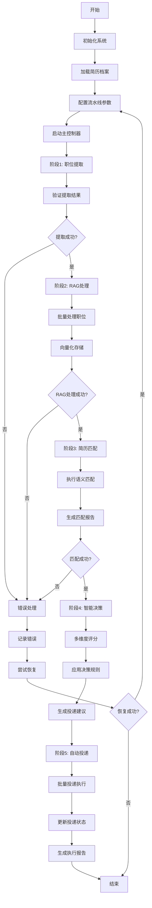

# 系统集成实施指南

## 📋 实施概述

本指南提供了智能简历投递系统端到端集成的详细实施步骤和技术规范。

## 🏗️ 核心组件实施规范

### 1. 统一主控制器 (MasterController)

#### 文件位置
```
src/integration/master_controller.py
```

#### 核心类设计

```python
class MasterController:
    """统一主控制器 - 协调整个端到端流程"""
    
    def __init__(self, config: Dict[str, Any]):
        # 初始化所有子模块
        self.job_extractor = ContentExtractor(config)
        self.rag_coordinator = RAGSystemCoordinator(config)
        self.resume_matcher = GenericResumeJobMatcher(config)
        self.decision_engine = DecisionEngine(config)
        self.auto_submitter = AutoSubmissionEngine(config)
        self.data_bridge = DataBridge(config)
        self.job_scheduler = JobScheduler(config)
    
    async def run_full_pipeline(self, resume_profile, pipeline_config):
        """执行完整的端到端流水线"""
        # 阶段1: 职位提取
        extraction_result = await self._execute_job_extraction(pipeline_config)
        
        # 阶段2: RAG处理
        rag_result = await self._execute_rag_processing(extraction_result)
        
        # 阶段3: 简历匹配
        matching_result = await self._execute_resume_matching(rag_result, resume_profile)
        
        # 阶段4: 智能决策
        decision_result = await self._execute_intelligent_decision(matching_result)
        
        # 阶段5: 自动投递
        submission_result = await self._execute_auto_submission(decision_result)
        
        return self._generate_execution_report(extraction_result, rag_result, matching_result, submission_result)
```

#### 关键方法实现

```python
async def _execute_job_extraction(self, pipeline_config):
    """执行职位提取阶段"""
    try:
        extraction_tasks = []
        for keyword in pipeline_config.search_keywords:
            task = self.job_extractor.extract_from_keyword(
                keyword=keyword,
                max_results=pipeline_config.max_jobs_per_keyword,
                max_pages=pipeline_config.max_pages
            )
            extraction_tasks.append(task)
        
        # 并发执行提取任务
        results = await asyncio.gather(*extraction_tasks, return_exceptions=True)
        
        # 合并和验证结果
        combined_results = self._merge_extraction_results(results)
        
        return {
            'success': True,
            'total_extracted': len(combined_results),
            'jobs': combined_results,
            'extraction_time': time.time() - start_time
        }
    except Exception as e:
        logger.error(f"职位提取失败: {e}")
        return {'success': False, 'error': str(e)}

async def _execute_rag_processing(self, extraction_result):
    """执行RAG处理阶段"""
    if not extraction_result['success']:
        return {'success': False, 'error': 'Extraction failed'}
    
    try:
        # 将提取的职位数据转换为RAG输入格式
        rag_input = self.data_bridge.transform_extraction_to_rag(extraction_result)
        
        # 批量处理职位数据
        rag_result = await self.rag_coordinator.import_database_jobs(
            batch_size=50,
            force_reprocess=False
        )
        
        return {
            'success': True,
            'processed_count': rag_result.get('total_imported', 0),
            'processing_time': rag_result.get('processing_time', 0),
            'success_rate': rag_result.get('success_rate', 0)
        }
    except Exception as e:
        logger.error(f"RAG处理失败: {e}")
        return {'success': False, 'error': str(e)}

async def _execute_resume_matching(self, rag_result, resume_profile):
    """执行简历匹配阶段"""
    if not rag_result['success']:
        return {'success': False, 'error': 'RAG processing failed'}
    
    try:
        # 执行简历匹配
        matching_result = await self.resume_matcher.find_matching_jobs(
            resume_profile=resume_profile,
            top_k=50
        )
        
        return {
            'success': True,
            'total_matches': matching_result.matching_summary.total_matches,
            'high_priority': matching_result.matching_summary.high_priority,
            'medium_priority': matching_result.matching_summary.medium_priority,
            'low_priority': matching_result.matching_summary.low_priority,
            'matches': matching_result.matches,
            'processing_time': matching_result.matching_summary.processing_time
        }
    except Exception as e:
        logger.error(f"简历匹配失败: {e}")
        return {'success': False, 'error': str(e)}
```

### 2. 数据传递接口 (DataBridge)

#### 文件位置
```
src/integration/data_bridge.py
```

#### 核心功能设计

```python
@dataclass
class PipelineData:
    """流水线数据容器"""
    pipeline_id: str
    resume_profile: GenericResumeProfile
    config: PipelineConfig
    start_time: float
    extraction_result: Optional[Dict] = None
    rag_result: Optional[Dict] = None
    matching_result: Optional[Dict] = None
    decision_result: Optional[Dict] = None
    submission_result: Optional[Dict] = None
    metadata: Dict[str, Any] = field(default_factory=dict)

class DataBridge:
    """数据传递桥接器"""
    
    def __init__(self, config: Dict[str, Any]):
        self.config = config
        self.validation_enabled = config.get('data_bridge', {}).get('validation_enabled', True)
        self.transformation_cache = {}
    
    def transform_extraction_to_rag(self, extraction_result: Dict) -> Dict:
        """转换职位提取结果为RAG输入格式"""
        if not self._validate_extraction_result(extraction_result):
            raise ValueError("Invalid extraction result format")
        
        jobs = extraction_result.get('jobs', [])
        transformed_jobs = []
        
        for job in jobs:
            transformed_job = {
                'job_id': job.get('id') or self._generate_job_id(job),
                'title': job.get('title', ''),
                'company': job.get('company', ''),
                'location': job.get('location', ''),
                'description': job.get('description', ''),
                'requirements': job.get('requirements', ''),
                'salary': job.get('salary', ''),
                'url': job.get('url', ''),
                'source': job.get('source', 'extraction'),
                'extracted_at': datetime.now().isoformat()
            }
            transformed_jobs.append(transformed_job)
        
        return {
            'jobs': transformed_jobs,
            'total_count': len(transformed_jobs),
            'transformation_time': datetime.now().isoformat()
        }
    
    def transform_rag_to_matching(self, rag_result: Dict) -> Dict:
        """转换RAG结果为匹配输入格式"""
        if not self._validate_rag_result(rag_result):
            raise ValueError("Invalid RAG result format")
        
        return {
            'processed_jobs_count': rag_result.get('processed_count', 0),
            'vector_db_ready': rag_result.get('success', False),
            'processing_quality': rag_result.get('success_rate', 0),
            'ready_for_matching': True
        }
```

### 3. 作业调度器 (JobScheduler)

#### 文件位置
```
src/integration/job_scheduler.py
```

#### 核心设计

```python
class JobScheduler:
    """作业调度器 - 管理任务队列和执行顺序"""
    
    def __init__(self, config: Dict[str, Any]):
        self.config = config
        self.task_queue = asyncio.Queue(maxsize=config.get('queue_size', 1000))
        self.running_tasks = {}
        self.completed_tasks = {}
        self.failed_tasks = {}
        self.max_concurrent = config.get('max_concurrent_jobs', 10)
        self.semaphore = asyncio.Semaphore(self.max_concurrent)
    
    async def schedule_pipeline_task(self, task_type: str, task_data: Dict, priority: int = 1):
        """调度流水线任务"""
        task = PipelineTask(
            task_id=f"{task_type}_{int(time.time())}",
            task_type=task_type,
            data=task_data,
            priority=priority,
            created_at=datetime.now()
        )
        
        await self.task_queue.put(task)
        logger.info(f"任务已调度: {task.task_id}")
        return task.task_id
    
    async def execute_task_batch(self, tasks: List[PipelineTask]):
        """批量执行任务"""
        async def execute_single_task(task):
            async with self.semaphore:
                try:
                    result = await self._execute_task(task)
                    self.completed_tasks[task.task_id] = result
                    return result
                except Exception as e:
                    self.failed_tasks[task.task_id] = str(e)
                    logger.error(f"任务执行失败 {task.task_id}: {e}")
                    return None
        
        # 并发执行任务
        results = await asyncio.gather(
            *[execute_single_task(task) for task in tasks],
            return_exceptions=True
        )
        
        return results
```

### 4. 智能决策引擎 (DecisionEngine)

#### 文件位置
```
src/integration/decision_engine.py
```

#### 核心算法设计

```python
class DecisionEngine:
    """智能决策引擎 - 基于多维度评分的投递决策"""
    
    def __init__(self, config: Dict[str, Any]):
        self.config = config
        self.decision_criteria = config.get('decision_criteria', {})
        self.learning_enabled = config.get('enable_learning', True)
        self.decision_history = []
    
    async def make_submission_decisions(self, matching_result: Dict) -> Dict:
        """制定投递决策"""
        matches = matching_result.get('matches', [])
        decisions = []
        
        for match in matches:
            decision = await self._evaluate_single_match(match)
            decisions.append(decision)
        
        # 应用全局约束
        final_decisions = self._apply_global_constraints(decisions)
        
        return {
            'total_evaluated': len(matches),
            'recommended_submissions': len([d for d in final_decisions if d['should_submit']]),
            'decisions': final_decisions,
            'decision_time': datetime.now().isoformat()
        }
    
    async def _evaluate_single_match(self, match: Dict) -> Dict:
        """评估单个匹配结果"""
        # 多维度评分
        scores = {
            'match_score': match.get('overall_score', 0),
            'company_reputation': await self._evaluate_company_reputation(match.get('company', '')),
            'salary_attractiveness': self._evaluate_salary_attractiveness(match.get('salary_range', {})),
            'location_preference': self._evaluate_location_preference(match.get('location', '')),
            'career_growth_potential': self._evaluate_career_growth(match),
            'application_competition': await self._evaluate_competition_level(match)
        }
        
        # 加权计算最终分数
        weights = self.decision_criteria.get('weights', {})
        final_score = sum(scores[key] * weights.get(key, 0.1) for key in scores)
        
        # 决策逻辑
        should_submit = final_score >= self.decision_criteria.get('submission_threshold', 0.7)
        
        return {
            'job_id': match.get('job_id'),
            'job_title': match.get('job_title'),
            'company': match.get('company'),
            'final_score': final_score,
            'dimension_scores': scores,
            'should_submit': should_submit,
            'submission_priority': self._calculate_priority(final_score),
            'decision_reasoning': self._generate_reasoning(scores, should_submit)
        }
```

### 5. 自动投递引擎 (AutoSubmissionEngine)

#### 文件位置
```
src/integration/auto_submission_engine.py
```

#### 核心功能设计

```python
class AutoSubmissionEngine:
    """自动投递引擎 - 执行智能投递操作"""
    
    def __init__(self, config: Dict[str, Any]):
        self.config = config
        self.submission_config = config.get('auto_submission', {})
        self.browser_manager = None
        self.session_manager = None
        self.submission_stats = {
            'total_attempts': 0,
            'successful_submissions': 0,
            'failed_submissions': 0,
            'daily_submission_count': 0
        }
    
    async def initialize(self):
        """初始化投递引擎"""
        # 初始化浏览器管理器
        from ..auth.browser_manager import BrowserManager
        from ..auth.session_manager import SessionManager
        
        self.browser_manager = BrowserManager(self.config)
        self.session_manager = SessionManager(self.config)
        
        # 启动浏览器并等待登录
        await self.browser_manager.start_browser()
        await self._wait_for_user_login()
    
    async def submit_applications(self, decision_result: Dict) -> Dict:
        """批量提交简历申请"""
        decisions = decision_result.get('decisions', [])
        submission_candidates = [d for d in decisions if d['should_submit']]
        
        # 按优先级排序
        submission_candidates.sort(key=lambda x: x['submission_priority'], reverse=True)
        
        # 应用每日限制
        daily_limit = self.submission_config.get('max_submissions_per_day', 50)
        if self.submission_stats['daily_submission_count'] >= daily_limit:
            logger.warning(f"已达到每日投递限制: {daily_limit}")
            return self._create_submission_result([], "Daily limit reached")
        
        # 执行投递
        submission_results = []
        for candidate in submission_candidates[:daily_limit]:
            if self.submission_stats['daily_submission_count'] >= daily_limit:
                break
            
            result = await self._submit_single_application(candidate)
            submission_results.append(result)
            
            # 添加延迟避免被检测
            delay = self.submission_config.get('submission_delay', 5)
            await asyncio.sleep(delay)
        
        return self._create_submission_result(submission_results)
    
    async def _submit_single_application(self, candidate: Dict) -> Dict:
        """提交单个申请"""
        try:
            job_url = candidate.get('job_url')
            if not job_url:
                return {'success': False, 'error': 'Missing job URL'}
            
            # 导航到职位页面
            await self.browser_manager.navigate_to_job(job_url)
            
            # 检查是否已经申请过
            if await self._check_already_applied():
                return {'success': False, 'error': 'Already applied'}
            
            # 执行投递操作
            success = await self._perform_application_submission()
            
            if success:
                self.submission_stats['successful_submissions'] += 1
                self.submission_stats['daily_submission_count'] += 1
                
                return {
                    'success': True,
                    'job_id': candidate.get('job_id'),
                    'job_title': candidate.get('job_title'),
                    'company': candidate.get('company'),
                    'submitted_at': datetime.now().isoformat()
                }
            else:
                self.submission_stats['failed_submissions'] += 1
                return {'success': False, 'error': 'Submission failed'}
                
        except Exception as e:
            logger.error(f"投递失败: {e}")
            self.submission_stats['failed_submissions'] += 1
            return {'success': False, 'error': str(e)}
```

## 🔄 集成工作流程

### 完整执行流程图



### 数据流转规范

```python
# 阶段1: 职位提取 -> RAG处理
extraction_output = {
    'success': True,
    'total_extracted': 150,
    'jobs': [
        {
            'id': 'job_001',
            'title': 'Python开发工程师',
            'company': '科技公司A',
            'location': '北京',
            'description': '...',
            'requirements': '...',
            'salary': '20-30K',
            'url': 'https://...'
        }
    ]
}

# 阶段2: RAG处理 -> 简历匹配
rag_output = {
    'success': True,
    'processed_count': 145,
    'processing_time': 120.5,
    'success_rate': 0.97,
    'vector_db_stats': {
        'document_count': 725,
        'collection_name': 'job_positions'
    }
}

# 阶段3: 简历匹配 -> 智能决策
matching_output = {
    'success': True,
    'total_matches': 45,
    'high_priority': 12,
    'medium_priority': 20,
    'low_priority': 13,
    'matches': [
        {
            'job_id': 'job_001',
            'overall_score': 0.85,
            'match_level': 'excellent',
            'recommendation_priority': 'high'
        }
    ]
}

# 阶段4: 智能决策 -> 自动投递
decision_output = {
    'total_evaluated': 45,
    'recommended_submissions': 15,
    'decisions': [
        {
            'job_id': 'job_001',
            'should_submit': True,
            'final_score': 0.82,
            'submission_priority': 'high'
        }
    ]
}

# 阶段5: 自动投递结果
submission_output = {
    'total_attempts': 15,
    'successful_submissions': 12,
    'failed_submissions': 3,
    'submission_details': [
        {
            'job_id': 'job_001',
            'success': True,
            'submitted_at': '2025-08-22T13:30:00'
        }
    ]
}
```

## 📊 监控和报告

### 实时监控指标

```python
monitoring_metrics = {
    'pipeline_status': {
        'current_stage': 'rag_processing',
        'progress_percentage': 65.5,
        'estimated_completion': '2025-08-22T14:15:00'
    },
    'performance_metrics': {
        'extraction_rate': 2.5,  # jobs/second
        'rag_processing_rate': 1.2,  # jobs/second
        'matching_rate': 5.8,  # matches/second
        'submission_rate': 0.3  # submissions/second
    },
    'resource_usage': {
        'cpu_usage': 45.2,
        'memory_usage': 1024,  # MB
        'disk_usage': 2048  # MB
    },
    'error_statistics': {
        'total_errors': 5,
        'error_rate': 0.03,
        'recovery_rate': 0.8
    }
}
```

### 执行报告模板

```python
execution_report = {
    'pipeline_summary': {
        'pipeline_id': 'pipeline_1692696000',
        'execution_time': 1800.5,  # seconds
        'total_jobs_processed': 150,
        'success_rate': 0.94
    },
    'stage_results': {
        'extraction': {
            'jobs_extracted': 150,
            'extraction_time': 300.2,
            'success_rate': 1.0
        },
        'rag_processing': {
            'jobs_processed': 145,
            'processing_time': 720.8,
            'success_rate': 0.97
        },
        'matching': {
            'matches_found': 45,
            'matching_time': 180.3,
            'average_score': 0.72
        },
        'decision': {
            'jobs_evaluated': 45,
            'recommended_submissions': 15,
            'decision_time': 45.1
        },
        'submission': {
            'submission_attempts': 15,
            'successful_submissions': 12,
            'submission_time': 450.2
        }
    },
    'recommendations': [
        '建议增加RAG处理的批次大小以提高效率',
        '考虑调整匹配阈值以获得更多候选职位',
        '优化投递间隔以避免被检测'
    ]
}
```

## 🚀 部署配置

### 生产环境配置

```yaml
# production_config.yaml
integration_system:
  master_controller:
    max_concurrent_jobs: 20
    checkpoint_interval: 50
    error_retry_attempts: 5
    enable_monitoring: true
    
  job_scheduler:
    queue_size: 2000
    batch_size: 100
    priority_levels: 5
    max_concurrent_tasks: 15
    
  data_bridge:
    validation_enabled: true
    transformation_cache: true
    cache_ttl: 7200
    data_retention_days: 90

performance_optimization:
  caching:
    enabled: true
    cache_size: 50000
    ttl_seconds: 7200
    
  concurrency:
    max_workers: 20
    semaphore_limit: 10
    
  database:
    connection_pool_size: 50
    query_timeout: 60
    batch_insert_size: 1000

monitoring:
  metrics_collection: true
  real_time_dashboard: true
  alert_thresholds:
    error_rate: 0.05
    processing_speed: 200
    memory_usage: 0.85
    cpu_usage: 0.80
  
  logging:
    level: INFO
    file_rotation: daily
    max_file_size: 100MB
    retention_days: 30
```

## 📋 实施检查清单

### 开发阶段检查项

- [ ] 创建 `src/integration/` 目录结构
- [ ] 实现 `MasterController` 类
- [ ] 实现 `DataBridge` 类
- [ ] 实现 `JobScheduler` 类
- [ ] 实现 `DecisionEngine` 类
- [ ] 实现 `AutoSubmissionEngine` 类
- [ ] 创建数据模型和接口定义
- [ ] 实现错误处理和恢复机制
- [ ] 添加日志和监控功能
- [ ] 编写单元测试
- [ ] 编写集成测试
- [ ] 性能测试和优化

### 部署阶段检查项

- [ ] 配置生产环境参数
- [ ] 设置数据库连接池
- [ ] 配置缓存系统
- [ ] 设置监控告警
- [ ] 配置日志轮转
- [ ] 设置备份策略
- [ ] 配置负载均衡
- [ ] 设置健康检查
- [ ] 配置自动重启
- [ ] 文档和运维手册

### 验收测试检查项

- [ ] 端到端流程测试
- [ ] 性能基准测试
- [ ] 错误恢复测试
- [ ] 并发处理测试
- [ ] 数据一致性测试
- [ ] 安全性测试
- [ ] 用户接受度测试
- [ ] 生产环境验证

这个实施指南提供了完整的技术规范和实施步骤，可以指导开发团队完成系统集成工作。