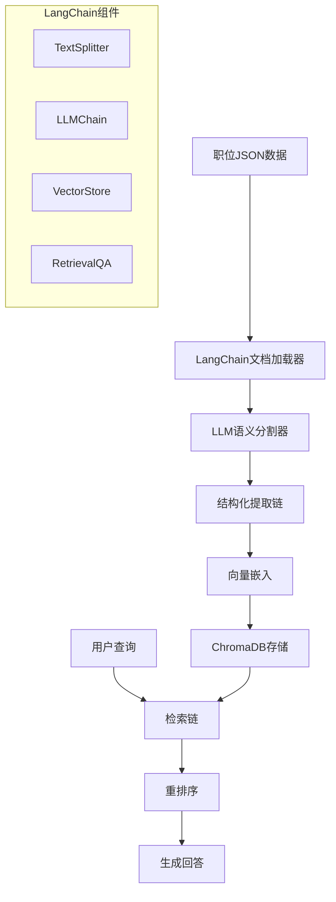

# 基于LangChain的RAG职位信息处理系统

## 🎯 LangChain优势

LangChain提供了完整的RAG工具链，包括：
- **文本分割器**: 多种智能分割策略
- **向量存储**: 集成ChromaDB等向量数据库
- **LLM集成**: 支持多种大语言模型
- **链式处理**: 构建复杂的处理流程
- **模板系统**: 标准化的Prompt管理

## 🏗️ 系统架构



## 🔧 核心实现

### 1. 环境配置

```python
# requirements.txt
langchain==0.1.0
langchain-community==0.0.10
langchain-openai==0.0.5
chromadb==0.4.22
sentence-transformers==2.2.2
pydantic==2.5.0
```

### 2. LangChain智能文本分割器

```python
from langchain.text_splitter import RecursiveCharacterTextSplitter
from langchain.schema import Document
from langchain.llms import OpenAI
from langchain.chains import LLMChain
from langchain.prompts import PromptTemplate
from langchain.output_parsers import PydanticOutputParser
from pydantic import BaseModel, Field
from typing import List, Dict
import json

class JobStructure(BaseModel):
    """职位结构化数据模型"""
    job_title: str = Field(description="职位名称")
    company: str = Field(description="公司名称")
    responsibilities: List[str] = Field(description="岗位职责列表")
    requirements: List[str] = Field(description="人员要求列表")
    skills: List[str] = Field(description="技能要求列表")
    education: str = Field(description="学历要求")
    experience: str = Field(description="经验要求")

class LangChainJobProcessor:
    """基于LangChain的职位数据处理器"""
    
    def __init__(self, llm_model="gpt-3.5-turbo"):
        # 初始化LLM
        self.llm = OpenAI(
            model_name=llm_model,
            temperature=0.1,
            max_tokens=2000
        )
        
        # 初始化输出解析器
        self.output_parser = PydanticOutputParser(pydantic_object=JobStructure)
        
        # 构建结构化提取链
        self.extraction_chain = self._build_extraction_chain()
        
        # 初始化语义分割器
        self.semantic_splitter = self._build_semantic_splitter()
    
    def _build_extraction_chain(self) -> LLMChain:
        """构建结构化提取链"""
        
        prompt_template = """
你是专业的HR数据分析师。请分析以下职位描述，将其结构化提取。

职位文本：
{job_text}

提取要求：
1. 准确分离岗位职责和人员要求
2. 提取所有技能关键词
3. 识别学历和经验要求
4. 确保信息完整且不重复

{format_instructions}

结构化输出：
"""
        
        prompt = PromptTemplate(
            template=prompt_template,
            input_variables=["job_text"],
            partial_variables={"format_instructions": self.output_parser.get_format_instructions()}
        )
        
        return LLMChain(
            llm=self.llm,
            prompt=prompt,
            output_parser=self.output_parser
        )
    
    def _build_semantic_splitter(self) -> RecursiveCharacterTextSplitter:
        """构建语义分割器"""
        
        return RecursiveCharacterTextSplitter(
            # 按语义单元分割
            separators=[
                "\n岗位职责：", "\n人员要求：", "\n任职要求：", 
                "\n工作职责：", "\n职位要求：", "\n招聘要求：",
                "\n\n",  # 段落分割
                "\n",    # 行分割
                "。",    # 句子分割
            ],
            chunk_size=500,
            chunk_overlap=50,
            length_function=len,
            is_separator_regex=False,
        )
    
    async def process_job_data(self, job_json: Dict) -> JobStructure:
        """处理职位数据"""
        
        # 提取原始文本
        job_text = job_json.get('description', '') or job_json.get('requirements', '')
        
        # 使用LLM结构化提取
        try:
            result = await self.extraction_chain.arun(job_text=job_text)
            return result
        except Exception as e:
            print(f"LLM提取失败，使用备用方案: {e}")
            return self._fallback_extraction(job_json)
    
    def create_documents(self, job_structure: JobStructure) -> List[Document]:
        """创建LangChain文档对象"""
        
        documents = []
        
        # 职位概览文档
        overview_doc = Document(
            page_content=f"职位：{job_structure.job_title}，公司：{job_structure.company}",
            metadata={
                "type": "overview",
                "job_title": job_structure.job_title,
                "company": job_structure.company
            }
        )
        documents.append(overview_doc)
        
        # 职责文档
        for i, responsibility in enumerate(job_structure.responsibilities):
            resp_doc = Document(
                page_content=responsibility,
                metadata={
                    "type": "responsibility",
                    "index": i,
                    "job_title": job_structure.job_title
                }
            )
            documents.append(resp_doc)
        
        # 要求文档
        for i, requirement in enumerate(job_structure.requirements):
            req_doc = Document(
                page_content=requirement,
                metadata={
                    "type": "requirement", 
                    "index": i,
                    "job_title": job_structure.job_title
                }
            )
            documents.append(req_doc)
        
        # 技能文档
        if job_structure.skills:
            skills_doc = Document(
                page_content=f"技能要求：{', '.join(job_structure.skills)}",
                metadata={
                    "type": "skills",
                    "skills": job_structure.skills,
                    "job_title": job_structure.job_title
                }
            )
            documents.append(skills_doc)
        
        return documents
```

### 3. ChromaDB向量存储集成

```python
from langchain.vectorstores import Chroma
from langchain.embeddings import HuggingFaceEmbeddings
from langchain.retrievers import ContextualCompressionRetriever
from langchain.retrievers.document_compressors import LLMChainExtractor

class ChromaDBManager:
    """ChromaDB向量存储管理器"""
    
    def __init__(self, persist_directory="./chroma_db"):
        # 初始化中文嵌入模型
        self.embeddings = HuggingFaceEmbeddings(
            model_name="sentence-transformers/paraphrase-multilingual-MiniLM-L12-v2",
            model_kwargs={'device': 'cpu'},
            encode_kwargs={'normalize_embeddings': True}
        )
        
        # 初始化ChromaDB
        self.vectorstore = Chroma(
            persist_directory=persist_directory,
            embedding_function=self.embeddings,
            collection_name="job_positions"
        )
        
        # 初始化压缩检索器
        self.compressor = LLMChainExtractor.from_llm(OpenAI(temperature=0))
        self.compression_retriever = ContextualCompressionRetriever(
            base_compressor=self.compressor,
            base_retriever=self.vectorstore.as_retriever(search_kwargs={"k": 10})
        )
    
    def add_job_documents(self, documents: List[Document]) -> List[str]:
        """添加职位文档到向量数据库"""
        
        # 批量添加文档
        doc_ids = self.vectorstore.add_documents(documents)
        
        # 持久化存储
        self.vectorstore.persist()
        
        return doc_ids
    
    def search_similar_jobs(self, query: str, k: int = 5) -> List[Document]:
        """搜索相似职位"""
        
        # 使用压缩检索器提升质量
        compressed_docs = self.compression_retriever.get_relevant_documents(query)
        
        return compressed_docs[:k]
    
    def hybrid_search(self, query: str, filters: Dict = None) -> List[Document]:
        """混合检索：向量检索 + 元数据过滤"""
        
        # 构建过滤条件
        search_kwargs = {"k": 20}
        if filters:
            search_kwargs["filter"] = filters
        
        # 执行检索
        docs = self.vectorstore.similarity_search(query, **search_kwargs)
        
        return docs
```

### 4. RAG检索问答链

```python
from langchain.chains import RetrievalQA
from langchain.chains.question_answering import load_qa_chain
from langchain.prompts import PromptTemplate

class JobRAGSystem:
    """职位信息RAG系统"""
    
    def __init__(self, vectorstore_manager: ChromaDBManager):
        self.vectorstore_manager = vectorstore_manager
        self.llm = OpenAI(temperature=0.2)
        
        # 构建QA链
        self.qa_chain = self._build_qa_chain()
        
        # 构建检索QA链
        self.retrieval_qa = RetrievalQA.from_chain_type(
            llm=self.llm,
            chain_type="stuff",
            retriever=vectorstore_manager.vectorstore.as_retriever(search_kwargs={"k": 5}),
            return_source_documents=True,
            chain_type_kwargs={"prompt": self._build_qa_prompt()}
        )
    
    def _build_qa_prompt(self) -> PromptTemplate:
        """构建问答Prompt"""
        
        template = """
你是专业的职位匹配顾问。基于以下职位信息回答用户问题。

职位信息：
{context}

用户问题：{question}

回答要求：
1. 基于提供的职位信息回答
2. 如果信息不足，明确说明
3. 提供具体的职位匹配建议
4. 回答要专业且有帮助

回答：
"""
        
        return PromptTemplate(
            template=template,
            input_variables=["context", "question"]
        )
    
    def _build_qa_chain(self) -> LLMChain:
        """构建问答链"""
        
        return load_qa_chain(
            llm=self.llm,
            chain_type="stuff",
            prompt=self._build_qa_prompt()
        )
    
    async def ask_question(self, question: str, filters: Dict = None) -> Dict:
        """问答接口"""
        
        # 检索相关文档
        relevant_docs = self.vectorstore_manager.hybrid_search(question, filters)
        
        # 生成回答
        result = await self.retrieval_qa.arun(
            query=question,
            source_documents=relevant_docs
        )
        
        return {
            "answer": result["result"],
            "source_documents": [
                {
                    "content": doc.page_content,
                    "metadata": doc.metadata
                }
                for doc in result["source_documents"]
            ]
        }
    
    async def find_matching_jobs(self, user_profile: str) -> List[Dict]:
        """职位匹配"""
        
        query = f"寻找适合以下背景的职位：{user_profile}"
        
        # 检索匹配职位
        matching_docs = self.vectorstore_manager.search_similar_jobs(query, k=10)
        
        # 按职位分组
        jobs_by_title = {}
        for doc in matching_docs:
            job_title = doc.metadata.get("job_title", "未知职位")
            if job_title not in jobs_by_title:
                jobs_by_title[job_title] = []
            jobs_by_title[job_title].append(doc)
        
        # 生成匹配报告
        matching_jobs = []
        for job_title, docs in jobs_by_title.items():
            job_info = {
                "job_title": job_title,
                "match_score": self._calculate_match_score(docs, user_profile),
                "responsibilities": [d.page_content for d in docs if d.metadata.get("type") == "responsibility"],
                "requirements": [d.page_content for d in docs if d.metadata.get("type") == "requirement"]
            }
            matching_jobs.append(job_info)
        
        # 按匹配度排序
        matching_jobs.sort(key=lambda x: x["match_score"], reverse=True)
        
        return matching_jobs[:5]
```

### 5. 完整的处理流程

```python
class JobRAGPipeline:
    """完整的职位RAG处理流程"""
    
    def __init__(self):
        self.processor = LangChainJobProcessor()
        self.vectorstore_manager = ChromaDBManager()
        self.rag_system = JobRAGSystem(self.vectorstore_manager)
    
    async def process_and_store_job(self, job_json: Dict) -> str:
        """处理并存储职位信息"""
        
        # 1. 结构化提取
        job_structure = await self.processor.process_job_data(job_json)
        
        # 2. 创建文档
        documents = self.processor.create_documents(job_structure)
        
        # 3. 存储到向量数据库
        doc_ids = self.vectorstore_manager.add_job_documents(documents)
        
        print(f"✅ 成功处理职位：{job_structure.job_title}")
        print(f"📄 创建文档数量：{len(documents)}")
        print(f"🔍 职责数量：{len(job_structure.responsibilities)}")
        print(f"📋 要求数量：{len(job_structure.requirements)}")
        print(f"🛠️ 技能数量：{len(job_structure.skills)}")
        
        return job_structure.job_title
    
    async def query_jobs(self, question: str) -> Dict:
        """查询职位信息"""
        
        return await self.rag_system.ask_question(question)
    
    async def match_jobs(self, user_profile: str) -> List[Dict]:
        """职位匹配"""
        
        return await self.rag_system.find_matching_jobs(user_profile)

# 使用示例
async def main():
    """主函数示例"""
    
    # 初始化RAG系统
    pipeline = JobRAGPipeline()
    
    # 处理您的职位数据
    job_data = {
        "url": "https://jobs.51job.com/shanghai/167134875.html",
        "extracted_at": "2025-08-19 14:21:19",
        "page_title": "【上海AI工程师_AI工程师招聘_中国软件与技术服务股份有限公司】-前程无忧官方招聘网站",
        "description": "岗位职责：\n1、基于客户大数据和人工智能技术现状，针对各个业务场景，收集业务方的AI需求，制定相应的解决方案\n2、完成相关解决方案的具体撰写，和业务和技术方进行解决方案沟通宣讲，推进相关方案落地\n3、支持方案落地，并通过项目实施和业务反馈，不断优化完善解决方案\n4、负责项目现场具体技术对接及实施\n人员要求：\n1、人工智能、计算机、软件工程等相关专业本科及以上学历；\n2、核心要求：具备1-2年以上LLM应用开发及AI Agent的实际开发与项目落地经验；"
    }
    
    # 处理并存储
    job_title = await pipeline.process_and_store_job(job_data)
    
    # 查询示例
    answer = await pipeline.query_jobs("这个AI工程师职位需要什么技能？")
    print(f"回答：{answer['answer']}")
    
    # 匹配示例
    user_profile = "我有3年Python开发经验，熟悉机器学习和LLM应用开发"
    matches = await pipeline.match_jobs(user_profile)
    
    for match in matches:
        print(f"匹配职位：{match['job_title']} (匹配度：{match['match_score']:.2f})")

if __name__ == "__main__":
    import asyncio
    asyncio.run(main())
```

## 🚀 LangChain优势总结

### 1. 开箱即用的组件
- **TextSplitter**: 多种智能分割策略
- **VectorStore**: 无缝集成ChromaDB
- **Chains**: 构建复杂处理流程
- **Retrievers**: 高级检索功能

### 2. 灵活的架构
- **模块化设计**: 组件可独立替换
- **链式组合**: 灵活构建处理流程
- **异步支持**: 高性能处理
- **错误处理**: 完善的异常处理机制

### 3. 丰富的生态
- **多模型支持**: OpenAI、Claude、本地模型
- **多向量库**: ChromaDB、Pinecone、Weaviate
- **预构建链**: QA、摘要、分析等
- **社区支持**: 活跃的开发社区

这个基于LangChain的方案可以完美解决您的需求，提供企业级的RAG职位信息处理能力！