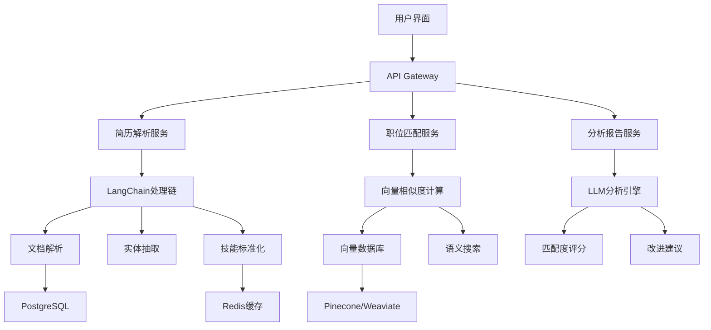

# 基于LLM的智能简历分析和匹配度计算系统

## 🎯 系统概述

基于你即将学习的LangChain、LlamaIndex和向量数据库技术，设计一个智能简历分析和职位匹配系统，结合你现有的数据工程和AI/ML背景，打造一个企业级的人才匹配解决方案。

## 🏗️ 系统架构设计

### 核心技术栈
```
前端层: React + TypeScript + Ant Design
API层: FastAPI + Python
LLM层: LangChain + OpenAI/Azure OpenAI
数据层: LlamaIndex + 向量数据库 (Pinecone/Weaviate)
存储层: PostgreSQL + Redis
部署层: Azure Container Apps + Azure Functions
```

### 系统架构图


## 📋 功能模块设计

### 1. 简历解析模块

#### 技术实现
```python
from langchain.document_loaders import PyPDFLoader, Docx2txtLoader
from langchain.text_splitter import RecursiveCharacterTextSplitter
from langchain.chains import LLMChain
from langchain.prompts import PromptTemplate

class ResumeParser:
    def __init__(self):
        self.llm = AzureOpenAI(temperature=0.1)
        self.text_splitter = RecursiveCharacterTextSplitter(
            chunk_size=1000,
            chunk_overlap=200
        )
        
    def parse_resume(self, file_path: str) -> dict:
        """解析简历文件，提取结构化信息"""
        
        # 1. 文档加载
        if file_path.endswith('.pdf'):
            loader = PyPDFLoader(file_path)
        elif file_path.endswith('.docx'):
            loader = Docx2txtLoader(file_path)
        
        documents = loader.load()
        
        # 2. 信息抽取
        extraction_prompt = PromptTemplate(
            input_variables=["resume_text"],
            template="""
            从以下简历中提取结构化信息，以JSON格式返回：
            
            简历内容：
            {resume_text}
            
            请提取以下信息：
            {{
                "personal_info": {{
                    "name": "姓名",
                    "phone": "电话",
                    "email": "邮箱",
                    "location": "地址"
                }},
                "education": [
                    {{
                        "school": "学校名称",
                        "degree": "学位",
                        "major": "专业",
                        "graduation_year": "毕业年份"
                    }}
                ],
                "work_experience": [
                    {{
                        "company": "公司名称",
                        "position": "职位",
                        "start_date": "开始时间",
                        "end_date": "结束时间",
                        "responsibilities": ["职责描述"],
                        "achievements": ["成就描述"]
                    }}
                ],
                "skills": {{
                    "technical_skills": ["技术技能"],
                    "programming_languages": ["编程语言"],
                    "frameworks": ["框架工具"],
                    "databases": ["数据库"],
                    "cloud_platforms": ["云平台"]
                }},
                "projects": [
                    {{
                        "name": "项目名称",
                        "description": "项目描述",
                        "technologies": ["使用技术"],
                        "achievements": ["项目成果"]
                    }}
                ],
                "certifications": ["认证证书"],
                "languages": ["语言能力"]
            }}
            """
        )
        
        extraction_chain = LLMChain(llm=self.llm, prompt=extraction_prompt)
        
        # 3. 执行抽取
        resume_text = "\n".join([doc.page_content for doc in documents])
        result = extraction_chain.run(resume_text=resume_text)
        
        return json.loads(result)
```

#### 技能标准化处理
```python
class SkillNormalizer:
    def __init__(self):
        self.skill_mapping = {
            # 编程语言标准化
            "python": ["python", "py", "python3"],
            "javascript": ["javascript", "js", "node.js", "nodejs"],
            "java": ["java", "jvm"],
            # 框架标准化
            "react": ["react", "reactjs", "react.js"],
            "vue": ["vue", "vuejs", "vue.js"],
            # 数据库标准化
            "mysql": ["mysql", "my sql"],
            "postgresql": ["postgresql", "postgres", "pg"],
            # 云平台标准化
            "azure": ["azure", "microsoft azure", "ms azure"],
            "aws": ["aws", "amazon web services"]
        }
        
    def normalize_skills(self, skills: List[str]) -> List[str]:
        """标准化技能名称"""
        normalized = []
        for skill in skills:
            skill_lower = skill.lower().strip()
            
            # 查找标准化映射
            for standard_name, variants in self.skill_mapping.items():
                if skill_lower in variants:
                    if standard_name not in normalized:
                        normalized.append(standard_name)
                    break
            else:
                # 如果没有找到映射，保留原始技能
                normalized.append(skill)
                
        return normalized
```

### 2. 向量化和索引模块

#### LlamaIndex实现
```python
from llama_index import VectorStoreIndex, ServiceContext
from llama_index.vector_stores import PineconeVectorStore
from llama_index.embeddings import AzureOpenAIEmbedding
import pinecone

class ResumeVectorStore:
    def __init__(self):
        # 初始化Pinecone
        pinecone.init(
            api_key=os.getenv("PINECONE_API_KEY"),
            environment=os.getenv("PINECONE_ENVIRONMENT")
        )
        
        # 创建向量存储
        self.vector_store = PineconeVectorStore(
            pinecone_index=pinecone.Index("resume-index"),
            namespace="resumes"
        )
        
        # 配置嵌入模型
        self.embed_model = AzureOpenAIEmbedding(
            model="text-embedding-ada-002",
            deployment_name="text-embedding-ada-002"
        )
        
        # 服务上下文
        self.service_context = ServiceContext.from_defaults(
            embed_model=self.embed_model
        )
        
    def index_resume(self, resume_data: dict, resume_id: str):
        """将简历数据向量化并存储"""
        
        # 构建简历文档
        resume_text = self._build_resume_text(resume_data)
        
        # 创建文档对象
        from llama_index import Document
        document = Document(
            text=resume_text,
            metadata={
                "resume_id": resume_id,
                "name": resume_data["personal_info"]["name"],
                "skills": resume_data["skills"]["technical_skills"],
                "experience_years": self._calculate_experience(resume_data),
                "education_level": self._get_education_level(resume_data)
            }
        )
        
        # 创建索引
        index = VectorStoreIndex.from_documents(
            [document],
            vector_store=self.vector_store,
            service_context=self.service_context
        )
        
        return index
    
    def _build_resume_text(self, resume_data: dict) -> str:
        """构建用于向量化的简历文本"""
        sections = []
        
        # 个人信息
        personal = resume_data["personal_info"]
        sections.append(f"姓名: {personal['name']}")
        
        # 技能部分
        skills = resume_data["skills"]
        all_skills = (
            skills["technical_skills"] + 
            skills["programming_languages"] + 
            skills["frameworks"] + 
            skills["databases"] + 
            skills["cloud_platforms"]
        )
        sections.append(f"技能: {', '.join(all_skills)}")
        
        # 工作经验
        for exp in resume_data["work_experience"]:
            exp_text = f"""
            公司: {exp['company']}
            职位: {exp['position']}
            职责: {'; '.join(exp['responsibilities'])}
            成就: {'; '.join(exp['achievements'])}
            """
            sections.append(exp_text)
        
        # 项目经验
        for project in resume_data["projects"]:
            project_text = f"""
            项目: {project['name']}
            描述: {project['description']}
            技术: {', '.join(project['technologies'])}
            成果: {'; '.join(project['achievements'])}
            """
            sections.append(project_text)
        
        return "\n\n".join(sections)
```

### 3. 职位匹配模块

#### 语义相似度计算
```python
class JobMatcher:
    def __init__(self, vector_store: ResumeVectorStore):
        self.vector_store = vector_store
        self.llm = AzureOpenAI(temperature=0.1)
        
    def calculate_match_score(self, resume_data: dict, job_description: str) -> dict:
        """计算简历与职位的匹配度"""
        
        # 1. 技能匹配分析
        skill_match = self._analyze_skill_match(resume_data, job_description)
        
        # 2. 经验匹配分析
        experience_match = self._analyze_experience_match(resume_data, job_description)
        
        # 3. 教育背景匹配
        education_match = self._analyze_education_match(resume_data, job_description)
        
        # 4. 语义相似度计算
        semantic_similarity = self._calculate_semantic_similarity(resume_data, job_description)
        
        # 5. 综合评分
        overall_score = self._calculate_overall_score({
            "skill_match": skill_match,
            "experience_match": experience_match,
            "education_match": education_match,
            "semantic_similarity": semantic_similarity
        })
        
        return {
            "overall_score": overall_score,
            "detailed_scores": {
                "skill_match": skill_match,
                "experience_match": experience_match,
                "education_match": education_match,
                "semantic_similarity": semantic_similarity
            },
            "recommendations": self._generate_recommendations(resume_data, job_description)
        }
    
    def _analyze_skill_match(self, resume_data: dict, job_description: str) -> float:
        """分析技能匹配度"""
        
        # 提取职位要求的技能
        skill_extraction_prompt = PromptTemplate(
            input_variables=["job_description"],
            template="""
            从以下职位描述中提取所需的技能要求，以JSON格式返回：
            
            职位描述：
            {job_description}
            
            请提取：
            {{
                "required_skills": ["必需技能"],
                "preferred_skills": ["优选技能"],
                "programming_languages": ["编程语言"],
                "frameworks": ["框架工具"],
                "databases": ["数据库"],
                "cloud_platforms": ["云平台"]
            }}
            """
        )
        
        chain = LLMChain(llm=self.llm, prompt=skill_extraction_prompt)
        job_skills_result = chain.run(job_description=job_description)
        job_skills = json.loads(job_skills_result)
        
        # 计算技能匹配度
        resume_skills = set()
        for skill_category in resume_data["skills"].values():
            if isinstance(skill_category, list):
                resume_skills.update([s.lower() for s in skill_category])
        
        required_skills = set([s.lower() for s in job_skills["required_skills"]])
        preferred_skills = set([s.lower() for s in job_skills["preferred_skills"]])
        
        # 必需技能匹配度 (权重70%)
        required_match = len(resume_skills & required_skills) / len(required_skills) if required_skills else 1.0
        
        # 优选技能匹配度 (权重30%)
        preferred_match = len(resume_skills & preferred_skills) / len(preferred_skills) if preferred_skills else 0.0
        
        return required_match * 0.7 + preferred_match * 0.3
    
    def _calculate_semantic_similarity(self, resume_data: dict, job_description: str) -> float:
        """计算语义相似度"""
        
        # 构建简历文本
        resume_text = self.vector_store._build_resume_text(resume_data)
        
        # 使用向量相似度计算
        from sentence_transformers import SentenceTransformer
        model = SentenceTransformer('all-MiniLM-L6-v2')
        
        # 计算嵌入向量
        resume_embedding = model.encode([resume_text])
        job_embedding = model.encode([job_description])
        
        # 计算余弦相似度
        from sklearn.metrics.pairwise import cosine_similarity
        similarity = cosine_similarity(resume_embedding, job_embedding)[0][0]
        
        return float(similarity)
```

### 4. 智能分析和建议模块

#### LangChain分析链
```python
class ResumeAnalyzer:
    def __init__(self):
        self.llm = AzureOpenAI(temperature=0.3)
        
    def generate_improvement_suggestions(self, resume_data: dict, job_description: str, match_score: dict) -> dict:
        """生成简历改进建议"""
        
        analysis_prompt = PromptTemplate(
            input_variables=["resume_summary", "job_description", "match_scores"],
            template="""
            作为一名资深的HR专家和职业顾问，请基于以下信息为候选人提供详细的简历改进建议：
            
            简历摘要：
            {resume_summary}
            
            目标职位描述：
            {job_description}
            
            当前匹配度评分：
            {match_scores}
            
            请提供以下方面的建议：
            
            1. 技能提升建议：
            - 需要学习的新技能
            - 需要加强的现有技能
            - 推荐的学习资源
            
            2. 经验优化建议：
            - 如何更好地描述现有经验
            - 需要补充的项目经验
            - 量化成果的建议
            
            3. 简历结构优化：
            - 内容组织建议
            - 关键词优化
            - 格式改进建议
            
            4. 职业发展路径：
            - 短期目标 (3-6个月)
            - 中期目标 (6-12个月)
            - 长期规划 (1-2年)
            
            请以JSON格式返回建议：
            {{
                "skill_improvements": {{
                    "new_skills_to_learn": ["技能列表"],
                    "skills_to_strengthen": ["技能列表"],
                    "learning_resources": ["资源推荐"]
                }},
                "experience_optimization": {{
                    "description_improvements": ["改进建议"],
                    "missing_experiences": ["缺失经验"],
                    "quantification_suggestions": ["量化建议"]
                }},
                "resume_structure": {{
                    "content_organization": ["组织建议"],
                    "keyword_optimization": ["关键词建议"],
                    "format_improvements": ["格式建议"]
                }},
                "career_roadmap": {{
                    "short_term": ["短期目标"],
                    "medium_term": ["中期目标"],
                    "long_term": ["长期目标"]
                }}
            }}
            """
        )
        
        # 构建简历摘要
        resume_summary = self._build_resume_summary(resume_data)
        
        # 执行分析
        analysis_chain = LLMChain(llm=self.llm, prompt=analysis_prompt)
        result = analysis_chain.run(
            resume_summary=resume_summary,
            job_description=job_description,
            match_scores=json.dumps(match_score, ensure_ascii=False, indent=2)
        )
        
        return json.loads(result)
    
    def generate_interview_questions(self, resume_data: dict, job_description: str) -> List[str]:
        """生成针对性面试问题"""
        
        question_prompt = PromptTemplate(
            input_variables=["resume_summary", "job_description"],
            template="""
            基于候选人的简历和目标职位，生成10个有针对性的面试问题：
            
            简历摘要：
            {resume_summary}
            
            职位描述：
            {job_description}
            
            请生成以下类型的问题：
            1. 技术深度问题 (3个)
            2. 项目经验问题 (3个)
            3. 问题解决能力问题 (2个)
            4. 团队协作问题 (2个)
            
            以JSON格式返回：
            {{
                "technical_questions": ["技术问题"],
                "project_questions": ["项目问题"],
                "problem_solving_questions": ["问题解决问题"],
                "teamwork_questions": ["团队协作问题"]
            }}
            """
        )
        
        resume_summary = self._build_resume_summary(resume_data)
        
        question_chain = LLMChain(llm=self.llm, prompt=question_prompt)
        result = question_chain.run(
            resume_summary=resume_summary,
            job_description=job_description
        )
        
        return json.loads(result)
```

## 🚀 API接口设计

### FastAPI实现
```python
from fastapi import FastAPI, UploadFile, File, HTTPException
from pydantic import BaseModel
from typing import List, Optional

app = FastAPI(title="智能简历分析系统", version="1.0.0")

class JobMatchRequest(BaseModel):
    resume_id: str
    job_description: str

class MatchResult(BaseModel):
    overall_score: float
    detailed_scores: dict
    recommendations: dict
    interview_questions: dict

@app.post("/api/resume/upload")
async def upload_resume(file: UploadFile = File(...)):
    """上传并解析简历"""
    try:
        # 保存文件
        file_path = f"uploads/{file.filename}"
        with open(file_path, "wb") as buffer:
            content = await file.read()
            buffer.write(content)
        
        # 解析简历
        parser = ResumeParser()
        resume_data = parser.parse_resume(file_path)
        
        # 生成简历ID
        resume_id = str(uuid.uuid4())
        
        # 向量化存储
        vector_store = ResumeVectorStore()
        vector_store.index_resume(resume_data, resume_id)
        
        # 存储到数据库
        # ... 数据库操作
        
        return {
            "resume_id": resume_id,
            "status": "success",
            "data": resume_data
        }
        
    except Exception as e:
        raise HTTPException(status_code=500, detail=str(e))

@app.post("/api/job/match", response_model=MatchResult)
async def calculate_job_match(request: JobMatchRequest):
    """计算职位匹配度"""
    try:
        # 获取简历数据
        resume_data = get_resume_from_db(request.resume_id)
        
        # 计算匹配度
        matcher = JobMatcher(ResumeVectorStore())
        match_result = matcher.calculate_match_score(
            resume_data, 
            request.job_description
        )
        
        # 生成改进建议
        analyzer = ResumeAnalyzer()
        suggestions = analyzer.generate_improvement_suggestions(
            resume_data, 
            request.job_description, 
            match_result
        )
        
        # 生成面试问题
        interview_questions = analyzer.generate_interview_questions(
            resume_data, 
            request.job_description
        )
        
        return MatchResult(
            overall_score=match_result["overall_score"],
            detailed_scores=match_result["detailed_scores"],
            recommendations=suggestions,
            interview_questions=interview_questions
        )
        
    except Exception as e:
        raise HTTPException(status_code=500, detail=str(e))

@app.get("/api/resume/search")
async def search_resumes(
    query: str,
    skills: Optional[List[str]] = None,
    experience_years: Optional[int] = None,
    limit: int = 10
):
    """语义搜索简历"""
    try:
        # 构建搜索查询
        search_query = query
        if skills:
            search_query += f" 技能: {', '.join(skills)}"
        if experience_years:
            search_query += f" 经验: {experience_years}年"
        
        # 向量搜索
        vector_store = ResumeVectorStore()
        results = vector_store.search(search_query, limit=limit)
        
        return {
            "query": search_query,
            "results": results,
            "total": len(results)
        }
        
    except Exception as e:
        raise HTTPException(status_code=500, detail=str(e))
```

## 📊 性能优化策略

### 1. 缓存策略
```python
import redis
from functools import wraps

redis_client = redis.Redis(host='localhost', port=6379, db=0)

def cache_result(expiration=3600):
    def decorator(func):
        @wraps(func)
        def wrapper(*args, **kwargs):
            # 生成缓存键
            cache_key = f"{func.__name__}:{hash(str(args) + str(kwargs))}"
            
            # 尝试从缓存获取
            cached_result = redis_client.get(cache_key)
            if cached_result:
                return json.loads(cached_result)
            
            # 执行函数并缓存结果
            result = func(*args, **kwargs)
            redis_client.setex(
                cache_key, 
                expiration, 
                json.dumps(result, ensure_ascii=False)
            )
            
            return result
        return wrapper
    return decorator

# 使用缓存装饰器
@cache_result(expiration=1800)  # 30分钟缓存
def calculate_skill_match(resume_skills, job_skills):
    # 计算逻辑
    pass
```

### 2. 批量处理
```python
class BatchProcessor:
    def __init__(self, batch_size=10):
        self.batch_size = batch_size
        
    async def process_resumes_batch(self, resume_files: List[UploadFile]):
        """批量处理简历"""
        results = []
        
        for i in range(0, len(resume_files), self.batch_size):
            batch = resume_files[i:i + self.batch_size]
            
            # 并行处理批次
            tasks = [self.process_single_resume(file) for file in batch]
            batch_results = await asyncio.gather(*tasks)
            
            results.extend(batch_results)
            
        return results
    
    async def process_single_resume(self, file: UploadFile):
        """处理单个简历"""
        # 异步处理逻辑
        pass
```

## 🔧 部署和监控

### Azure部署配置
```yaml
# docker-compose.yml
version: '3.8'
services:
  api:
    build: .
    ports:
      - "8000:8000"
    environment:
      - AZURE_OPENAI_API_KEY=${AZURE_OPENAI_API_KEY}
      - PINECONE_API_KEY=${PINECONE_API_KEY}
      - DATABASE_URL=${DATABASE_URL}
    depends_on:
      - redis
      - postgres
      
  redis:
    image: redis:alpine
    ports:
      - "6379:6379"
      
  postgres:
    image: postgres:13
    environment:
      - POSTGRES_DB=resume_db
      - POSTGRES_USER=admin
      - POSTGRES_PASSWORD=${DB_PASSWORD}
    ports:
      - "5432:5432"
```

### 监控和日志
```python
import logging
from prometheus_client import Counter, Histogram, generate_latest

# 指标定义
REQUEST_COUNT = Counter('requests_total', 'Total requests', ['method', 'endpoint'])
REQUEST_DURATION = Histogram('request_duration_seconds', 'Request duration')

# 日志配置
logging.basicConfig(
    level=logging.INFO,
    format='%(asctime)s - %(name)s - %(levelname)s - %(message)s',
    handlers=[
        logging.FileHandler('app.log'),
        logging.StreamHandler()
    ]
)

logger = logging.getLogger(__name__)

@app.middleware("http")
async def monitor_requests(request, call_next):
    start_time = time.time()
    
    response = await call_next(request)
    
    # 记录指标
    REQUEST_COUNT.labels(
        method=request.method, 
        endpoint=request.url.path
    ).inc()
    
    REQUEST_DURATION.observe(time.time() - start_time)
    
    # 记录日志
    logger.info(f"{request.method} {request.url.path} - {response.status_code}")
    
    return response
```

## 📈 学习路径建议

### 第1-2周：基础框架学习
1. **LangChain基础**
   - 安装和配置
   - 基本链式调用
   - 提示模板使用
   - 文档加载器

2. **LlamaIndex入门**
   - 索引构建
   - 查询引擎
   - 向量存储集成

### 第3-4周：向量数据库实践
1. **Pinecone使用**
   - 索引创建和管理
   - 向量插入和查询
   - 元数据过滤

2. **语义搜索实现**
   - 嵌入模型选择
   - 相似度计算
   - 结果排序

### 第5-6周：项目集成开发
1. **API开发**
   - FastAPI框架
   - 异步处理
   - 错误处理

2. **系统集成**
   - 数据库设计
   - 缓存策略
   - 性能优化

### 第7-8周：部署和优化
1. **容器化部署**
   - Docker配置
   - Azure部署
   - 监控设置

2. **性能调优**
   - 批量处理
   - 缓存优化
   - 并发控制

## 🎯 项目价值

### 技术价值
- **LLM应用实践**: 深入理解LangChain和LlamaIndex的实际应用
- **向量数据库**: 掌握语义搜索和相似度计算技术
- **系统架构**: 设计企业级AI应用的完整架构

### 商业价值
- **HR效率提升**: 自动化简历筛选，提高招聘效率
- **匹配精度**: 基于语义理解的精准匹配
- **数据洞察**: 提供深入的人才市场分析

### 职业发展价值
- **技能证明**: 展示LLM技术的实际应用能力
- **项目经验**: 完整的端到端项目开发经验
- **行业影响**: 在HR科技领域建立技术影响力

这个项目将完美结合你现有的数据工程背景和即将学习的LLM技术，为你的职业发展提供强有力的技术支撑。