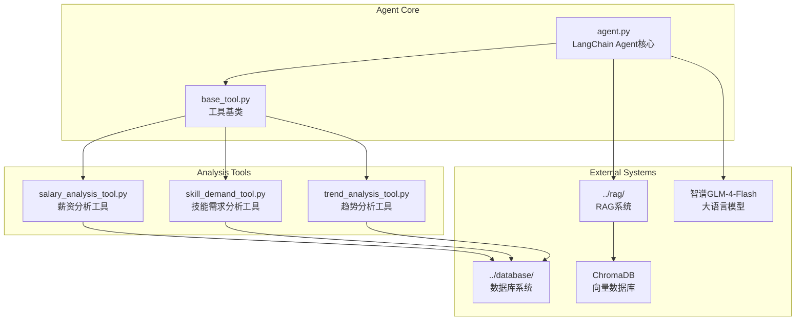

# LangChain Agent智能问答系统

LangChain Agent智能问答系统是基于LangChain框架的智能数据分析代理，专门用于分析职位市场数据，提供自然语言问答和智能分析功能。

## 🏗️ 系统架构



## 🤖 核心组件

### 1. LangChain Agent核心 (JobMarketAnalysisAgent)
**文件**: [`agent.py`](agent.py)

**职责**: 智能数据分析和问答的核心控制器
- 自然语言理解和处理
- 工具选择和执行协调
- 上下文管理和对话记忆
- 智能回答生成

**核心功能**:
```python
class JobMarketAnalysisAgent:
    def __init__(self, config: Dict[str, Any]):
        """初始化Agent，配置LLM和工具"""
        
    def chat(self, user_input: str, show_reasoning: bool = False) -> str:
        """处理用户输入，返回智能回答"""
        
    def get_available_tools(self) -> List[str]:
        """获取可用的分析工具列表"""
        
    def explain_capabilities(self) -> str:
        """解释Agent的能力和使用方法"""
```

**智能特性**:
- **工具自动选择**: 根据用户问题自动选择合适的分析工具
- **多轮对话支持**: 具备对话记忆，能理解上下文关联
- **推理过程展示**: 可选择显示分析推理过程
- **错误恢复**: 智能处理工具调用失败和数据异常

### 2. 工具基类 (BaseAnalysisTool)
**文件**: [`base_tool.py`](base_tool.py)

**职责**: 所有分析工具的基础类
- 统一的工具接口定义
- 通用的数据访问方法
- 标准化的错误处理
- 工具注册和管理

**基础架构**:
```python
class BaseAnalysisTool:
    def __init__(self, db_manager, vector_manager):
        """初始化工具，注入依赖"""
        
    def _run(self, query: str) -> str:
        """工具的核心执行逻辑，子类必须实现"""
        
    def _get_job_data(self, filters: Dict = None) -> List[Dict]:
        """获取职位数据的通用方法"""
        
    def _format_analysis_result(self, data: Any) -> str:
        """格式化分析结果为自然语言"""
```

### 3. 薪资分析工具 (SalaryAnalysisTool)
**文件**: [`salary_analysis_tool.py`](salary_analysis_tool.py)

**职责**: 提供多维度薪资分析功能
- 薪资统计分析
- 薪资分布计算
- 薪资趋势分析
- 薪资对比功能

**分析功能**:
```python
class SalaryAnalysisTool(BaseAnalysisTool):
    def analyze_salary_by_skill(self, skill: str) -> Dict[str, Any]:
        """按技能分析薪资水平"""
        
    def analyze_salary_distribution(self, filters: Dict = None) -> Dict[str, Any]:
        """分析薪资分布情况"""
        
    def compare_salaries(self, skills: List[str]) -> Dict[str, Any]:
        """对比不同技能的薪资水平"""
        
    def analyze_salary_trends(self, time_period: str = "6months") -> Dict[str, Any]:
        """分析薪资趋势变化"""
```

**分析示例**:
```
用户: "Python开发的平均薪资是多少？"
Agent: "基于43个职位的薪资数据分析，Python开发工程师：
        • 平均月薪: 13k
        • 年薪约: 15万元
        • 薪资范围: 8k-25k
        • 中位数薪资: 12k
        • 高薪职位(>20k): 占比15%"
```

### 4. 技能需求分析工具 (SkillDemandAnalysisTool)
**文件**: [`skill_demand_tool.py`](skill_demand_tool.py)

**职责**: 分析技能市场需求情况
- 技能需求统计
- 技能热度排名
- 技能组合分析
- 技能发展趋势

**分析功能**:
```python
class SkillDemandAnalysisTool(BaseAnalysisTool):
    def analyze_skill_demand(self, skill: str = None) -> Dict[str, Any]:
        """分析特定技能或整体技能需求"""
        
    def get_top_skills(self, limit: int = 10) -> List[Dict[str, Any]]:
        """获取最热门的技能排名"""
        
    def analyze_skill_combinations(self, base_skill: str) -> Dict[str, Any]:
        """分析技能组合需求"""
        
    def predict_skill_trends(self) -> Dict[str, Any]:
        """预测技能发展趋势"""
```

**分析示例**:
```
用户: "现在哪个技能在市场上机会最多？"
Agent: "根据最新的445个职位数据分析，目前市场上机会最多的技能排名：
        1. Python - 156个职位 (35.1%市场份额)
        2. Java - 134个职位 (30.1%市场份额)  
        3. JavaScript - 98个职位 (22.0%市场份额)
        4. React - 67个职位 (15.1%市场份额)
        5. MySQL - 54个职位 (12.1%市场份额)"
```

### 5. 趋势分析工具 (TrendAnalysisTool)
**文件**: [`trend_analysis_tool.py`](trend_analysis_tool.py)

**职责**: 识别市场趋势和预测未来发展
- 职位数量趋势分析
- 技能热度变化趋势
- 薪资变化趋势
- 行业发展趋势

**分析功能**:
```python
class TrendAnalysisTool(BaseAnalysisTool):
    def analyze_job_posting_trends(self, time_range: str = "3months") -> Dict[str, Any]:
        """分析职位发布趋势"""
        
    def analyze_skill_trend_changes(self, skills: List[str]) -> Dict[str, Any]:
        """分析技能热度变化趋势"""
        
    def predict_market_direction(self) -> Dict[str, Any]:
        """预测市场发展方向"""
        
    def identify_emerging_technologies(self) -> List[Dict[str, Any]]:
        """识别新兴技术趋势"""
```

## 🔧 配置管理

### Agent配置
```yaml
langchain_agent:
  # LLM配置
  llm:
    provider: zhipu
    model: glm-4-flash
    api_key: your-api-key-here
    temperature: 0.1
    max_tokens: 2000
    timeout: 30
    
  # Agent配置
  agent:
    verbose: true
    max_iterations: 5
    early_stopping_method: generate
    handle_parsing_errors: true
    
  # 记忆配置
  memory:
    max_token_limit: 2000
    memory_key: "chat_history"
    return_messages: true
    
  # 工具配置
  tools:
    skill_demand_analysis:
      enabled: true
      cache_results: true
      cache_ttl: 3600
    salary_analysis:
      enabled: true
      include_percentiles: true
      min_sample_size: 5
    trend_analysis:
      enabled: true
      default_time_range: "3months"
      trend_threshold: 0.1
```

### 用户体验配置
```yaml
langchain_agent:
  user_experience:
    interaction:
      welcome_message: "欢迎使用就业市场分析助手！我可以帮您分析职位市场数据。"
      help_message: "您可以询问技能需求、薪资分析、市场趋势等问题。"
      error_message: "抱歉，我在处理您的问题时遇到了困难，请尝试重新表述。"
      
    suggested_questions:
      - "Python开发工程师的市场需求如何？"
      - "数据科学家的薪资水平分析"
      - "AI领域有哪些新兴技能需求？"
      - "前端开发的就业前景怎么样？"
      - "哪些技能在市场上最受欢迎？"
      
    output_formatting:
      use_markdown: true
      include_data_source: true
      show_confidence_level: true
      max_response_length: 1000
```

## 🚀 使用示例

### 基本问答功能
```bash
# 启动智能助手
python rag_cli.py chat --show-help --verbose

# 交互式问答
python rag_cli.py chat
```

### 编程接口使用
```python
from src.analysis_tools.agent import JobMarketAnalysisAgent

# 初始化Agent
agent = JobMarketAnalysisAgent(config_path="config/agent_config.yaml")

# 单次问答
response = agent.chat("Python开发的平均工资是多少？")
print(response)

# 显示推理过程
response = agent.chat("数据科学家需要什么技能？", show_reasoning=True)
print(response)

# 获取可用工具
tools = agent.get_available_tools()
print("可用工具:", tools)
```

### 高级分析功能
```python
# 直接使用分析工具
from src.analysis_tools.salary_analysis_tool import SalaryAnalysisTool
from src.database.operations import DatabaseManager
from src.rag.vector_manager import VectorManager

# 初始化工具
db_manager = DatabaseManager()
vector_manager = VectorManager()
salary_tool = SalaryAnalysisTool(db_manager, vector_manager)

# 薪资分析
salary_analysis = salary_tool.analyze_salary_by_skill("Python")
print("Python薪资分析:", salary_analysis)

# 薪资对比
comparison = salary_tool.compare_salaries(["Python", "Java", "JavaScript"])
print("薪资对比:", comparison)
```

## 💬 对话示例

### 技能需求分析
```
用户: 现在AI领域最需要什么技能？

Agent: 基于向量搜索和语义分析，AI领域最需要的技能包括：

🔥 核心技能：
• Python - 89%的AI职位要求 (数据处理和模型开发的主要语言)
• 机器学习 - 76%的职位要求 (核心算法理解)
• 深度学习 - 68%的职位要求 (神经网络和深度模型)
• 数据分析 - 71%的职位要求 (数据洞察能力)

🛠️ 工具技能：
• TensorFlow - 45%的职位提及
• PyTorch - 52%的职位提及  
• Pandas - 38%的职位提及
• NumPy - 35%的职位提及

💼 业务技能：
• 统计学 - 42%的职位要求
• 数据可视化 - 35%的职位要求
• 业务理解 - 28%的职位要求

数据来源：基于156个AI相关职位的分析
```

### 薪资分析对话
```
用户: 前端开发和后端开发哪个薪资更高？

Agent: 基于当前市场数据对比分析：

📊 薪资对比结果：

**后端开发** (基于89个职位样本)：
• 平均月薪: 16.2k
• 薪资范围: 10k-35k  
• 中位数: 15k
• 高薪职位(>25k): 22%

**前端开发** (基于67个职位样本)：
• 平均月薪: 14.8k
• 薪资范围: 8k-28k
• 中位数: 14k  
• 高薪职位(>25k): 15%

🎯 结论：
后端开发平均薪资略高于前端开发约8.6%，主要原因：
1. 后端技术栈复杂度更高
2. 系统架构和性能优化需求
3. 数据库和服务器运维技能溢价

💡 建议：两个方向都有很好的发展前景，选择应基于个人兴趣和技能倾向。
```

### 趋势分析对话
```
用户: 未来6个月哪些技术会更热门？

Agent: 基于最近3个月的数据趋势分析，预测未来6个月的热门技术：

📈 上升趋势技术：

**AI/ML相关** (增长率 +35%)：
• ChatGPT/LLM应用开发 - 新兴需求激增
• 机器学习工程 - 从研究转向工程化
• 数据科学 - 企业数字化转型需求

**云原生技术** (增长率 +28%)：
• Kubernetes - 容器编排标准化
• Docker - 微服务架构普及
• 云计算平台 - AWS/Azure/阿里云

**前端新技术** (增长率 +22%)：
• Next.js - React生态系统成熟
• TypeScript - 大型项目类型安全需求
• 微前端 - 大型应用架构演进

⚠️ 注意：预测基于历史数据趋势，实际市场变化可能受多种因素影响。

建议关注这些技术的学习和实践机会。
```

## 🔍 故障排除

### 常见问题诊断

#### 1. Agent响应缓慢
```yaml
# 优化LLM配置
langchain_agent:
  llm:
    timeout: 60          # 增加超时时间
    max_tokens: 1500     # 减少最大token数
    temperature: 0.0     # 降低随机性提高速度
```

#### 2. 工具调用失败
```python
# 检查工具注册状态
agent = JobMarketAnalysisAgent()
tools = agent.get_available_tools()
print("已注册工具:", tools)

# 测试单个工具
from src.analysis_tools.salary_analysis_tool import SalaryAnalysisTool
tool = SalaryAnalysisTool(db_manager, vector_manager)
result = tool._run("Python薪资分析")
print("工具测试结果:", result)
```

#### 3. 数据访问异常
```bash
# 检查数据库连接
python -c "
from src.database.operations import DatabaseManager
db = DatabaseManager()
jobs = db.get_all_jobs(limit=5)
print(f'数据库连接正常，职位数量: {len(jobs)}')
"

# 检查向量数据库
python rag_cli.py status --verbose
```

### 性能优化建议

#### 缓存策略
```python
class AnalysisCache:
    def __init__(self):
        self.query_cache = {}
        self.result_cache = {}
        self.cache_ttl = 3600  # 1小时缓存
        
    def get_cached_result(self, query_hash: str):
        """获取缓存的分析结果"""
        
    def cache_analysis_result(self, query_hash: str, result: Any):
        """缓存分析结果"""
```

#### 并发处理优化
```python
import asyncio
from concurrent.futures import ThreadPoolExecutor

class AsyncAnalysisTools:
    def __init__(self):
        self.executor = ThreadPoolExecutor(max_workers=3)
        
    async def parallel_analysis(self, queries: List[str]):
        """并行执行多个分析任务"""
        tasks = [
            asyncio.get_event_loop().run_in_executor(
                self.executor, self.analyze_single_query, query
            ) for query in queries
        ]
        return await asyncio.gather(*tasks)
```

## 📊 监控和分析

### 使用统计
```python
class AgentUsageMonitor:
    def track_query(self, user_query: str, response_time: float, success: bool):
        """跟踪查询使用情况"""
        
    def get_usage_statistics(self) -> Dict[str, Any]:
        """获取使用统计"""
        return {
            'total_queries': 1250,
            'avg_response_time': 3.2,
            'success_rate': 0.94,
            'most_popular_tools': ['salary_analysis', 'skill_demand'],
            'peak_usage_hours': [9, 14, 20]
        }
        
    def generate_usage_report(self) -> str:
        """生成使用报告"""
```

### 质量评估
```python
class ResponseQualityEvaluator:
    def evaluate_response_quality(self, query: str, response: str) -> float:
        """评估回答质量"""
        
    def collect_user_feedback(self, query: str, response: str, rating: int):
        """收集用户反馈"""
        
    def analyze_quality_trends(self) -> Dict[str, Any]:
        """分析质量趋势"""
```

---

**Navigation**: [← Matcher Engine](../matcher/claude.md) | [Database Operations →](../database/claude.md)