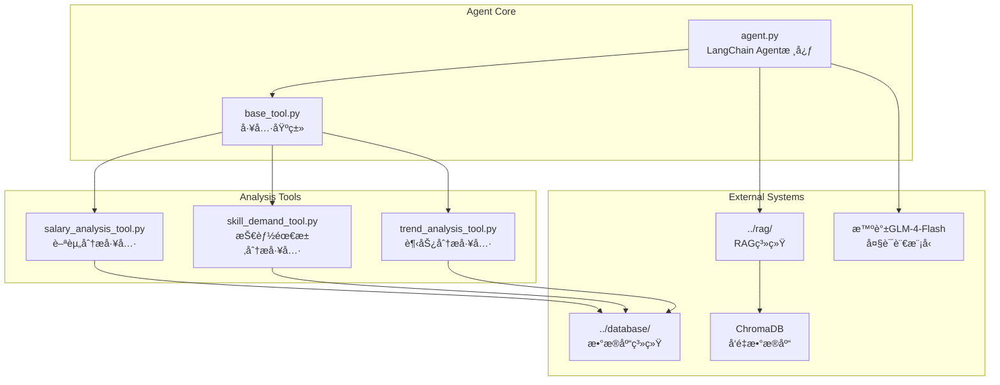

# LangChain Agent智能问答系统

LangChain Agent智能问答系统是基äºLangChain框æ¶çš„智能数æ®åˆ†æ代ç†ï¼Œä¸“门用äºåˆ†æèŒä½å¸‚场数æ®ï¼Œæ供自然语言问答和智能分æ功能。

## ğŸ—ï¸ ç³»ç»Ÿæ¶æ„



## 🤖 核心组件

### 1. LangChain Agent核心 (JobMarketAnalysisAgent)
**文件**: [`agent.py`](agent.py)

**èŒè´£**: 智能数æ®åˆ†æ和问答的核心æ§åˆ¶å™¨
- 自然语言ç†è§£å’Œå¤„ç†
- 工具选择和执行åè°ƒ
- 上下文管ç†å’Œå¯¹è¯è®°å¿†
- 智能å›ç­”生æˆ

**核心功能**:
```python
class JobMarketAnalysisAgent:
    def __init__(self, config: Dict[str, Any]):
        """åˆå§‹åŒ–Agent，é…ç½®LLM和工具"""
        
    def chat(self, user_input: str, show_reasoning: bool = False) -> str:
        """处ç†ç”¨æˆ·è¾“入，返å›æ™ºèƒ½å›ç­”"""
        
    def get_available_tools(self) -> List[str]:
        """è·å–å¯ç”¨çš„分æ工具列表"""
        
    def explain_capabilities(self) -> str:
        """解释Agent的能力和使用方法"""
```

**智能特性**:
- **工具自动选择**: æ ¹æ®ç”¨æˆ·é—®é¢˜è‡ªåŠ¨é€‰æ‹©åˆé€‚的分æ工具
- **多轮对è¯æ”¯æŒ**: 具备对è¯è®°å¿†ï¼Œèƒ½ç†è§£ä¸Šä¸‹æ–‡å…³è”
- **æ¨ç†è¿‡ç¨‹å±•ç¤º**: å¯é€‰æ‹©æ˜¾ç¤ºåˆ†ææ¨ç†è¿‡ç¨‹
- **错误æ¢å¤**: 智能处ç†å·¥å…·è°ƒç”¨å¤±è´¥å’Œæ•°æ®å¼‚常

### 2. 工具基类 (BaseAnalysisTool)
**文件**: [`base_tool.py`](base_tool.py)

**èŒè´£**: 所有分æ工具的基础类
- 统一的工具æ¥å£å®šä¹‰
- 通用的数æ®è®¿é—®æ–¹æ³•
- 标准化的错误处ç†
- 工具注册和管ç†

**基础æ¶æ„**:
```python
class BaseAnalysisTool:
    def __init__(self, db_manager, vector_manager):
        """åˆå§‹åŒ–工具，注入ä¾èµ–"""
        
    def _run(self, query: str) -> str:
        """工具的核心执行逻辑，å­ç±»å¿…é¡»å®ç°"""
        
    def _get_job_data(self, filters: Dict = None) -> List[Dict]:
        """è·å–èŒä½æ•°æ®çš„通用方法"""
        
    def _format_analysis_result(self, data: Any) -> str:
        """æ ¼å¼åŒ–分æ结æœä¸ºè‡ªç„¶è¯­è¨€"""
```

### 3. 薪资分æ工具 (SalaryAnalysisTool)
**文件**: [`salary_analysis_tool.py`](salary_analysis_tool.py)

**èŒè´£**: æ供多维度薪资分æ功能
- 薪资统计分æ
- 薪资分布计算
- 薪资趋势分æ
- 薪资对比功能

**分æ功能**:
```python
class SalaryAnalysisTool(BaseAnalysisTool):
    def analyze_salary_by_skill(self, skill: str) -> Dict[str, Any]:
        """按技能分æ薪资水平"""
        
    def analyze_salary_distribution(self, filters: Dict = None) -> Dict[str, Any]:
        """分æ薪资分布情况"""
        
    def compare_salaries(self, skills: List[str]) -> Dict[str, Any]:
        """对比ä¸åŒæŠ€èƒ½çš„薪资水平"""
        
    def analyze_salary_trends(self, time_period: str = "6months") -> Dict[str, Any]:
        """分æ薪资趋势å˜åŒ–"""
```

**分æ示例**:
```
用户: "Pythonå¼€å‘çš„å¹³å‡è–ªèµ„是多少？"
Agent: "基äº43个èŒä½çš„薪资数æ®åˆ†æ，Pythonå¼€å‘工程师：
        • å¹³å‡æœˆè–ª: 13k
        • 年薪约: 15万元
        • 薪资范围: 8k-25k
        • 中ä½æ•°è–ªèµ„: 12k
        • 高薪èŒä½(>20k): å æ¯”15%"
```

### 4. 技能需求分æ工具 (SkillDemandAnalysisTool)
**文件**: [`skill_demand_tool.py`](skill_demand_tool.py)

**èŒè´£**: 分æ技能市场需求情况
- 技能需求统计
- 技能热度æ’å
- 技能组åˆåˆ†æ
- 技能å‘展趋势

**分æ功能**:
```python
class SkillDemandAnalysisTool(BaseAnalysisTool):
    def analyze_skill_demand(self, skill: str = None) -> Dict[str, Any]:
        """分æ特定技能或整体技能需求"""
        
    def get_top_skills(self, limit: int = 10) -> List[Dict[str, Any]]:
        """è·å–最热门的技能æ’å"""
        
    def analyze_skill_combinations(self, base_skill: str) -> Dict[str, Any]:
        """分æ技能组åˆéœ€æ±‚"""
        
    def predict_skill_trends(self) -> Dict[str, Any]:
        """预测技能å‘展趋势"""
```

**分æ示例**:
```
用户: "ç°åœ¨å“ªä¸ªæŠ€èƒ½åœ¨å¸‚场上机会最多？"
Agent: "æ ¹æ®æœ€æ–°çš„445个èŒä½æ•°æ®åˆ†æ，目å‰å¸‚场上机会最多的技能æ’å：
        1. Python - 156个èŒä½ (35.1%市场份é¢)
        2. Java - 134个èŒä½ (30.1%市场份é¢)  
        3. JavaScript - 98个èŒä½ (22.0%市场份é¢)
        4. React - 67个èŒä½ (15.1%市场份é¢)
        5. MySQL - 54个èŒä½ (12.1%市场份é¢)"
```

### 5. 趋势分æ工具 (TrendAnalysisTool)
**文件**: [`trend_analysis_tool.py`](trend_analysis_tool.py)

**èŒè´£**: 识别市场趋势和预测未æ¥å‘展
- èŒä½æ•°é‡è¶‹åŠ¿åˆ†æ
- 技能热度å˜åŒ–趋势
- 薪资å˜åŒ–趋势
- 行业å‘展趋势

**分æ功能**:
```python
class TrendAnalysisTool(BaseAnalysisTool):
    def analyze_job_posting_trends(self, time_range: str = "3months") -> Dict[str, Any]:
        """分æèŒä½å‘布趋势"""
        
    def analyze_skill_trend_changes(self, skills: List[str]) -> Dict[str, Any]:
        """分æ技能热度å˜åŒ–趋势"""
        
    def predict_market_direction(self) -> Dict[str, Any]:
        """预测市场å‘展方å‘"""
        
    def identify_emerging_technologies(self) -> List[Dict[str, Any]]:
        """识别新兴技术趋势"""
```

## 🔧 é…置管ç†

### Agenté…ç½®
```yaml
langchain_agent:
  # LLMé…ç½®
  llm:
    provider: zhipu
    model: glm-4-flash
    api_key: your-api-key-here
    temperature: 0.1
    max_tokens: 2000
    timeout: 30
    
  # Agenté…ç½®
  agent:
    verbose: true
    max_iterations: 5
    early_stopping_method: generate
    handle_parsing_errors: true
    
  # 记忆é…ç½®
  memory:
    max_token_limit: 2000
    memory_key: "chat_history"
    return_messages: true
    
  # 工具é…ç½®
  tools:
    skill_demand_analysis:
      enabled: true
      cache_results: true
      cache_ttl: 3600
    salary_analysis:
      enabled: true
      include_percentiles: true
      min_sample_size: 5
    trend_analysis:
      enabled: true
      default_time_range: "3months"
      trend_threshold: 0.1
```

### 用户体验é…ç½®
```yaml
langchain_agent:
  user_experience:
    interaction:
      welcome_message: "欢è¿ä½¿ç”¨å°±ä¸šå¸‚场分æ助手ï¼æˆ‘å¯ä»¥å¸®æ‚¨åˆ†æèŒä½å¸‚场数æ®ã€‚"
      help_message: "您å¯ä»¥è¯¢é—®æŠ€èƒ½éœ€æ±‚ã€è–ªèµ„分æã€å¸‚场趋势等问题。"
      error_message: "抱歉，我在处ç†æ‚¨çš„问题时é‡åˆ°äº†å›°éš¾ï¼Œè¯·å°è¯•é‡æ–°è¡¨è¿°ã€‚"
      
    suggested_questions:
      - "Pythonå¼€å‘工程师的市场需求如何？"
      - "æ•°æ®ç§‘学家的薪资水平分æ"
      - "AI领域有哪些新兴技能需求？"
      - "å‰ç«¯å¼€å‘的就业å‰æ™¯æ€ä¹ˆæ ·ï¼Ÿ"
      - "哪些技能在市场上最å—欢è¿ï¼Ÿ"
      
    output_formatting:
      use_markdown: true
      include_data_source: true
      show_confidence_level: true
      max_response_length: 1000
```

## 🚀 使用示例

### 基本问答功能
```bash
# å¯åŠ¨æ™ºèƒ½åŠ©æ‰‹
python rag_cli.py chat --show-help --verbose

# 交互å¼é—®ç­”
python rag_cli.py chat
```

### 编程æ¥å£ä½¿ç”¨
```python
from src.analysis_tools.agent import JobMarketAnalysisAgent

# åˆå§‹åŒ–Agent
agent = JobMarketAnalysisAgent(config_path="config/agent_config.yaml")

# å•æ¬¡é—®ç­”
response = agent.chat("Pythonå¼€å‘çš„å¹³å‡å·¥èµ„是多少？")
print(response)

# 显示æ¨ç†è¿‡ç¨‹
response = agent.chat("æ•°æ®ç§‘学家需è¦ä»€ä¹ˆæŠ€èƒ½ï¼Ÿ", show_reasoning=True)
print(response)

# è·å–å¯ç”¨å·¥å…·
tools = agent.get_available_tools()
print("å¯ç”¨å·¥å…·:", tools)
```

### 高级分æ功能
```python
# ç›´æ¥ä½¿ç”¨åˆ†æ工具
from src.analysis_tools.salary_analysis_tool import SalaryAnalysisTool
from src.database.operations import DatabaseManager
from src.rag.vector_manager import VectorManager

# åˆå§‹åŒ–工具
db_manager = DatabaseManager()
vector_manager = VectorManager()
salary_tool = SalaryAnalysisTool(db_manager, vector_manager)

# 薪资分æ
salary_analysis = salary_tool.analyze_salary_by_skill("Python")
print("Python薪资分æ:", salary_analysis)

# 薪资对比
comparison = salary_tool.compare_salaries(["Python", "Java", "JavaScript"])
print("薪资对比:", comparison)
```

## 💬 对è¯ç¤ºä¾‹

### 技能需求分æ
```
用户: ç°åœ¨AI领域最需è¦ä»€ä¹ˆæŠ€èƒ½ï¼Ÿ

Agent: 基äºå‘é‡æœç´¢å’Œè¯­ä¹‰åˆ†æ，AI领域最需è¦çš„技能包括：

🔥 核心技能：
• Python - 89%çš„AIèŒä½è¦æ±‚ (æ•°æ®å¤„ç†å’Œæ¨¡å‹å¼€å‘的主è¦è¯­è¨€)
• 机器学习 - 76%çš„èŒä½è¦æ±‚ (核心算法ç†è§£)
• 深度学习 - 68%çš„èŒä½è¦æ±‚ (ç¥ç»ç½‘络和深度模å‹)
• æ•°æ®åˆ†æ - 71%çš„èŒä½è¦æ±‚ (æ•°æ®æ´å¯Ÿèƒ½åŠ›)

ğŸ› ï¸ å·¥å…·æŠ€èƒ½ï¼š
• TensorFlow - 45%çš„èŒä½æåŠ
• PyTorch - 52%çš„èŒä½æåŠ  
• Pandas - 38%çš„èŒä½æåŠ
• NumPy - 35%çš„èŒä½æåŠ

💼 业务技能：
• 统计学 - 42%çš„èŒä½è¦æ±‚
• æ•°æ®å¯è§†åŒ– - 35%çš„èŒä½è¦æ±‚
• 业务ç†è§£ - 28%çš„èŒä½è¦æ±‚

æ•°æ®æ¥æºï¼šåŸºäº156个AI相关èŒä½çš„分æ
```

### 薪资分æ对è¯
```
用户: å‰ç«¯å¼€å‘å’Œå端开å‘哪个薪资更高？

Agent: 基äºå½“å‰å¸‚场数æ®å¯¹æ¯”分æ：

📊 薪资对比结æœï¼š

**å端开å‘** (基äº89个èŒä½æ ·æœ¬)：
• å¹³å‡æœˆè–ª: 16.2k
• 薪资范围: 10k-35k  
• 中ä½æ•°: 15k
• 高薪èŒä½(>25k): 22%

**å‰ç«¯å¼€å‘** (基äº67个èŒä½æ ·æœ¬)：
• å¹³å‡æœˆè–ª: 14.8k
• 薪资范围: 8k-28k
• 中ä½æ•°: 14k  
• 高薪èŒä½(>25k): 15%

🯠结论：
å端开å‘å¹³å‡è–ªèµ„略高äºå‰ç«¯å¼€å‘约8.6%，主è¦åŸå› ï¼š
1. å端技术栈å¤æ‚度更高
2. 系统æ¶æ„和性能优化需求
3. æ•°æ®åº“å’ŒæœåŠ¡å™¨è¿ç»´æŠ€èƒ½æº¢ä»·

💡 建议：两个方å‘都有很好的å‘展å‰æ™¯ï¼Œé€‰æ‹©åº”基äºä¸ªäººå…´è¶£å’ŒæŠ€èƒ½å€¾å‘。
```

### 趋势分æ对è¯
```
用户: 未æ¥6个月哪些技术会更热门？

Agent: 基äºæœ€è¿‘3个月的数æ®è¶‹åŠ¿åˆ†æ，预测未æ¥6个月的热门技术：

📈 上å‡è¶‹åŠ¿æŠ€æœ¯ï¼š

**AI/ML相关** (å¢é•¿ç‡ +35%)：
• ChatGPT/LLMåº”ç”¨å¼€å‘ - 新兴需求激å¢
• 机器学习工程 - ä»ç ”究转å‘工程化
• æ•°æ®ç§‘å­¦ - ä¼ä¸šæ•°å­—化转å‹éœ€æ±‚

**云åŸç”ŸæŠ€æœ¯** (å¢é•¿ç‡ +28%)：
• Kubernetes - 容器编æ’标准化
• Docker - å¾®æœåŠ¡æ¶æ„æ™®åŠ
• äº‘è®¡ç®—å¹³å° - AWS/Azure/阿里云

**å‰ç«¯æ–°æŠ€æœ¯** (å¢é•¿ç‡ +22%)：
• Next.js - React生æ€ç³»ç»Ÿæˆç†Ÿ
• TypeScript - 大å‹é¡¹ç›®ç±»å‹å®‰å…¨éœ€æ±‚
• å¾®å‰ç«¯ - 大å‹åº”用æ¶æ„演进

âš ï¸ æ³¨æ„：预测基äºå†å²æ•°æ®è¶‹åŠ¿ï¼Œå®é™…市场å˜åŒ–å¯èƒ½å—多ç§å› ç´ å½±å“。

建议关注这些技术的学习和å®è·µæœºä¼šã€‚
```

## 🔠故障æ’除

### 常è§é—®é¢˜è¯Šæ–­

#### 1. Agentå“应缓慢
```yaml
# 优化LLMé…ç½®
langchain_agent:
  llm:
    timeout: 60          # å¢åŠ è¶…时时间
    max_tokens: 1500     # å‡å°‘最大tokenæ•°
    temperature: 0.0     # é™ä½éšæœºæ€§æ高速度
```

#### 2. 工具调用失败
```python
# 检查工具注册状æ€
agent = JobMarketAnalysisAgent()
tools = agent.get_available_tools()
print("已注册工具:", tools)

# 测试å•ä¸ªå·¥å…·
from src.analysis_tools.salary_analysis_tool import SalaryAnalysisTool
tool = SalaryAnalysisTool(db_manager, vector_manager)
result = tool._run("Python薪资分æ")
print("工具测试结æœ:", result)
```

#### 3. æ•°æ®è®¿é—®å¼‚常
```bash
# 检查数æ®åº“è¿æ¥
python -c "
from src.database.operations import DatabaseManager
db = DatabaseManager()
jobs = db.get_all_jobs(limit=5)
print(f'æ•°æ®åº“è¿æ¥æ­£å¸¸ï¼ŒèŒä½æ•°é‡: {len(jobs)}')
"

# 检查å‘é‡æ•°æ®åº“
python rag_cli.py status --verbose
```

### 性能优化建议

#### 缓存策略
```python
class AnalysisCache:
    def __init__(self):
        self.query_cache = {}
        self.result_cache = {}
        self.cache_ttl = 3600  # 1å°æ—¶ç¼“å­˜
        
    def get_cached_result(self, query_hash: str):
        """è·å–缓存的分æ结æœ"""
        
    def cache_analysis_result(self, query_hash: str, result: Any):
        """缓存分æ结æœ"""
```

#### 并å‘处ç†ä¼˜åŒ–
```python
import asyncio
from concurrent.futures import ThreadPoolExecutor

class AsyncAnalysisTools:
    def __init__(self):
        self.executor = ThreadPoolExecutor(max_workers=3)
        
    async def parallel_analysis(self, queries: List[str]):
        """并行执行多个分æ任务"""
        tasks = [
            asyncio.get_event_loop().run_in_executor(
                self.executor, self.analyze_single_query, query
            ) for query in queries
        ]
        return await asyncio.gather(*tasks)
```

## 📊 监æ§å’Œåˆ†æ

### 使用统计
```python
class AgentUsageMonitor:
    def track_query(self, user_query: str, response_time: float, success: bool):
        """跟踪查询使用情况"""
        
    def get_usage_statistics(self) -> Dict[str, Any]:
        """è·å–使用统计"""
        return {
            'total_queries': 1250,
            'avg_response_time': 3.2,
            'success_rate': 0.94,
            'most_popular_tools': ['salary_analysis', 'skill_demand'],
            'peak_usage_hours': [9, 14, 20]
        }
        
    def generate_usage_report(self) -> str:
        """生æˆä½¿ç”¨æŠ¥å‘Š"""
```

### è´¨é‡è¯„ä¼°
```python
class ResponseQualityEvaluator:
    def evaluate_response_quality(self, query: str, response: str) -> float:
        """评估å›ç­”è´¨é‡"""
        
    def collect_user_feedback(self, query: str, response: str, rating: int):
        """收集用户å馈"""
        
    def analyze_quality_trends(self) -> Dict[str, Any]:
        """分æè´¨é‡è¶‹åŠ¿"""
```

---

**Navigation**: [↠Matcher Engine](../matcher/claude.md) | [Database Operations →](../database/claude.md)