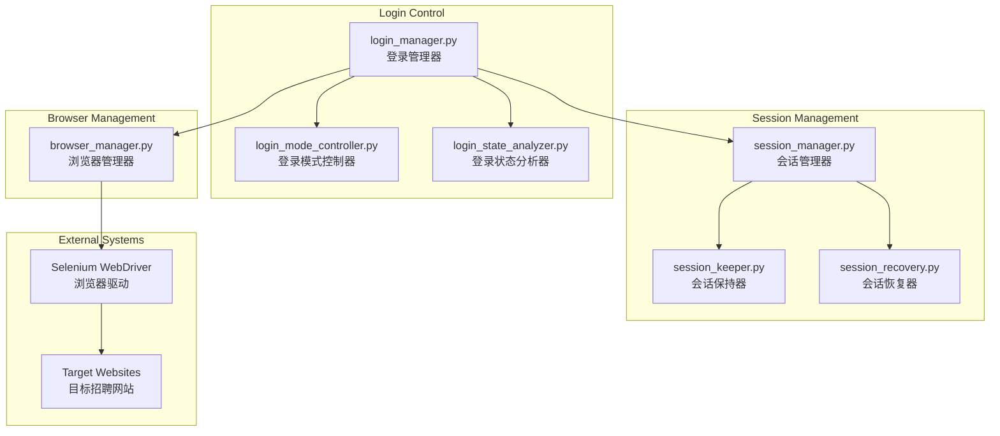

# 认证和会话管理

认证和会话管理模块负责浏览器管理、登录控制、会话维护和状态分析，确保自动化系统能够稳定地维持登录状态并执行操作。

## 🏗️ 系统架构



## 🎯 核心组件

### 1. 登录管理器 (LoginManager)
**文件**: [`login_manager.py`](login_manager.py)

**职责**: 统一的登录管理和控制
- 自动登录检测和执行
- 多网站登录适配
- 登录状态验证
- 登录失败重试

### 2. 会话管理器 (SessionManager)
**文件**: [`session_manager.py`](session_manager.py)

**职责**: 浏览器会话生命周期管理
- 会话创建和初始化
- 会话状态监控
- 会话超时处理
- 会话数据持久化

### 3. 登录模式控制器 (LoginModeController)
**文件**: [`login_mode_controller.py`](login_mode_controller.py)

**职责**: 登录模式的统一控制
- 登录模式开关管理
- 登录工作流程启动
- 详情页访问前验证
- 配置驱动的模式切换

**核心方法**:
```python
class LoginModeController:
    def is_login_mode_enabled(self) -> bool:
        """检查是否启用登录模式 - 核心开关方法"""
        
    def start_login_workflow(self) -> bool:
        """启动登录工作流程 - 核心入口方法"""
        
    def validate_login_before_details(self) -> bool:
        """详情页访问前的登录验证 - 关键保护方法"""
```

### 4. 登录状态分析器 (LoginStateAnalyzer)
**文件**: [`login_state_analyzer.py`](login_state_analyzer.py)

**职责**: 智能分析和提取登录状态信息
- Cookies分析和认证信息提取
- LocalStorage/SessionStorage分析
- DOM元素登录状态检测
- 用户信息提取和验证

## 🔧 配置管理

### 登录模式配置
```yaml
login_mode:
  enabled: true                          # 登录模式开关
  website: qiancheng                     # 目标网站
  auto_save_session: true                # 自动保存登录会话
  max_login_attempts: 3                  # 最大登录尝试次数
  require_login_for_details: true        # 详情页是否需要登录验证
  session_validation_interval: 300      # 会话验证间隔(秒)
  detail_page_delay: 3.0                # 详情页访问延迟(秒)
  login_retry_delay: 10                 # 登录重试延迟(秒)
```

### 会话管理配置
```yaml
session_management:
  keep_alive_enabled: true              # 启用会话保活
  keep_alive_interval: 30               # 保活检查间隔(秒)
  session_timeout_handling: true        # 会话超时处理
  auto_reconnect: true                  # 自动重连
  max_reconnect_attempts: 3             # 最大重连尝试次数
  session_persistence: true             # 会话持久化
```

## 🚀 使用示例

### 基本登录操作
```python
from src.auth.login_manager import LoginManager
from src.auth.browser_manager import BrowserManager

# 初始化管理器
browser_manager = BrowserManager()
login_manager = LoginManager(browser_manager.driver, config)

# 执行登录
success = login_manager.login()
if success:
    print("✅ 登录成功")
else:
    print("❌ 登录失败")
```

### 会话保活示例
```python
from src.auth.session_keeper import SessionKeeper

session_keeper = SessionKeeper(driver, config)

# 保持会话活跃5分钟
success = session_keeper.keep_session_alive(delay_minutes=5.0)
if success:
    print("✅ 会话保活成功")
```

---

**Navigation**: [← Analysis Tools](../analysis_tools/claude.md) | [Search Automation →](../search/claude.md)