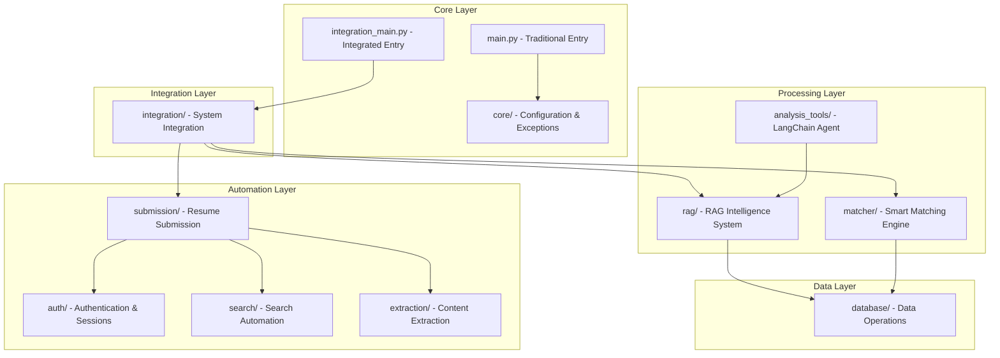

# Source Code Documentation

This directory contains the core source code for the intelligent resume submission system. Each module has its own specialized documentation to help Claude Code understand and work with specific components.

## 🏗️ Module Architecture



## 📁 Module Documentation

### 🤖 Intelligence & Analysis
- **[`rag/claude.md`](rag/claude.md)** - RAG智能分析系统
  - Vector database management
  - LLM integration and processing
  - Semantic search and matching
  - Performance optimization

- **[`analysis_tools/claude.md`](analysis_tools/claude.md)** - LangChain Agent系统
  - Natural language analysis tools
  - Market data analysis
  - Intelligent Q&A system
  - Tool orchestration

- **[`matcher/claude.md`](matcher/claude.md)** - 智能匹配引擎
  - Multi-dimensional scoring algorithms
  - Skill matching optimization
  - Semantic similarity calculation
  - Time-aware matching

### 🔧 System Integration
- **[`integration/claude.md`](integration/claude.md)** - 端到端集成系统
  - Master controller architecture
  - Decision engine logic
  - Pipeline orchestration
  - Monitoring and error handling

- **[`core/claude.md`](core/claude.md)** - 核心模块
  - Configuration management
  - Exception handling
  - System constants
  - Base controllers

### 🤖 Automation Components
- **[`auth/claude.md`](auth/claude.md)** - 认证和会话管理
  - Login management
  - Session persistence
  - Browser management
  - State analysis

- **[`search/claude.md`](search/claude.md)** - 搜索和导航
  - Search automation
  - URL building
  - Login detection
  - Navigation control

- **[`extraction/claude.md`](extraction/claude.md)** - 内容提取
  - Content extraction engines
  - Page parsing logic
  - Data storage management
  - URL extraction

- **[`submission/claude.md`](submission/claude.md)** - 简历投递引擎
  - Submission automation
  - Button recognition
  - Anti-crawler systems
  - Status detection

### 💾 Data Management
- **[`database/claude.md`](database/claude.md)** - 数据库管理
  - Data models and schemas
  - Database operations
  - Vector database integration
  - Migration scripts

## 🚀 Quick Navigation

### Entry Points
- **Traditional System**: [`main.py`](main.py) - Basic resume submission
- **Integrated System**: [`integration_main.py`](integration_main.py) - Full pipeline automation

### Key Configuration Files
- **Main Config**: [`../config/config.yaml`](../config/config.yaml)
- **Integration Config**: [`../config/integration_config.yaml`](../config/integration_config.yaml)
- **Agent Config**: [`../config/agent_config.yaml`](../config/agent_config.yaml)

### Development Commands
```bash
# RAG System
python rag_cli.py status
python rag_cli.py pipeline run --batch-size 20

# Integration System
python src/integration_main.py -k "Python开发" -l "北京"

# Traditional System
python src/main.py --website zhilian
```

## 🔗 Cross-Module Dependencies

### High-Level Dependencies
```
integration/ → rag/ → database/
integration/ → matcher/ → database/
integration/ → submission/ → auth/ → search/ → extraction/
analysis_tools/ → rag/ → database/
```

### Key Interfaces
- **DataBridge**: [`integration/data_bridge.py`](integration/data_bridge.py) - Inter-module data transfer
- **DatabaseManager**: [`database/operations.py`](database/operations.py) - Centralized data access
- **ConfigManager**: [`core/config.py`](core/config.py) - Configuration management

## 📋 Development Guidelines

### When Working with Specific Modules
1. **Read the module's claude.md first** for context and architecture
2. **Check dependencies** in the cross-reference section
3. **Review configuration files** for module-specific settings
4. **Test changes** using the provided commands in each module's documentation

### Code Organization Principles
- **Single Responsibility**: Each module handles one primary concern
- **Loose Coupling**: Modules communicate through well-defined interfaces
- **High Cohesion**: Related functionality is grouped together
- **Configuration-Driven**: Behavior controlled through YAML files

## 🛠️ Common Development Tasks

### Adding New Features
1. Identify the appropriate module based on functionality
2. Review the module's architecture documentation
3. Follow the established patterns and interfaces
4. Update both code and documentation

### Debugging Issues
1. Check the module-specific logs in `../logs/`
2. Review the module's error handling patterns
3. Use the debugging commands provided in each module's documentation
4. Consult the troubleshooting sections

### Performance Optimization
1. Review the performance monitoring in [`rag/claude.md`](rag/claude.md)
2. Check database optimization in [`database/claude.md`](database/claude.md)
3. Monitor integration performance in [`integration/claude.md`](integration/claude.md)

---

**Navigation**: [← Root Documentation](../CLAUDE.md) | [Module List ↑](#-module-documentation)