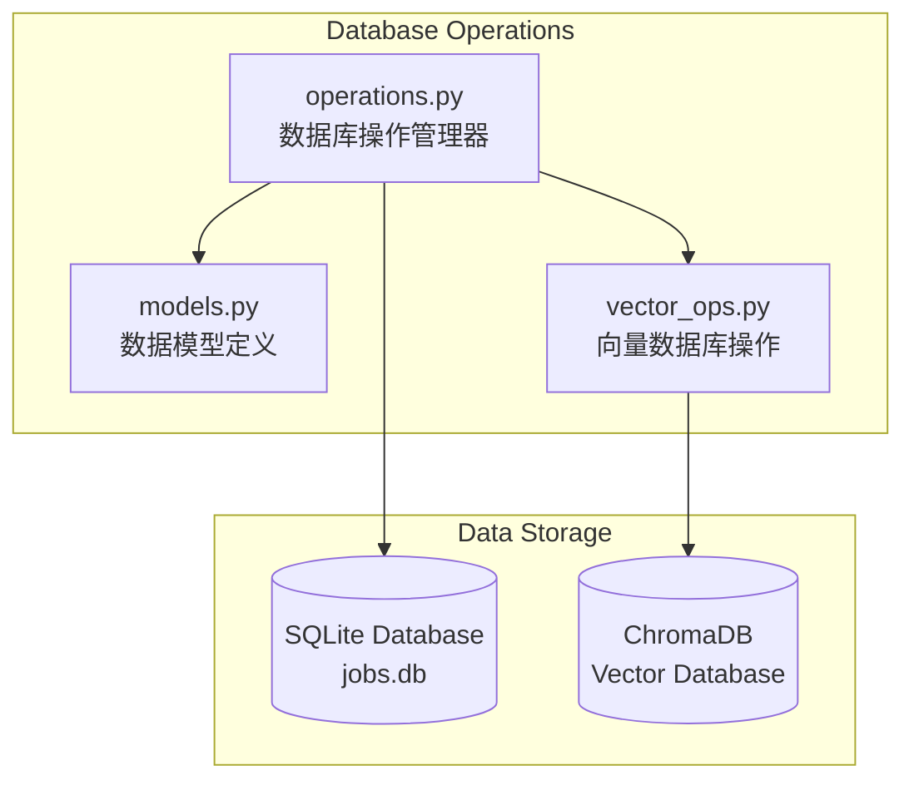

# 数据库管理

数据库管理模块负责SQLite关系数据库和ChromaDB向量数据库的统一管理，提供数据模型定义、CRUD操作、向量操作和数据完整性保护。

## 🏗️ 系统架构

## 🎯 核心组件

### 1. 数据库操作管理器 (DatabaseManager)
**文件**: [`operations.py`](operations.py)

**职责**: 统一的数据库操作管理
- 数据库连接和事务管理
- CRUD操作的统一接口
- 批量操作和性能优化
- 数据完整性保护

### 2. 数据模型 (Models)
**文件**: [`models.py`](models.py)

**职责**: 定义数据库表结构和模型
- 职位数据模型
- 简历匹配结果模型
- 投递记录模型
- RAG处理状态模型

### 3. 向量数据库操作 (VectorOperations)
**文件**: [`vector_ops.py`](vector_ops.py)

**职责**: ChromaDB向量数据库操作
- 向量存储和检索
- 相似度搜索
- 集合管理
- 元数据过滤

## 📊 主要数据表

### jobs - 职位数据表
- 职位基本信息
- 公司信息
- 薪资范围
- 技能要求
- 软删除支持

### resume_matches - 简历匹配表
- 匹配分数和详情
- 处理状态跟踪
- 匹配算法版本
- 时间戳信息

### submission_logs - 投递日志表
- 投递状态记录
- 错误信息存储
- 性能指标跟踪
- 审计追踪

---

**Navigation**: [← Analysis Tools](../analysis_tools/claude.md) | [Search Automation →](../search/claude.md)