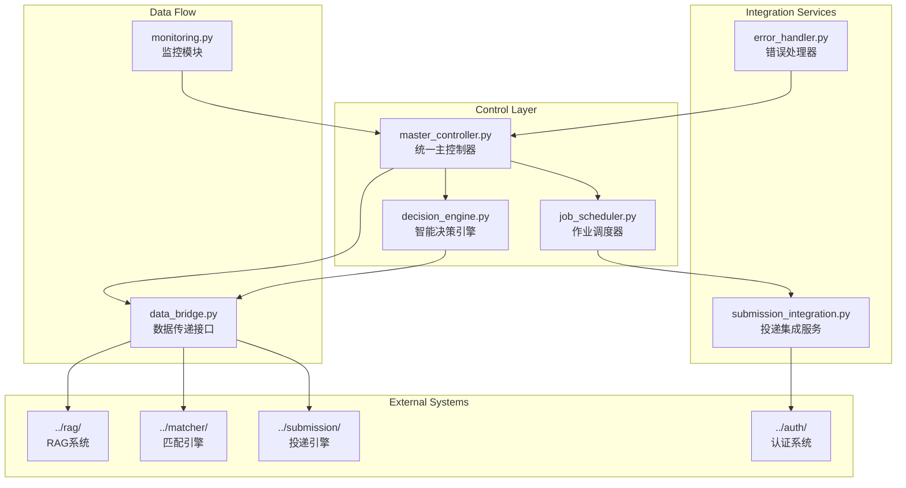

# 端到端集成系统

端到端集成系统是统一协调从职位搜索到自动投递完整流程的核心控制模块，提供智能决策、自动化流程和性能监控功能。

## 🏗️ 系统架构



## 🎯 核心组件

### 1. 统一主控制器 (MasterController)
**文件**: [`master_controller.py`](master_controller.py)

**职责**: 协调整个端到端流程的执行
- 流水线编排和执行
- 模块间数据传递协调
- 错误处理和恢复
- 性能监控和优化

**核心方法**:
```python
class MasterController:
    async def run_full_pipeline(self, pipeline_config: PipelineConfig) -> ExecutionReport:
        """执行完整的端到端流水线"""
        
    async def run_health_check(self) -> Dict[str, Any]:
        """运行系统健康检查"""
        
    def get_system_status(self) -> Dict[str, Any]:
        """获取系统状态信息"""
```

**流水线阶段**:
1. **职位提取阶段**: 协调搜索和内容提取
2. **RAG处理阶段**: 职位数据向量化和分析
3. **简历匹配阶段**: 智能匹配和评分
4. **智能决策阶段**: 投递决策和优先级排序
5. **自动投递阶段**: 执行投递操作

### 2. 智能决策引擎 (DecisionEngine)
**文件**: [`decision_engine.py`](decision_engine.py)

**职责**: AI驱动的投递决策和优先级排序
- 多维度评分算法
- 投递策略优化
- 风险评估和控制
- 学习优化机制

**决策维度**:
```python
class DecisionCriteria:
    match_score: float = 0.3           # 匹配度权重
    salary_attractiveness: float = 0.2  # 薪资吸引力
    company_reputation: float = 0.2     # 公司声誉
    location_preference: float = 0.1    # 地理位置偏好
    career_growth_potential: float = 0.1 # 职业发展潜力
    application_competition: float = 0.1 # 申请竞争度
```

**薪资过滤功能**:
- **硬性阈值**: 薪资匹配度 < 0.3 直接拒绝
- **分级策略**: 支持不同职位级别的差异化阈值
- **动态调整**: 根据市场情况调整过滤标准

### 3. 作业调度器 (JobScheduler)
**文件**: [`job_scheduler.py`](job_scheduler.py)

**职责**: 管理和调度各种作业任务
- 任务队列管理
- 优先级调度
- 并发控制
- 资源分配

**调度策略**:
- **优先级队列**: 基于匹配分数和紧急程度
- **负载均衡**: 智能分配系统资源
- **故障转移**: 任务失败自动重试和转移
- **时间窗口**: 支持定时和周期性任务

### 4. 数据传递接口 (DataBridge)
**文件**: [`data_bridge.py`](data_bridge.py)

**职责**: 模块间数据传递和格式转换
- 数据格式标准化
- 模块间通信协议
- 数据验证和清洗
- 缓存和性能优化

**数据流转**:
```
职位数据 → RAG处理 → 匹配结果 → 决策评估 → 投递执行
    ↓         ↓         ↓         ↓         ↓
  标准化   向量化存储   评分排序   决策记录   状态更新
```

## 🔧 配置管理

### 集成系统配置
```yaml
integration_system:
  master_controller:
    max_concurrent_jobs: 10
    execution_timeout: 3600
    checkpoint_interval: 100
    enable_monitoring: true
    
  decision_engine:
    submission_threshold: 0.7      # 投递阈值
    priority_threshold: 0.8        # 高优先级阈值
    max_daily_submissions: 50      # 每日最大投递数
    
    # 薪资过滤配置
    salary_filters:
      enabled: true
      min_salary_match_score: 0.3
      strict_mode: true
      
    # 决策权重配置
    weights:
      match_score: 0.3
      salary_attractiveness: 0.2
      company_reputation: 0.2
      location_preference: 0.1
      career_growth_potential: 0.1
      application_competition: 0.1
  
  auto_submission:
    dry_run_mode: false           # 生产环境设为false
    max_submissions_per_day: 50
    submission_delay: 5           # 投递间隔(秒)
    enable_smart_delay: true      # 智能延迟
    max_retries: 3
```

### 性能配置
```yaml
performance:
  concurrency:
    max_workers: 10
    thread_pool_size: 20
    semaphore_limit: 5
    
  caching:
    enabled: true
    cache_size: 10000
    ttl_seconds: 3600
    
  database:
    connection_pool_size: 20
    batch_insert_size: 1000
    query_timeout: 30
```

## 🚀 使用示例

### 基本集成流程
```bash
# 基本使用 - 指定关键词和地区
python src/integration_main.py -k "Python开发" "数据分析师" -l "北京" "上海"

# 干运行模式 - 测试流程不实际投递
python src/integration_main.py -k "Python开发" --dry-run

# 指定简历文件
python src/integration_main.py -k "Python开发" -r testdata/resume.json

# 健康检查
python src/integration_main.py --health-check
```

### 高级配置使用
```bash
# 使用自定义配置文件
python src/integration_main.py -k "Python开发" --config custom_integration_config.yaml

# 启用详细日志
python src/integration_main.py -k "Python开发" --verbose --log-level DEBUG

# 限制处理数量
python src/integration_main.py -k "Python开发" --max-jobs 100 --batch-size 20
```

## 📊 监控和性能

### 监控模块 (Monitoring)
**文件**: [`monitoring.py`](monitoring.py)

**监控指标**:
- **流水线执行状态**: 各阶段执行进度和状态
- **性能指标**: 处理速度、响应时间、资源使用
- **错误统计**: 错误类型、频率、恢复情况
- **业务指标**: 投递成功率、匹配质量、用户满意度

**告警机制**:
- **阈值告警**: 性能指标超出预设阈值
- **异常告警**: 系统异常和错误
- **业务告警**: 投递失败率过高等业务问题

### 性能优化策略

#### 1. 并发控制优化
```python
# 动态并发数调整
def get_optimal_concurrency(system_load: float) -> int:
    if system_load < 0.5:
        return 10  # 高并发
    elif system_load < 0.8:
        return 5   # 中等并发
    else:
        return 2   # 低并发
```

#### 2. 缓存策略
```python
# 多层缓存架构
class CacheManager:
    def __init__(self):
        self.l1_cache = {}          # 内存缓存
        self.l2_cache = RedisCache() # Redis缓存
        self.l3_cache = DatabaseCache() # 数据库缓存
```

#### 3. 批处理优化
```python
# 智能批次大小调整
def calculate_optimal_batch_size(
    available_memory: float,
    processing_complexity: float
) -> int:
    base_size = 50
    memory_factor = min(available_memory / 4.0, 2.0)
    complexity_factor = max(1.0 / processing_complexity, 0.5)
    return int(base_size * memory_factor * complexity_factor)
```

## 🛠️ 错误处理和恢复

### 错误处理器 (ErrorHandler)
**文件**: [`error_handler.py`](error_handler.py)

**错误分类**:
- **系统错误**: 网络连接、数据库连接等基础设施问题
- **业务错误**: 数据格式错误、业务逻辑异常
- **外部服务错误**: API调用失败、第三方服务不可用
- **资源错误**: 内存不足、磁盘空间不足等

**恢复策略**:
```python
class RecoveryStrategy:
    def __init__(self):
        self.retry_policies = {
            'network_error': ExponentialBackoff(max_retries=5),
            'api_error': LinearBackoff(max_retries=3),
            'resource_error': ImmediateStop(),
            'business_error': ManualIntervention()
        }
```

### 检查点和恢复
```python
class CheckpointManager:
    def save_checkpoint(self, pipeline_state: PipelineState):
        """保存流水线检查点"""
        
    def restore_from_checkpoint(self, checkpoint_id: str) -> PipelineState:
        """从检查点恢复流水线状态"""
        
    def cleanup_old_checkpoints(self, retention_days: int = 7):
        """清理过期检查点"""
```

## 🔍 故障排除

### 常见问题诊断

#### 1. 流水线执行缓慢
```bash
# 检查系统资源使用
python src/integration_main.py --health-check --verbose

# 调整并发参数
# 在配置文件中减少 max_workers 和 thread_pool_size
```

#### 2. 投递成功率低
```bash
# 检查决策引擎配置
# 调整 submission_threshold 和薪资过滤阈值

# 查看决策日志
tail -f logs/decision_engine.log
```

#### 3. 内存使用过高
```yaml
# 调整批处理大小
performance:
  concurrency:
    max_workers: 5        # 减少并发数
  database:
    batch_insert_size: 500 # 减少批次大小
```

### 性能调优指南

#### 系统资源优化
```yaml
# 针对不同硬件配置的推荐设置

# 低配置 (4GB RAM, 2 CPU)
integration_system:
  master_controller:
    max_concurrent_jobs: 3
performance:
  concurrency:
    max_workers: 2
    thread_pool_size: 5

# 中等配置 (8GB RAM, 4 CPU)  
integration_system:
  master_controller:
    max_concurrent_jobs: 6
performance:
  concurrency:
    max_workers: 5
    thread_pool_size: 10

# 高配置 (16GB RAM, 8+ CPU)
integration_system:
  master_controller:
    max_concurrent_jobs: 10
performance:
  concurrency:
    max_workers: 10
    thread_pool_size: 20
```

## 📈 业务指标和分析

### 关键性能指标 (KPI)
- **流水线完成率**: >95%
- **平均处理时间**: <30分钟/批次
- **投递成功率**: >80%
- **系统可用性**: >99%
- **错误恢复时间**: <5分钟

### 业务分析报告
```python
class BusinessAnalytics:
    def generate_daily_report(self) -> Dict[str, Any]:
        """生成每日业务报告"""
        return {
            'total_jobs_processed': 1250,
            'successful_submissions': 45,
            'submission_success_rate': 0.85,
            'average_match_score': 0.72,
            'top_companies': ['腾讯', '阿里巴巴', '字节跳动'],
            'performance_metrics': {
                'avg_processing_time': 25.3,
                'peak_memory_usage': 3.2,
                'error_rate': 0.02
            }
        }
```

---

**Navigation**: [← RAG System](../rag/claude.md) | [Submission Engine →](../submission/claude.md)