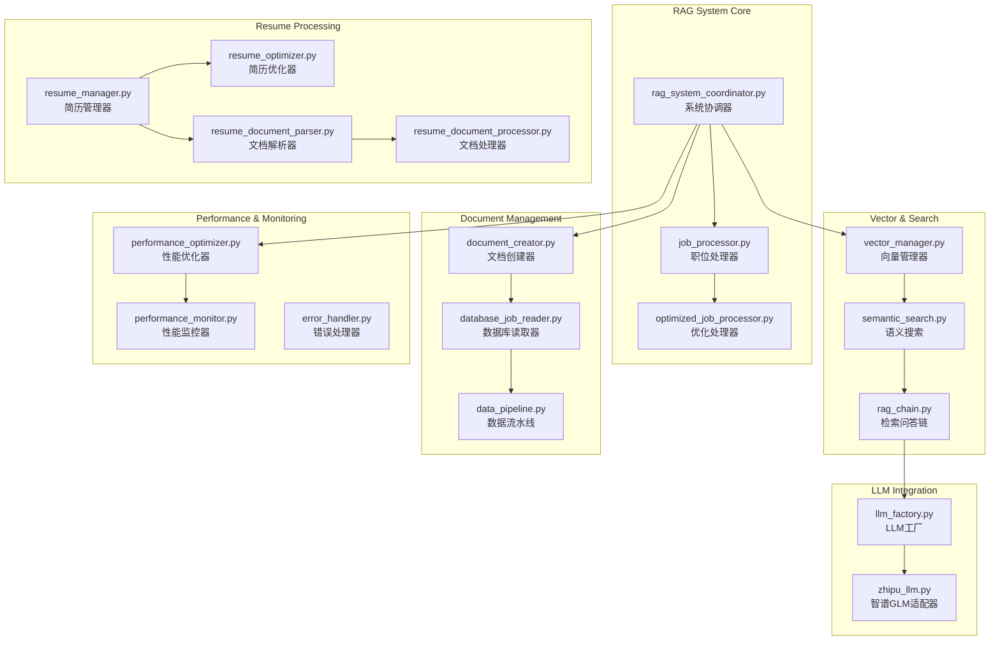

# RAG智能分析系统

RAG (Retrieval-Augmented Generation) 智能分析系统是基于LangChain框架的核心智能处理模块，负责职位数据的向量化存储、语义搜索、智能匹配和简历优化。

## 🏗️ 系统架构



## 🚀 核心组件

### 1. RAG系统协调器 (RAGSystemCoordinator)
**文件**: [`rag_system_coordinator.py`](rag_system_coordinator.py)

**职责**: 管理RAG系统各组件的协调和执行
- 职位数据向量化处理
- 语义搜索和匹配协调
- 文档创建和管理
- 性能优化控制

**核心方法**:
```python
class RAGSystemCoordinator:
    async def process_jobs_batch(self, batch_size: int = 50) -> ProcessingResult
    async def search_similar_jobs(self, query: str, limit: int = 10) -> List[JobMatch]
    async def optimize_resume_for_job(self, resume: Dict, job_id: str) -> OptimizedResume
```

### 2. 向量管理器 (VectorManager)
**文件**: [`vector_manager.py`](vector_manager.py)

**职责**: ChromaDB向量数据库的管理和操作
- 向量数据库初始化和配置
- 文档向量化和存储
- 相似度搜索和检索
- 集合管理和维护

**核心特性**:
- **多语言支持**: 使用 `paraphrase-multilingual-MiniLM-L12-v2` 模型
- **高性能检索**: 毫秒级向量检索
- **灵活过滤**: 支持元数据过滤和条件查询
- **批量操作**: 支持批量插入和更新

### 3. 语义搜索引擎 (SemanticSearch)
**文件**: [`semantic_search.py`](semantic_search.py)

**职责**: 基于向量相似度的智能搜索
- 语义相似度计算
- 多维度搜索策略
- 结果排序和过滤
- 搜索性能优化

**搜索策略**:
- **hybrid**: 70%相似度 + 30%时间权重
- **fresh_first**: 新数据优先策略
- **balanced**: 50%相似度 + 50%时间权重

### 4. 职位处理器 (JobProcessor)
**文件**: [`job_processor.py`](job_processor.py) / [`optimized_job_processor.py`](optimized_job_processor.py)

**职责**: 职位数据的智能处理和分析
- 职位描述解析和结构化
- 技能提取和标准化
- 薪资信息解析
- 公司信息补充

**优化特性**:
- **批量处理**: 支持大批量职位数据处理
- **增量更新**: 避免重复处理已处理数据
- **错误恢复**: 智能错误处理和重试机制
- **性能监控**: 实时处理性能跟踪

## 🤖 LLM集成

### LLM工厂 (LLMFactory)
**文件**: [`llm_factory.py`](llm_factory.py)

**支持的LLM提供商**:
- **智谱GLM**: glm-4-flash (推荐)
- **OpenAI**: gpt-3.5-turbo, gpt-4
- **Claude**: claude-3-sonnet
- **本地模型**: 支持Ollama等本地部署

**配置示例**:
```yaml
rag_system:
  llm:
    provider: zhipu
    model: glm-4-flash
    api_key: your-api-key-here
    temperature: 0.1
    max_tokens: 1500
    retry_attempts: 3
    timeout_seconds: 30
```

### 智谱GLM适配器 (ZhipuLLM)
**文件**: [`zhipu_llm.py`](zhipu_llm.py)

**特性**:
- 完整的智谱AI API集成
- 自动重试和错误处理
- 流式响应支持
- 成本优化配置

## 📄 简历处理系统

### 简历管理器 (ResumeManager)
**文件**: [`resume_manager.py`](resume_manager.py)

**功能**:
- 简历数据标准化和验证
- 多格式简历解析支持
- 简历版本管理
- 简历匹配历史跟踪

### 简历文档处理器
**文件**: [`resume_document_parser.py`](resume_document_parser.py) / [`resume_document_processor.py`](resume_document_processor.py)

**支持格式**:
- **DOCX**: Microsoft Word文档
- **PDF**: PDF简历文档
- **JSON**: 结构化简历数据
- **Markdown**: Markdown格式简历

**处理流程**:
```
原始文档 → 文本提取 → 结构化解析 → 数据验证 → 标准化输出
```

### 简历优化器 (ResumeOptimizer)
**文件**: [`resume_optimizer.py`](resume_optimizer.py)

**优化功能**:
- **技能匹配优化**: 根据目标职位调整技能描述
- **关键词优化**: 增加职位相关关键词
- **格式优化**: 改进简历结构和布局
- **个性化建议**: 基于AI的个性化改进建议

## ⚡ 性能优化

### 性能优化器 (PerformanceOptimizer)
**文件**: [`performance_optimizer.py`](performance_optimizer.py)

**优化策略**:
- **批量处理**: 智能批次大小调整
- **并发控制**: 异步处理和并发限制
- **缓存机制**: 多层缓存策略
- **内存管理**: 内存使用优化

### 性能监控器 (PerformanceMonitor)
**文件**: [`performance_monitor.py`](performance_monitor.py)

**监控指标**:
- **处理速度**: 职位/分钟处理速度
- **内存使用**: 实时内存使用监控
- **响应时间**: API调用响应时间
- **错误率**: 处理错误率统计

**性能目标**:
- RAG处理速度: >50 职位/分钟
- 向量检索时间: <100ms
- 内存使用: <4GB per instance
- 系统可用性: >99%

## 🔧 配置管理

### 核心配置
```yaml
rag_system:
  database:
    path: ./data/jobs.db
    batch_size: 50
  
  vector_db:
    persist_directory: ./data/test_chroma_db
    collection_name: job_positions
    embeddings:
      model_name: sentence-transformers/paraphrase-multilingual-MiniLM-L12-v2
      device: cpu
      normalize_embeddings: true
  
  processing:
    batch_size: 50
    force_reprocess: false
    skip_processed: true
    max_retry_attempts: 3
    
  performance:
    enable_caching: true
    cache_size: 10000
    max_workers: 10
    memory_limit_gb: 4
```

### 时间感知搜索配置
```yaml
rag_system:
  vector_db:
    time_aware_search:
      enable_time_boost: true
      fresh_data_boost: 0.2
      fresh_data_days: 7
      time_decay_factor: 0.1
      search_strategy: "hybrid"  # hybrid, fresh_first, balanced
```

## 🚀 使用示例

### 基本RAG操作
```bash
# 系统状态检查
python rag_cli.py status

# 运行数据流水线
python rag_cli.py pipeline run --batch-size 20 --show-progress

# 语义搜索测试
python rag_cli.py search "Python开发工程师" --limit 5

# 向量数据库测试
python rag_cli.py test --test-search --queries "Python,Java,前端"
```

### 简历处理
```bash
# 处理单个简历文档
python rag_cli.py resume process --input my_resume.docx --output my_profile.json

# 批量处理简历文档
python rag_cli.py resume batch-process --input-dir resumes/ --output-dir processed/

# 验证简历JSON格式
python rag_cli.py resume validate --input resume.json --schema-check
```

### 简历匹配
```bash
# 查找匹配职位
python rag_cli.py match find-jobs --resume data/resume.json --limit 20 --output matches.json

# 分析特定职位匹配度
python rag_cli.py match analyze-fit --resume data/resume.json --job-id job123

# 生成HTML匹配报告
python rag_cli.py match generate-report --resume data/resume.json --output report.html
```

## 🔍 故障排除

### 常见问题

#### 1. 向量数据库连接问题
```bash
# 检查ChromaDB状态
python rag_cli.py status --verbose

# 重建向量数据库
python rag_cli.py clear --force
python rag_cli.py pipeline run --batch-size 10
```

#### 2. LLM API调用失败
```yaml
# 检查API配置
rag_system:
  llm:
    api_key: your-valid-api-key
    timeout_seconds: 60  # 增加超时时间
    retry_attempts: 5    # 增加重试次数
```

#### 3. 内存使用过高
```yaml
# 调整批次大小和并发数
rag_system:
  processing:
    batch_size: 20      # 减少批次大小
    max_workers: 5      # 减少并发数
  performance:
    memory_limit_gb: 2  # 设置内存限制
```

### 性能调优

#### 向量检索优化
```python
# 调整检索参数
search_params = {
    "k": 10,                    # 检索数量
    "score_threshold": 0.7,     # 相似度阈值
    "include_metadata": True,   # 包含元数据
    "filter": {"status": "active"}  # 过滤条件
}
```

#### 批处理优化
```python
# 动态批次大小调整
def get_optimal_batch_size(available_memory: float) -> int:
    if available_memory > 8:
        return 100
    elif available_memory > 4:
        return 50
    else:
        return 20
```

## 📊 监控和日志

### 日志配置
```yaml
logging:
  level: INFO
  handlers:
    - type: file
      filename: logs/rag_system.log
      max_size: 100MB
      backup_count: 5
    - type: console
      level: DEBUG
```

### 性能指标
- **处理吞吐量**: 实时监控职位处理速度
- **向量检索延迟**: 监控搜索响应时间
- **LLM调用统计**: API调用成功率和延迟
- **内存使用趋势**: 内存使用模式分析

---

**Navigation**: [← Source Overview](../claude.md) | [Integration System →](../integration/claude.md)