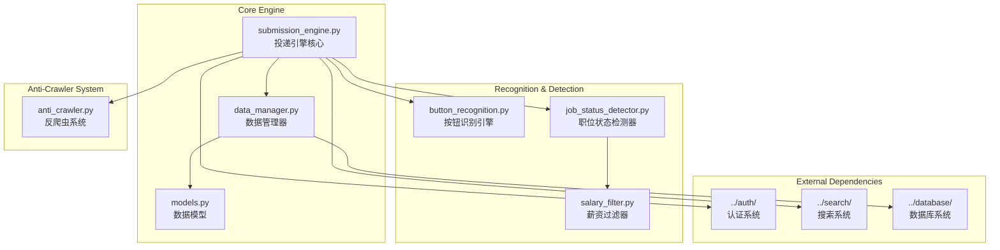

# 简历投递引擎

简历投递引擎是完整的自动投递功能模块，支持智能按钮识别、反爬虫系统、登录状态管理和投递状态跟踪。

## 🏗️ 系统架构



## 🎯 核心组件

### 1. 投递引擎核心 (ResumeSubmissionEngine)
**文件**: [`submission_engine.py`](submission_engine.py)

**职责**: 完整的自动投递功能控制
- 批量投递任务调度
- 单个职位投递执行
- 投递状态跟踪和统计
- 错误处理和重试机制

**核心方法**:
```python
class ResumeSubmissionEngine:
    async def run_submission_batch(self, batch_size: int = 10) -> SubmissionReport:
        """执行批量投递"""
        
    async def submit_single_job(self, job_match: Dict) -> SubmissionResult:
        """投递单个职位 - 集成状态检测"""
        
    def get_pending_submissions(self, limit: int) -> List[Dict]:
        """获取待投递的职位匹配记录"""
        
    def generate_submission_report(self) -> SubmissionReport:
        """生成投递统计报告"""
```

**投递流程**:
```
获取待投递职位 → 登录状态检查 → 页面导航 → 状态检测 → 按钮识别 → 执行投递 → 状态更新
```

### 2. 职位状态检测器 (JobStatusDetector)
**文件**: [`job_status_detector.py`](job_status_detector.py)

**职责**: 智能检测职位页面状态
- 职位可用性检测
- 已申请状态识别
- 职位暂停/过期检测
- 登录要求检测

**检测策略**:
```python
class JobStatusDetector:
    def detect_job_status(self) -> JobStatusResult:
        """检测职位状态 - 一次性获取所有信息避免重复DOM查找"""
        
    def _get_page_info_once(self) -> Dict[str, Any]:
        """一次性获取页面所有需要的信息，避免重复DOM查找，提高性能"""
        
    def _analyze_page_status(self, page_info: Dict[str, Any]) -> JobStatusResult:
        """基于一次性获取的页面信息分析状态"""
```

**状态类型**:
- `PENDING`: 可以投递
- `ALREADY_APPLIED`: 已经申请
- `JOB_SUSPENDED`: 职位暂停招聘
- `JOB_EXPIRED`: 职位已过期
- `LOGIN_REQUIRED`: 需要登录
- `BUTTON_NOT_FOUND`: 找不到申请按钮
- `PAGE_ERROR`: 页面错误

### 3. 按钮识别引擎 (ButtonRecognitionEngine)
**文件**: [`button_recognition.py`](button_recognition.py)

**职责**: 通用按钮识别和点击
- 多网站按钮模式识别
- 智能按钮定位
- 安全点击执行
- 点击结果验证

**支持的网站**:
```python
BUTTON_SELECTORS = {
    'qiancheng': [  # 51job
        "a.but_sq#app_ck",
        "a[onclick*='delivery']",
        "button:contains('申请职位')"
    ],
    'zhilian': [    # 智联招聘
        "button.apply-btn",
        "a.apply-position"
    ],
    'boss': [       # Boss直聘
        "button.btn-apply",
        "a.start-chat-btn"
    ]
}
```

### 4. 反爬虫系统 (AntiCrawlerSystem)
**文件**: [`anti_crawler.py`](anti_crawler.py)

**职责**: 模拟人类行为避免反爬检测
- 随机延迟控制
- 用户代理轮换
- 人类行为模拟
- 会话保活机制

**反爬策略**:
```python
class AntiCrawlerSystem:
    def get_random_delay(self, base_delay: float = 3.0) -> float:
        """获取随机延迟时间 - 3-8秒随机延迟"""
        
    def simulate_human_behavior(self):
        """模拟人类行为 - 随机鼠标移动、页面滚动等"""
        
    def keep_session_alive(self, delay_minutes: float):
        """在延迟期间保持浏览器会话活跃"""
        
    def handle_session_timeout(self):
        """处理会话超时，自动重新登录"""
```

**多层次反爬设计**:
1. **时间策略**
   - 随机延迟：3-8秒基础延迟
   - 批次间隔：每10个职位休息2-5分钟
   - 每日限制：最多50个投递
   - 时段控制：工作时间投递

2. **行为模拟**
   - 鼠标轨迹：模拟真实鼠标移动路径
   - 页面滚动：随机滚动查看职位详情
   - 停留时间：每个页面停留15-45秒
   - 阅读模拟：模拟阅读职位描述的行为

3. **请求伪装**
   - User-Agent轮换：使用真实浏览器UA池
   - Referer设置：正确设置来源页面
   - 请求头完整性：模拟真实浏览器请求头
   - Cookie管理：维护完整的会话状态

### 5. 数据管理器 (SubmissionDataManager)
**文件**: [`data_manager.py`](data_manager.py)

**职责**: 投递数据管理和状态跟踪
- 投递记录管理
- 状态更新和查询
- 软删除功能
- 日志记录和统计

**核心功能**:
```python
class SubmissionDataManager:
    def delete_suspended_job(self, match_id: int) -> bool:
        """软删除暂停招聘的职位记录"""
        
    def mark_as_processed(self, match_id: int, success: bool = True) -> bool:
        """标记职位为已处理"""
        
    def log_job_status_detection(self, job_record, status_result: JobStatusResult):
        """记录职位状态检测结果到日志"""
        
    def get_submission_statistics(self) -> Dict[str, Any]:
        """获取投递统计信息"""
```

### 6. 薪资过滤器 (SalaryFilter)
**文件**: [`salary_filter.py`](salary_filter.py)

**职责**: 薪资匹配度阈值检查
- 薪资匹配度评估
- 阈值过滤逻辑
- 分级过滤策略
- 过滤结果记录

**过滤逻辑**:
```python
class SalaryFilter:
    def evaluate_salary(self, match: Dict[str, Any]) -> tuple[SalaryFilterResult, Dict[str, Any]]:
        """评估薪资匹配度"""
        salary_match_score = match.get('salary_match_score', 0.0)
        applicable_threshold = self._get_applicable_threshold(job_title)
        
        if salary_match_score < applicable_threshold:
            return SalaryFilterResult.REJECT, {
                'rejection_reason': 'salary_threshold',
                'salary_match_score': salary_match_score,
                'required_threshold': applicable_threshold
            }
        
        return SalaryFilterResult.PASS, {}
```

## 🔧 配置管理

### 投递引擎配置
```yaml
submission_engine:
  batch_size: 10
  daily_limit: 50
  submission_delay_range: [3, 8]  # 3-8秒随机延迟
  
  # 职位状态检测配置
  job_status_detection:
    timeout: 5
    text_patterns:
      job_suspended:
        - "很抱歉，你选择的职位目前已经暂停招聘"
        - "该职位已暂停招聘"
        - "职位暂停招聘"
      job_expired:
        - "该职位已过期"
        - "职位已过期"
        - "招聘已结束"
      login_required:
        - "请先登录"
        - "需要登录后查看"
        - "登录后投递"
    
    applied_indicators:
      text_patterns: ["已申请", "已投递", "已发送"]
      class_patterns: ["off", "disabled", "applied"]
  
  # 按钮识别配置
  button_recognition:
    selectors:
      qiancheng:  # 51job
        - "a.but_sq#app_ck"
        - "a[onclick*='delivery']"
        - "button:contains('申请职位')"
      zhilian:
        - "button.apply-btn"
        - "a.apply-position"
      boss:
        - "button.btn-apply"
        - "a.start-chat-btn"
    
    timeout: 10
    retry_attempts: 3
  
  # 反爬虫配置
  anti_crawler:
    enable_random_delay: true
    base_delay: 3.0
    max_delay: 8.0
    batch_rest_minutes: [2, 5]
    daily_submission_limit: 50
    
    # 行为模拟
    human_behavior:
      enable_mouse_movement: true
      enable_page_scroll: true
      reading_time_range: [15, 45]
      
    # 会话管理
    session_management:
      keep_alive_enabled: true
      keep_alive_interval: 30  # 秒
      session_timeout_handling: true
      auto_reconnect: true
      max_reconnect_attempts: 3
```

### 薪资过滤配置
```yaml
salary_filter:
  enabled: true
  min_salary_match_score: 0.3      # 最低薪资匹配度阈值
  strict_mode: true                # 严格模式：低于阈值直接拒绝
  
  # 分级阈值策略
  tiered_thresholds:
    enabled: false
    senior_positions:
      min_score: 0.5
      keywords: ["高级", "资深", "专家", "架构师", "总监"]
    regular_positions:
      min_score: 0.3
      keywords: ["工程师", "开发", "分析师"]
```

## 🚀 使用示例

### 基本投递操作
```bash
# 运行批量投递 (通过集成系统)
python src/integration_main.py -k "Python开发" --enable-submission

# 干运行模式 - 测试投递流程但不实际投递
python src/integration_main.py -k "Python开发" --dry-run

# 检查待投递职位
python -c "
from src.submission.data_manager import SubmissionDataManager
dm = SubmissionDataManager()
pending = dm.get_pending_submissions(limit=10)
print(f'待投递职位数量: {len(pending)}')
"
```

### 状态检测测试
```python
# 测试职位状态检测
from src.submission.job_status_detector import JobStatusDetector
from src.auth.browser_manager import BrowserManager

browser = BrowserManager()
detector = JobStatusDetector(browser.driver, config)

# 导航到职位页面
browser.driver.get("https://jobs.51job.com/job/123456")

# 检测状态
result = detector.detect_job_status()
print(f"职位状态: {result.status}")
print(f"检测原因: {result.reason}")
```

### 按钮识别测试
```python
# 测试按钮识别
from src.submission.button_recognition import ButtonRecognitionEngine

engine = ButtonRecognitionEngine(driver, config)
button_info = engine.find_application_button(driver.page_source)

if button_info:
    success = engine.click_button_safely(button_info)
    print(f"按钮点击{'成功' if success else '失败'}")
```

## 📊 监控和统计

### 投递统计报告
```python
class SubmissionReport:
    def __init__(self):
        self.total_processed = 0
        self.successful_submissions = 0
        self.failed_submissions = 0
        self.already_applied = 0
        self.suspended_jobs = 0
        self.button_not_found = 0
        
    def get_success_rate(self) -> float:
        """计算投递成功率"""
        if self.total_processed == 0:
            return 0.0
        return self.successful_submissions / self.total_processed
        
    def generate_summary(self) -> str:
        """生成统计摘要"""
        return f"""
📊 投递统计报告:
   总处理数: {self.total_processed}
   成功投递: {self.successful_submissions}
   投递失败: {self.failed_submissions}
   已申请过: {self.already_applied}
   职位暂停: {self.suspended_jobs}
   按钮未找到: {self.button_not_found}
   成功率: {self.get_success_rate():.2%}
        """
```

### 性能监控
```python
class SubmissionPerformanceMonitor:
    def track_submission_time(self, job_id: str, duration: float):
        """跟踪单个投递耗时"""
        
    def track_batch_performance(self, batch_size: int, total_time: float):
        """跟踪批次投递性能"""
        
    def get_performance_metrics(self) -> Dict[str, float]:
        """获取性能指标"""
        return {
            'avg_submission_time': 15.3,      # 平均投递时间(秒)
            'submissions_per_minute': 3.2,    # 每分钟投递数
            'success_rate': 0.85,             # 投递成功率
            'error_rate': 0.05                # 错误率
        }
```

## 🔍 故障排除

### 常见问题诊断

#### 1. 投递成功率低
```bash
# 检查职位状态检测日志
tail -f logs/job_status_detection.log

# 检查按钮识别配置
# 确认目标网站的按钮选择器是否正确

# 调整反爬虫延迟
# 增加 submission_delay_range 的值
```

#### 2. 会话超时问题
```yaml
# 调整会话保活配置
submission_engine:
  anti_crawler:
    session_management:
      keep_alive_enabled: true
      keep_alive_interval: 15  # 减少检查间隔
      auto_reconnect: true
      max_reconnect_attempts: 5  # 增加重连次数
```

#### 3. 按钮识别失败
```python
# 调试按钮识别
from src.submission.button_recognition import ButtonRecognitionEngine

# 打印页面源码中的按钮相关内容
page_source = driver.page_source
import re
buttons = re.findall(r'<[^>]*(?:button|申请|投递)[^>]*>', page_source, re.IGNORECASE)
for button in buttons:
    print(button)
```

### 性能优化建议

#### 批次大小优化
```python
def get_optimal_batch_size(success_rate: float, avg_time: float) -> int:
    """根据成功率和平均时间计算最优批次大小"""
    if success_rate > 0.9 and avg_time < 10:
        return 15  # 高成功率，快速处理
    elif success_rate > 0.7 and avg_time < 20:
        return 10  # 中等性能
    else:
        return 5   # 保守处理
```

#### 延迟策略优化
```python
def calculate_adaptive_delay(recent_failures: int) -> float:
    """根据最近失败次数动态调整延迟"""
    base_delay = 3.0
    if recent_failures > 5:
        return base_delay * 2.0  # 失败多时增加延迟
    elif recent_failures > 2:
        return base_delay * 1.5
    else:
        return base_delay
```

## 🛡️ 安全和合规

### 数据安全
- **敏感信息保护**: 不记录用户密码和个人敏感信息
- **日志脱敏**: 自动脱敏处理日志中的敏感数据
- **数据加密**: 重要配置信息加密存储

### 合规性考虑
- **频率限制**: 严格控制投递频率，避免对目标网站造成压力
- **用户协议**: 遵守各招聘网站的用户协议和使用条款
- **数据使用**: 仅用于个人求职目的，不进行商业化使用

### 风险控制
```python
class RiskController:
    def assess_submission_risk(self, job_match: Dict) -> RiskLevel:
        """评估投递风险等级"""
        
    def should_pause_submissions(self) -> bool:
        """判断是否应该暂停投递"""
        
    def get_safe_submission_window(self) -> Tuple[int, int]:
        """获取安全投递时间窗口"""
```

---

**Navigation**: [← Integration System](../integration/claude.md) | [Matcher Engine →](../matcher/claude.md)