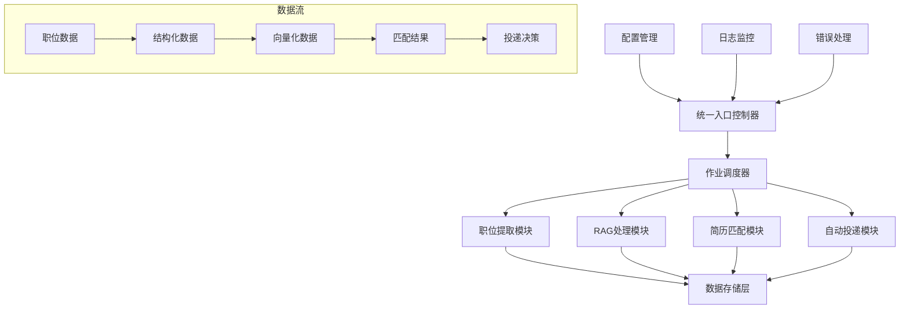
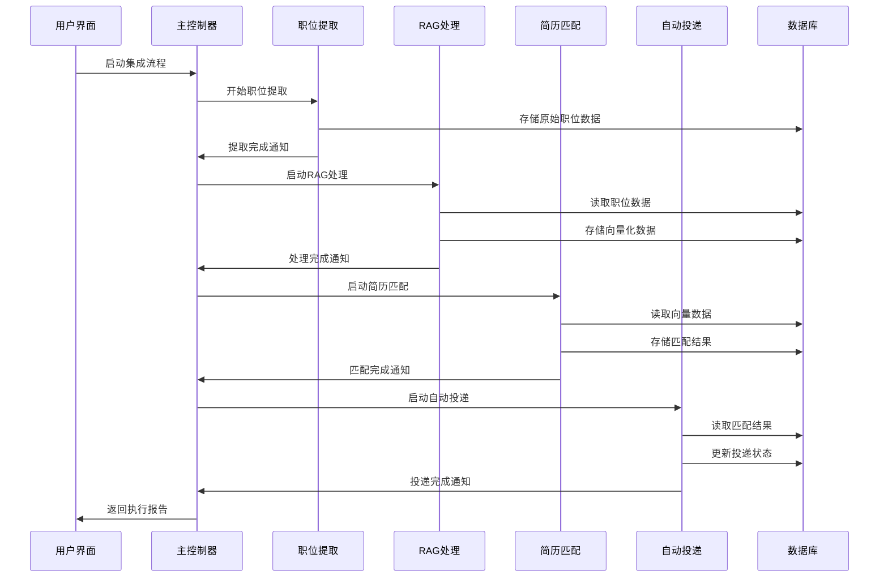

# 智能简历投递系统 - 端到端集成执行计划

## 📋 项目概述

本执行计划旨在实现智能简历投递系统的完整端到端集成，连接所有核心模块：
**职位提取 → RAG处理 → 简历匹配 → 自动投递**

## 🎯 集成目标

### 主要目标
1. **统一工作流程**：创建从职位发现到简历投递的完整自动化流程
2. **智能决策引擎**：基于RAG分析和匹配结果的智能投递决策
3. **性能优化**：确保整个流程的高效性和稳定性
4. **错误处理**：建立完善的错误恢复和重试机制
5. **监控与报告**：实时监控系统状态和生成详细报告

### 技术目标
- 模块间无缝数据传递
- 统一的配置管理
- 集中化的日志和监控
- 可扩展的架构设计
- 高可用性和容错能力

## 🏗️ 系统架构设计

### 核心组件架构



### 数据流设计



## 🔧 核心集成组件

### 1. 统一主控制器 (MasterController)

**职责**：
- 协调所有子模块的执行
- 管理整体工作流程
- 处理模块间的数据传递
- 监控系统状态和性能

**核心功能**：
```python
class MasterController:
    def __init__(self, config):
        self.job_extractor = JobExtractionEngine(config)
        self.rag_processor = RAGSystemCoordinator(config)
        self.resume_matcher = GenericResumeJobMatcher(config)
        self.auto_submitter = AutoSubmissionEngine(config)
        
    async def run_full_pipeline(self, resume_profile, job_search_params):
        # 1. 职位提取阶段
        extraction_result = await self.job_extractor.extract_jobs(job_search_params)
        
        # 2. RAG处理阶段
        rag_result = await self.rag_processor.process_extracted_jobs(extraction_result)
        
        # 3. 简历匹配阶段
        matching_result = await self.resume_matcher.match_jobs(resume_profile)
        
        # 4. 自动投递阶段
        submission_result = await self.auto_submitter.submit_applications(matching_result)
        
        return self.generate_execution_report(extraction_result, rag_result, matching_result, submission_result)
```

### 2. 作业调度器 (JobScheduler)

**职责**：
- 管理任务队列和优先级
- 控制并发执行
- 处理任务依赖关系
- 实现断点续传

**核心功能**：
```python
class JobScheduler:
    def __init__(self):
        self.task_queue = asyncio.Queue()
        self.running_tasks = {}
        self.completed_tasks = {}
        
    async def schedule_pipeline(self, pipeline_config):
        # 创建任务依赖图
        task_graph = self.build_task_dependency_graph(pipeline_config)
        
        # 按依赖顺序执行任务
        for task_batch in task_graph:
            await self.execute_task_batch(task_batch)
```

### 3. 数据传递接口 (DataBridge)

**职责**：
- 标准化模块间数据格式
- 实现数据验证和转换
- 提供数据缓存机制
- 处理数据版本兼容性

**数据模型**：
```python
@dataclass
class PipelineData:
    job_extraction_result: JobExtractionResult
    rag_processing_result: RAGProcessingResult
    matching_result: MatchingResult
    submission_result: SubmissionResult
    metadata: Dict[str, Any]
    
class DataBridge:
    def transform_extraction_to_rag(self, extraction_result) -> RAGInput:
        # 转换职位提取结果为RAG输入格式
        pass
        
    def transform_rag_to_matching(self, rag_result) -> MatchingInput:
        # 转换RAG结果为匹配输入格式
        pass
```

## 📊 集成实施计划

### 阶段1：基础架构搭建 (第1-2周)

**目标**：建立集成框架和核心组件

**任务清单**：
1. **创建统一主控制器**
   - 设计MasterController类架构
   - 实现基础的模块协调功能
   - 建立配置管理系统

2. **建立数据传递机制**
   - 定义标准化数据模型
   - 实现DataBridge组件
   - 创建数据验证机制

3. **集成现有模块**
   - 重构现有模块接口
   - 统一错误处理机制
   - 建立日志系统

### 阶段2：工作流程集成 (第3-4周)

**目标**：实现端到端工作流程

**任务清单**：
1. **职位提取集成**
   - 集成现有的content_extractor
   - 实现批量提取功能
   - 添加提取进度监控

2. **RAG处理集成**
   - 集成RAGSystemCoordinator
   - 实现自动化RAG流水线
   - 优化处理性能

3. **简历匹配集成**
   - 集成GenericResumeJobMatcher
   - 实现批量匹配功能
   - 添加匹配质量评估

4. **自动投递集成**
   - 创建AutoSubmissionEngine
   - 集成现有的auth和search模块
   - 实现智能投递决策

### 阶段3：智能决策引擎 (第5-6周)

**目标**：实现基于AI的智能决策

**任务清单**：
1. **决策引擎开发**
   - 创建DecisionEngine类
   - 实现多维度评分算法
   - 建立投递策略配置

2. **智能过滤系统**
   - 实现职位质量评估
   - 添加重复职位检测
   - 创建黑名单管理

3. **自适应学习**
   - 实现投递结果反馈机制
   - 建立策略优化算法
   - 添加A/B测试功能

### 阶段4：性能优化与监控 (第7-8周)

**目标**：优化系统性能和建立监控体系

**任务清单**：
1. **性能优化**
   - 实现并发处理优化
   - 添加缓存机制
   - 优化数据库查询

2. **监控系统**
   - 建立实时监控面板
   - 实现性能指标收集
   - 添加告警机制

3. **错误处理**
   - 完善错误恢复机制
   - 实现断点续传功能
   - 建立错误分析系统

## 🔄 详细工作流程

### 完整执行流程

```python
async def execute_full_pipeline(self, config):
    """执行完整的端到端流程"""
    
    # 1. 初始化阶段
    pipeline_context = PipelineContext(config)
    await self.initialize_all_modules(pipeline_context)
    
    # 2. 职位提取阶段
    logger.info("开始职位提取阶段")
    extraction_result = await self.job_extractor.extract_jobs(
        keywords=config.search_keywords,
        locations=config.search_locations,
        max_pages=config.max_pages
    )
    
    # 验证提取结果
    if not self.validate_extraction_result(extraction_result):
        raise PipelineError("职位提取结果验证失败")
    
    # 3. RAG处理阶段
    logger.info("开始RAG处理阶段")
    rag_input = self.data_bridge.transform_extraction_to_rag(extraction_result)
    rag_result = await self.rag_processor.process_jobs_batch(rag_input)
    
    # 4. 简历匹配阶段
    logger.info("开始简历匹配阶段")
    matching_input = self.data_bridge.transform_rag_to_matching(rag_result)
    matching_result = await self.resume_matcher.match_jobs_batch(
        resume_profile=config.resume_profile,
        job_data=matching_input
    )
    
    # 5. 智能决策阶段
    logger.info("开始智能决策阶段")
    decision_result = await self.decision_engine.make_submission_decisions(
        matching_result=matching_result,
        decision_criteria=config.decision_criteria
    )
    
    # 6. 自动投递阶段
    logger.info("开始自动投递阶段")
    submission_result = await self.auto_submitter.submit_applications(
        decisions=decision_result,
        submission_config=config.submission_config
    )
    
    # 7. 生成报告
    execution_report = self.generate_comprehensive_report(
        extraction_result, rag_result, matching_result, 
        decision_result, submission_result
    )
    
    return execution_report
```

### 错误处理和恢复机制

```python
class PipelineErrorHandler:
    def __init__(self):
        self.checkpoint_manager = CheckpointManager()
        self.retry_manager = RetryManager()
    
    async def handle_pipeline_error(self, error, context):
        """处理流水线错误"""
        
        # 1. 保存检查点
        checkpoint = self.checkpoint_manager.create_checkpoint(context)
        
        # 2. 分析错误类型
        error_type = self.classify_error(error)
        
        # 3. 决定恢复策略
        if error_type == "RECOVERABLE":
            return await self.retry_from_checkpoint(checkpoint)
        elif error_type == "PARTIAL_FAILURE":
            return await self.continue_from_last_success(checkpoint)
        else:
            return await self.full_restart_required(checkpoint)
```

## 📈 性能优化策略

### 1. 并发处理优化

```python
class ConcurrentProcessor:
    def __init__(self, max_workers=10):
        self.semaphore = asyncio.Semaphore(max_workers)
        self.executor = ThreadPoolExecutor(max_workers=max_workers)
    
    async def process_jobs_concurrently(self, jobs, process_func):
        """并发处理职位数据"""
        async def process_single_job(job):
            async with self.semaphore:
                return await process_func(job)
        
        tasks = [process_single_job(job) for job in jobs]
        return await asyncio.gather(*tasks, return_exceptions=True)
```

### 2. 智能缓存机制

```python
class IntelligentCache:
    def __init__(self):
        self.job_cache = TTLCache(maxsize=10000, ttl=3600)
        self.rag_cache = TTLCache(maxsize=5000, ttl=7200)
        self.matching_cache = TTLCache(maxsize=1000, ttl=1800)
    
    def get_cached_result(self, cache_type, key):
        """获取缓存结果"""
        cache_map = {
            'job': self.job_cache,
            'rag': self.rag_cache,
            'matching': self.matching_cache
        }
        return cache_map.get(cache_type, {}).get(key)
```

### 3. 数据库优化

```python
class DatabaseOptimizer:
    def __init__(self, db_config):
        self.connection_pool = create_connection_pool(db_config)
        self.query_cache = QueryCache()
    
    async def batch_insert_jobs(self, jobs):
        """批量插入职位数据"""
        async with self.connection_pool.acquire() as conn:
            await conn.executemany(
                "INSERT INTO jobs (...) VALUES (...)",
                jobs
            )
    
    async def optimized_job_query(self, filters):
        """优化的职位查询"""
        cache_key = self.generate_cache_key(filters)
        cached_result = self.query_cache.get(cache_key)
        
        if cached_result:
            return cached_result
        
        result = await self.execute_optimized_query(filters)
        self.query_cache.set(cache_key, result)
        return result
```

## 📊 监控和报告系统

### 1. 实时监控面板

```python
class MonitoringDashboard:
    def __init__(self):
        self.metrics_collector = MetricsCollector()
        self.alert_manager = AlertManager()
    
    def collect_pipeline_metrics(self):
        """收集流水线指标"""
        return {
            'extraction_rate': self.metrics_collector.get_extraction_rate(),
            'rag_processing_speed': self.metrics_collector.get_rag_speed(),
            'matching_accuracy': self.metrics_collector.get_matching_accuracy(),
            'submission_success_rate': self.metrics_collector.get_submission_rate(),
            'system_resource_usage': self.metrics_collector.get_resource_usage()
        }
```

### 2. 综合报告生成

```python
class ReportGenerator:
    def generate_execution_report(self, pipeline_results):
        """生成执行报告"""
        return {
            'execution_summary': {
                'total_jobs_processed': pipeline_results.total_jobs,
                'successful_extractions': pipeline_results.extraction_success,
                'rag_processing_rate': pipeline_results.rag_success_rate,
                'matching_results': pipeline_results.matching_summary,
                'submission_results': pipeline_results.submission_summary,
                'execution_time': pipeline_results.total_time,
                'error_summary': pipeline_results.error_summary
            },
            'performance_metrics': self.calculate_performance_metrics(pipeline_results),
            'recommendations': self.generate_optimization_recommendations(pipeline_results)
        }
```

## 🔧 配置管理

### 统一配置结构

```yaml
# 集成系统配置
integration_system:
  # 主控制器配置
  master_controller:
    max_concurrent_jobs: 10
    checkpoint_interval: 100
    error_retry_attempts: 3
    
  # 作业调度配置
  job_scheduler:
    queue_size: 1000
    batch_size: 50
    priority_levels: 3
    
  # 数据传递配置
  data_bridge:
    validation_enabled: true
    transformation_cache: true
    data_retention_days: 30

# 各模块集成配置
modules:
  job_extraction:
    enabled: true
    max_pages_per_site: 10
    extraction_timeout: 300
    
  rag_processing:
    enabled: true
    batch_size: 50
    llm_timeout: 30
    
  resume_matching:
    enabled: true
    matching_threshold: 0.6
    max_matches_per_resume: 20
    
  auto_submission:
    enabled: true
    submission_delay: 5
    max_submissions_per_day: 50

# 性能优化配置
performance:
  caching:
    enabled: true
    cache_size: 10000
    ttl_seconds: 3600
    
  concurrency:
    max_workers: 10
    semaphore_limit: 5
    
  database:
    connection_pool_size: 20
    query_timeout: 30

# 监控配置
monitoring:
  metrics_collection: true
  real_time_dashboard: true
  alert_thresholds:
    error_rate: 0.1
    processing_speed: 100
    memory_usage: 0.8
```

## 🚀 部署和运维

### 1. 部署架构

```python
class DeploymentManager:
    def __init__(self, deployment_config):
        self.config = deployment_config
        self.container_manager = ContainerManager()
        self.service_registry = ServiceRegistry()
    
    async def deploy_integrated_system(self):
        """部署集成系统"""
        
        # 1. 部署核心服务
        await self.deploy_core_services()
        
        # 2. 部署数据层
        await self.deploy_data_layer()
        
        # 3. 部署监控系统
        await self.deploy_monitoring_system()
        
        # 4. 配置负载均衡
        await self.configure_load_balancing()
        
        # 5. 启动健康检查
        await self.start_health_checks()
```

### 2. 运维监控

```python
class OperationsManager:
    def __init__(self):
        self.health_checker = HealthChecker()
        self.log_analyzer = LogAnalyzer()
        self.performance_monitor = PerformanceMonitor()
    
    async def monitor_system_health(self):
        """监控系统健康状态"""
        while True:
            health_status = await self.health_checker.check_all_services()
            
            if not health_status.all_healthy:
                await self.handle_unhealthy_services(health_status)
            
            await asyncio.sleep(30)  # 每30秒检查一次
```

## 📋 测试策略

### 1. 集成测试

```python
class IntegrationTestSuite:
    def __init__(self):
        self.test_data_manager = TestDataManager()
        self.mock_services = MockServiceManager()
    
    async def test_full_pipeline(self):
        """测试完整流水线"""
        
        # 准备测试数据
        test_config = self.test_data_manager.get_test_config()
        test_resume = self.test_data_manager.get_test_resume()
        
        # 执行完整流程
        master_controller = MasterController(test_config)
        result = await master_controller.run_full_pipeline(test_resume, test_config)
        
        # 验证结果
        assert result.extraction_result.success
        assert result.rag_result.processed_count > 0
        assert result.matching_result.matches_found > 0
        assert result.submission_result.submitted_count >= 0
```

### 2. 性能测试

```python
class PerformanceTestSuite:
    async def test_pipeline_performance(self):
        """测试流水线性能"""
        
        # 测试不同负载下的性能
        load_levels = [10, 50, 100, 500]
        
        for load in load_levels:
            start_time = time.time()
            
            # 执行测试
            results = await self.run_load_test(load)
            
            end_time = time.time()
            processing_time = end_time - start_time
            
            # 记录性能指标
            self.record_performance_metrics(load, processing_time, results)
```

## 📈 成功指标

### 关键性能指标 (KPIs)

1. **处理效率**
   - 职位提取速度：> 100 职位/分钟
   - RAG处理速度：> 50 职位/分钟
   - 匹配处理速度：> 200 匹配/分钟

2. **准确性指标**
   - 职位提取准确率：> 95%
   - RAG处理成功率：> 90%
   - 匹配准确率：> 85%

3. **系统可靠性**
   - 系统可用性：> 99%
   - 错误恢复率：> 95%
   - 数据一致性：> 99.9%

4. **用户体验**
   - 端到端处理时间：< 30分钟
   - 系统响应时间：< 5秒
   - 报告生成时间：< 2分钟

## 🎯 预期收益

### 1. 效率提升
- **自动化程度**：从手动操作提升到90%自动化
- **处理速度**：比现有流程快5-10倍
- **错误率降低**：减少人为错误80%

### 2. 智能化水平
- **匹配精度**：提升匹配准确率30%
- **决策质量**：基于AI的智能决策
- **自适应学习**：系统持续优化

### 3. 运维效率
- **监控覆盖**：100%系统组件监控
- **故障恢复**：自动故障检测和恢复
- **性能优化**：持续性能监控和优化

## 📅 实施时间表

| 阶段 | 时间 | 主要任务 | 交付物 |
|------|------|----------|--------|
| 阶段1 | 第1-2周 | 基础架构搭建 | 统一主控制器、数据传递机制 |
| 阶段2 | 第3-4周 | 工作流程集成 | 端到端工作流程 |
| 阶段3 | 第5-6周 | 智能决策引擎 | AI决策系统 |
| 阶段4 | 第7-8周 | 性能优化与监控 | 监控系统、性能优化 |
| 测试 | 第9周 | 集成测试 | 测试报告 |
| 部署 | 第10周 | 生产部署 | 生产环境 |

## 🔚 总结

本执行计划提供了智能简历投递系统端到端集成的完整路线图。通过系统化的方法，我们将实现：

1. **统一的系统架构**：所有模块协调工作
2. **智能化的决策引擎**：基于AI的投递决策
3. **高性能的处理能力**：并发和缓存优化
4. **完善的监控体系**：实时监控和报告
5. **可靠的错误处理**：自动恢复和重试

这个集成系统将大大提升简历投递的效率和成功率，为用户提供更好的求职体验。